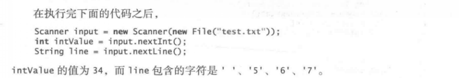
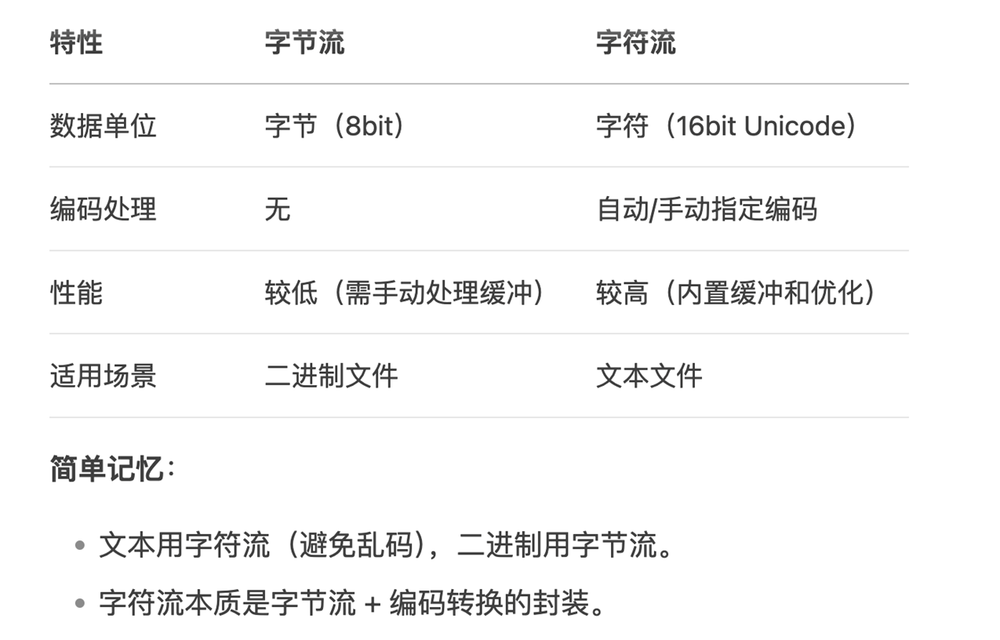
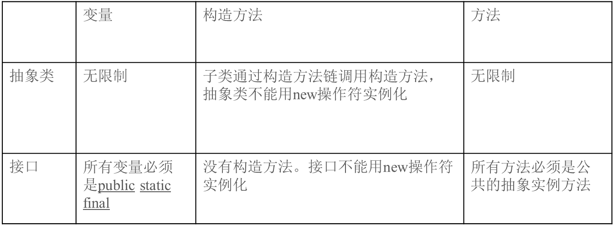
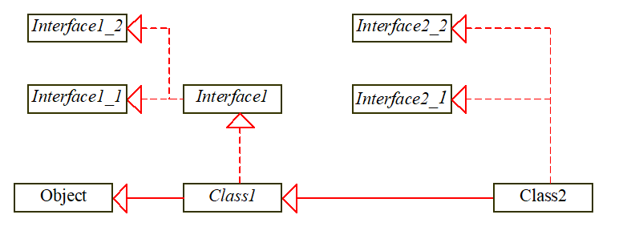

# Java学习课堂笔记

## 3.20

##### 常量

​	final datatype CONSTANT = value;

##### 字符数据和数值数据之间的转换

​	char ch = 'm';   char ch = 0x006d;  char ch =109;

##### char数据类型转换

​	如果另外一个操作数是数字或字符，会自动转换成int类型的数据.

##### String类型

​	字符串拼接

##### 程序设计风格和文档

​	适当的注释，命名习惯，适当的缩进和空白

##### 程序设计错误

​	语法错误，运行错误，逻辑错误


## 3.24

#### 选择

```java
	if ( /*条件表达式*/ ){
		boolean = true; // or false;
		// 注在C++中可以与1,0 相等价，而java不行。 java中你无法进行强制转换
	}
```

###### 					

##### random方法

###### 	生成随机数

​	生成大于等于0.0且小于1.0的 double 型随机数 

​		（0 <= Math.random() < 1.0）

###### 	生成随机字符

> ​	计算机处理的是数值数据和字符。每个字符都有唯一的一个从0到FFFF（即十进制的65535）的十六进制数 。要生成一个随机字符就是使用下面的表达式生成0到 65535 之间的随机数：（注意：因为 0 <= Math.random() < 1.0所以必须给 65535加1）：
>
> ​						(char)(Math.random() * (65535 + 1))
>
> ​		推广前面的讨论可以生成任意两个在 ch1 和 ch2 之间的随机字符，其中 ch1 < ch2 ，如下所		示：
>
> ​					(char)(ch1 + Math.random() * (ch2 – ch1 + 1))

##### switch语句

​					


#### 循环

​		三种形式的循环语句：while、do-while和for在表达的效果上是一样的。

##### 	注意：

​			在循环控制中，不要使用浮点值来比较值是否相等。 因为浮点值是某些值的近似值，所		以使用它们可能导致不精确的循环次数和不准确的结果。 

​		在do循环的环境下，循环结束的分号是必需要的。


## 3.27

##### 	Character类

​		有下划线--静态方法

​		无下划线--实例方法

```java
// 实例方法和静态方法区别
// 实例方法：实例方法是依赖于具体的实例对象的，必顫先创建实例对象，然后通过实例对象才能访问实例方法。
// 静态方法：静态方法是属于类的，不依赖于实例对象，可以直接通过类名调用静态方法。
// 1. 实例方法可以访问实例变量和类变量，静态方法只能访问类变量。
// 2. 实例方法可以访问实例方法和静态方法，静态方法只能访问静态方法。
// 3. 实例方法可以被重写，静态方法不能被重写。
```


##### 	String类

```java
//String类的使用
// 1. String类是不可变的，一旦创建就不能修改。
// 2. String类是final类，不能被继承。
// String 比较
// 1. == 比较的是对象的地址值，
// 2. equals() 比较的是对象的内容值。
// 3. compareTo() 比较的是对象的大小值，返回值为int类型，
//   3.1. 如果当前对象大于参数对象，返回正数；
//   3.2. 如果当前对象小于参数对象，返回负数；
//   3.3. 如果当前对象等于参数对象，返回0；
// 4. String类的常用方法：
        ength();//：返回字符串的长度；
        charAt(int index);//：返回指定索引处的字符；
        substring(int beginIndex, int endIndex);//：返回指定索引范围内的子字符串；
        indexOf(String str);//：返回指定字符串//字符串在当前字符串中最后一次出现的位置；
        toLowerCase();//：将字符串转换为小写字母；
        toUpperCase();//：将字符串转换为大写字母；
        trim();//：去除字符串首尾的空格；
        split(String regex);//：将字符串按照指定的正则表达式分割成字符串数组；
        replace(String oldStr, String newStr);//：将字符串中的指定子字符串替换为新的子字符串；
        startsWith(String prefix);//：判断字符串是否以指定的前缀开始；
        endsWith(String suffix);//：判断字符串是否以指定的后缀结束；
        concat(String str1, String str2);
		regionMatches(String regex);// ：判断字符串是否与指定的正则表达式匹配；
```

##### 	StringBuilder类

​		

## 3.31

### 方法

​				方法的一个好处就是重用

#### 方法头


#### 实际参数

#### 注意


#### 传递参数

##### 通过值传递

#### 模块化代码

### 方法的优点

​		一旦写出一个方法就可以在任何地方重用它。

​		信息隐藏：方法的实现细节封装在方法内，对使用该方法的用户来说是隐藏的。

​		减少复杂度。

### 设计图

​		e.g.


## 4.3

### 数组的基本知识

#### 数组的大小

#### 下标变量

#### 增强型for循环（for - each循环）

​	JDK 1.5引入了一个新的for循环，它可以让你不使用下标变量就可以顺序地遍历整个数组。 例如：下面	的代码显示数组myList中的所有元素： 

```java
for (**double** value: myList) 
 	System.out.println(value);
//一般来讲，这个语法是
for (elementType value: arrayRefVar) {
 // Process the value
}
```

 当需要以其它顺序遍历该数组或改变数组中的元素时，你还是必须使用下标变量。

​	一旦数组被创建就不能再修改它的大小。可以通过使用

​			 arrayRefVar.length

​	来求得数组的大小。

### 传递数组给方法

e.g.

```java
public static void printArray(int[] array) {
  for (int i = 0; i < array.length; i++) {
    System.out.print(array[i] + " ");
  }
} 
```

#### 匿名数组

​	使用下面的语法创建一个数组：

​		new dataType[]{literal0, literal1, ..., literalk};

​	这里没有数组的显式引用变量。这样的数组被称为*匿名数组*。

#### 值传递

Java使用**值传递**的方法传递实参给方法。传递基本数据类型变量的值与传递数组值会有很大不同。

对于基本数据类型参数，传递的是实参的值。**在方法中改变局部参数的值并不影响方法之外变量的值**。

对于数组类型参数，参数值是数组的引用，**传递给方法的是这个引用。方法体中数组发生的改变，将会影响到作为参数传给方法的原始数组**。 

e.g.


​		当调用m(x,y)时，x和y的值被传递给 number 和 numbers。因为y包含的是数组的引用值，所以，		numbers现在包含的是指向同一数组的相同引用值。

​		JVM将数组存储在一个被称作堆的内存区域，堆是用来动态分配内存的，在堆中的内存块可以按任意顺序		分配和释放。

### 从方法中返回数组

```java
public static int[] reverse(int[] list) {  //转置原来的数组
  int[] result = new int[list.length];
  for (int i = 0, j = result.length - 1; 
       i < list.length; i++, j--) {
    result[j] = list[i];
  }
  return result;
}

```

### 可变长参数列表

​		可以把类型相同但个数可变的参数传递给方法

​			方法中参数声明如下：

​				typename … parameterName

​				如double… numbers

​		注意：

​			1.只能给方法中指定**一个可变长参数**

​			2.**任何常规参数**必须在它之前

​			3.**可变长参数被当成数组对待**


## 4.10

​		静态变量和静态方法即既可以在类的实例方法中使用，也可以在类的静态方法中使用。但是实例变量和实例方法只能在类的实例		方法中使用

​		如果一个变量依赖于实例

## 5.15

- 异常处理

> 方法定义者：
>
> ​	if（除数为0）——检测
>
> ​		throw new Exception(...);
>
> 
>
> 方法调用者：
>
> ​	try{
>
> ​		.......;
>
> ​	}catch(Exception e){
>
> ​		......;
>
> ​	}

- 异常处理调用栈

在栈顶位置调用

### 文本IO

#### 如何给main方法传参数

- 判断参数个数
- 清楚各个位置的语义

#### 使用File类获取文件的属性、删除和重命名文件

- - - 注意：文件或者目录不存在时，仍然可以创建一个File类

#### 使用PrintWriter类向文件写数据

- 不关闭文件流，文件会一直占用着。

#### 使用Scanner类从文件读取数据

- 为文件___创建File对象
- f->Scanner input
- 读——>while (input.hasNext())
- input.next()
- 关闭input


- - nextLine()直接读一行
  - - 分隔符：\r\n
    - 开始时不跳过空格
    - 到哪结束：“abc\r\n”包括换行符
  - next(),nextInt()令牌读取法
  - - 分隔符：空格
    - 跳过任意多个空格
    - abc<---到这里就结束了，不包括分隔符



#### 从Web上读数据


## 5.22

- 

### 接口

#### 抽象类

类 ===> 共性，父类

UML中抽象方法是用斜体表示

构造方法：保护型#

子类必须给出抽象方法的实现

- 为什么把抽象方法放到父类中？

  > - 编译的时候看的是声明类型
  >
  > - - - 抽象方法不能包含在非抽象类中
  >     - 抽象类不能创建对象，它的构造是通过子类的构造方法使用的
  > - 作为统一化的处理方式

- 抽象类不一定要包含抽象方法

- 抽象类的父类可以不一定是抽象类

- 抽象类不能new一个实例，但是可以new（作为一个数据类型使用），如该类型的数组

- 抽象类中不是抽象的方法必须有实现

- 子类可以将父类中的具体方法重写，并定义为抽象的

- 抽象方法绝对不能是静态的


> 通过抽象类实现所以类型数字的比较


#### 接口

- 与类相似的结构

  > 只包含常量和抽象方法（常量的声明，和抽象方法的签名）

- 可以看作一个特殊的类

  > 接口不能new一个实例
  >
  > 但是可以声明成一个变量类型使用

- 接口实现时需要使用implements关键字让对象的类实现这个接口来完成

- 接口中所有的数据都是public static final

  所有的方法都是public abstract


- - - 注意：
    - instanceof 自己和父类都是true，“实现和虚线都行”
    - 一个子类唯一的对应一个父类，在Java中实现多继承式通过接口来实现的
    - 在上一点中实现了一个接口实现一个继承时，intanceof仍然可以“上层的上层”
  - 


## 5.29

The java.util.Arrays.sort(array) method requires that the elements in an array are instances of Comparable<E>. 

Arrays.sort一定要是可以排序的，不能排序的类会报错

clone()会抛出一个必检异常，可以使用try..catch..捕获

- - - 注意，内容的相同应该用equals

- 空接口（标记接口）

  声明这个接口时，表明这个类会有该性质
  
- 浅拷贝和深拷贝

  浅拷贝只是一个引用


- JDK 8之前





- JDK 8之后的新特性

- | 特性     | 接口（Interface）                      | 抽象类（Abstract Class） |
  | :------- | :------------------------------------- | :----------------------- |
  | 实现方式 | 使用 `implements` 关键字               | 使用 `extends` 关键字    |
  | 方法实现 | 仅包含抽象方法（Java 8+ 可有默认方法） | 可包含抽象方法和具体方法 |
  | 多继承   | 支持多接口继承                         | 仅支持单继承             |
  | 成员变量 | 默认为 `public static final`           | 可定义各种访问权限的变量 |


所有的类共享同一个根类Object，但是接口没有共同的根。与类相似，接口也可以定义一种类型。一个接口类型的变量可以引用任何实现该接口的类的实例。如果一个类实现了一个接口，那么这个接口就类似与该类的一个父类。可以将接口当作一种数据类型使用，将接口类型的变量转换为它的子类，反之亦然。



假设c是Class2的实例，那么c也是Object、Class1、Interface1、Interface1_1、 Interface1_2、Interface2_1和 Interface2_2的实例。


- 使用类还是接口

  > 抽象类和接口都是用来建模对象的共同特征。那么该如何确定在什么情况下使用接口，什么情况下使用类呢？一般来说，详细描述父子关系的强是关系（strong is-a relationship）应该用类建模。例如：职员是人，所以他们的关系是用类继承建模的。弱是关系（weak is-a relationship）也称为类属关系（is-kind-of relationship），它表明对象拥有某种属性。弱是关系可以用接口来建模。
  >
  >   
  >
  > 比如像飞，游等动作，不适合用类建模，适合用接口建模


# 总复习

##  Java概述

- 1

  >1.6-1.10
  >
  >java语言规范、API、JDK和IDE
  >
  >创建、编译和执行Java程序		javac,java
  >
  >程序设计错误					编译错误，运行时错误（e.g.1/0），逻辑错误

- 2

  > 编写简单的程序				main方法
  >
  > 从控制台读取输入				
  >
  > 标识符，变量，常量，赋值		整型，浮点型，字符型，布尔型  有封装类
  >
  > 数字数据类型和操作			
  >
  > 数字型直接量					强制转换（（ ）， parse...）
  >
  > 数值类型转换
  >
  > 2.12可以略过，显示当前时间和2.16-2.17

- 3

  > boolean数据类型
  >
  > if语句：单向，双向，嵌套，逻辑运算符
  >
  > 选择语句中常见的错误		条件表达式
  >
  > 产生随机数
  >
  > switch语句				switch什么内容，case是并列的
  >
  > 3.8课略过，计算身体质量指数，3.9示例；计算税率，3.12示例；彩票，3.15操作符的优先级，3.16调试

- 4

  >Math类和random()方法
  >
  >字符
  >
  >String类型
  >
  >可以略过4.2常用的数学函数

- 5

  > while，do-while，for
  >
  > 使用计数器控制循环，使用标志值控制循环
  >
  > 关键字break和continue
  >
  > 略过5.6循环嵌套和5.7最小化数字错误
  >
  > 5.8示例看一个即可，5.11示例学习，显示素数

- 6

  > 定义方法
  >
  > 调用方法，参数值的传递		参数列表：个数，类型顺序
  >
  > 模块化代码					基本类型的值传递，引用类型的值传递
  >
  > 重载方法				同一个类中的或者是具有继承关系的类之间,重载是静态多态的一种体现方式
  >
  > ​						发生在编译的时候，使模块更加清晰，语义更加内聚
  >
  > ​						方法的抽象和逐步求精：打印日历
  >
  > ​											信用卡的匹配
  >
  > 变量的作用域
  >
  > 生成随机字符
  >
  > 可略过6.7示例学习；进制转化、6.11方法抽象和逐步求精

- 7

  >声明、创建、初始化数组
  >
  >数组大小，默认值，下标变量
  >
  >除了数组，foreach循环
  >
  >给方法传递数组，从方法中返回数组		注意课上的数组倒序
  >
  >可变长参数列表，命令行参数
  >
  >Arrays
  >
  >可略过7,3示例学习，分享数组，7.10数组的差，7.11数组的查找   

- 8

  > 注意排序接口方法的调用


## 面向对象基础

- 9

  >定义对象的类
  >
  >构造方法
  >
  >通过引用变量房屋数据和方法
  >
  >静态/实例变量、常量和方法		静态方法和实例方法的区分准则：使用时是否依赖实例的信息
  >
  >可见性修饰符					public，private，protected(子类和同一个包可见)，default(什么								都不加，同一个包可见)
  >
  >​							使用类：创建实例，继承
  >
  >数据域封装				为什么？把数据域设为私有，加入该数据域的读写访问器
  >
  >​								保护数据不被任意篡改，维护
  >
  >向方法传递对象参数
  >
  >this引用
  >
  >可略去9.6使用Java中的类库，9.12不可变对象和类

- 10

  >10.10字符串类String，10.11StringBuilder等
  >
  >其他略过

- 11

  >父类和子类
  >
  >super关键字，构造方法链		所在类的父类（调用父类的一般方法和构造方法）
  >
  >​							**什么时候编译器会自动加super（PPT）**
  >
  >覆盖和重载					覆盖是在有继承关系的类之间（大括号内的，必须是实例方法）
  >
  >Object类中的toString()和equals()方法
  >
  >多态，动态绑定，对象转换和instanceof	任何需要使用父类的地方，传入不同的子类
  >
  >​										**动态绑定机制（PPT）**
  >
  >​					父 x = new 子（）；
  >
  >​				声明                   实际			实际类型决定动态绑定有无的方法
  >
  >ArrayList类		掌握API
  >
  >protected数据和方法

- 12

  >异常处理概述
  >
  >异常类型，必检免检异常，常见异常原因		必检：编译器要求必须处理的异常（两种方式处理）
  >
  >​												（1）try catch  （2）方法头throw	
  >
  >异常处理三大基本操作
  >
  >异常处理器
  >
  >Finally子句
  >
  >File类
  >
  >文件输入和输出			为指定文件创建File对象；创建输入输出对象；作输入输出操作；关闭对象
  >
  >​							Scanner：令牌读取法（空格），nextLine（换行，回车换行会吸收）
  >
  >​							两种方法不能混着用
  >
  >Scanner的工作原理
  >
  >
  >
  >可略去12.7-12.9链式异常；自定义异常类；12.12-12.13Web读取，Web爬虫

- 13

  >抽象类及几点说明
  >
  >接口						**为什么？    注意点**   **接口和抽象类的区别**
  >
  >​							**什么时候用接口，什么时候用抽象类**
  >
  >接口和抽象类
  >
  >可略去13.3-13.4示例学习；Number类和Calendar，13.9-13.10 Rational类和类的设计原则


> 
>
> 
>
> 
>
> 实在没写出来，写出框架，还有注释
