# ch1

## 数据库-数据库管理系统-数据库系统


- 文件系统管理数据存在的局限

  - 数据冗余与非一致性
  - 程序依赖于数据
  - 数据孤立
  - 完整性问题
  - 更新的原子性保证问题
  - 并发访问
  - 安全性问题

- 数据库

  > 数据库是长期存储在计算机内有组织的、大量相关联的、可共享的数据集合

- 数据库语言

  1. 数据定义语言（DDL）
  2. 数据操纵语言（DML）
  3. 数据控制语言（DCL）

  上述三个称为SQL语言（结构化的数据库语言）

  

## 数据库系统三层结构

> 数据系统的体系结构受运行数据库的底层计算机系统的影响

- 外部层
- 概念层
- 内部层

> 数据的三级模式和两层映射保证数据的独立性

## 数据模型-数据库模式

> 数据模型有三个核心部分组成
>
> 1. 数据结构
> 2. 数据操纵
> 3. 完整性约束

> 主要的数据模型
>
> 

## 数据库的发展


# ch2 1~5

## 关系数据库结构

- 关系模型的三要素

> 1. 基本结构
>
> 2. 基本操作
>
>    1. 基本：
>
>       并，差，广义积，选择，投影
>
>    2. 扩展：
>
>       交，连接，除
>
> 3. 完整性约束
>
>    视图完成性，参照完整性和用户自定义完整性

- 核心术语

  > - 关系 (Relation)：一个二维表，是笛卡尔积的子集 
  >
  > - 关系模式 (Relation Schema)：对关系结构的描述，也就是表的框架或“型”(Type) 
  >
  >   例如：
  >
  >   ```
  >   课程(课程号, 课程名, 学分)
  >   ```
  >
  > - 关系实例 (Relation Instance)：特定时刻关系的值，即表中的具体数据 
  >
  > - 元组 (Tuple)：表中的一行记录 
  >
  > - 属性 (Attribute)：表中的一列 
  >
  > - 域 (Domain)：属性的取值范围。同一个属性的值来自同一个域 
  >
  > - 度 (Degree/Arity)：属性的个数
  >
  > - 基数 (Cardinality)：元组的数目
  >
  
-  **码 (Key) & 完整性**
  
  >
  > - 超码 (Super Key)：能唯一标识一个元组的一个或多个属性的集合 
  > - 候选码 (Candidate Key)：不含多余属性的最小超码 
  > - 主码 (Primary Key)：被数据库设计者选中的、用于唯一标识元组的候选码 
  > - 外码 (Foreign Key)：一个关系中的属性（或属性组），是另一个关系的主码。它建立了两个关系之间的关联 
  > - 实体完整性 (Entity Integrity)：主码的任何属性都不能为空值 (NULL) 
  > - **参照完整性 (Referential Integrity)**：外码的值必须是其参照关系中某个元组的主码值，或者为空值 
  
- **关系模式的完整性是对关系的某种约束条件。**

  >  三类完整性约束：
  >
  > 实体完整性，参照完整性和用户自定义完整性。其中前两种完整性是关系模型必须满足的完整性约束。

## 基本关系代数操作

| **运算**                         | **符号** | **描述**                                                     |
| -------------------------------- | -------- | ------------------------------------------------------------ |
| **选择 (Select)**                | σp(r)    | 从关系 r 中选取满足条件 p 的元组 。                          |
| **投影 (Project)**               | πA(r)    | 从关系 r 中选择出属性A所在的列，并去除重复行 。              |
| **并 (Union)**                   | r∪s      | 合并两个关系 r 和 s 的元组并去重。要求两个关系有相同的度和兼容的域 。 |
| **差 (Set Difference)**          | r−s      | 从关系 r 中移除也存在于关系 s 中的元组。同样要求两个关系兼容 。 |
| **笛卡尔积 (Cartesian Product)** | r×s      | 将两个关系的元组合并成所有可能的组合 。                      |
| **更名 (Rename)**                | ρx(E)    | 将表达式 E 的结果命名为 x 。                                 |


## 附加的关系代数操作

| **运算**                    | **符号** | **描述**                                                     |
| --------------------------- | -------- | ------------------------------------------------------------ |
| **交 (Set Intersection)**   | r∩s      | 取出同时存在于关系 r 和 s 中的元组。可以用差集表示：r∩s=r−(r−s) 。 |
| **自然连接 (Natural Join)** | r⋈s      | 在两个关系的公共属性上进行等值连接，并去除重复的公共属性列。如果两个关系没有公共属性，则等同于笛卡尔积 。 |
| **除 (Division)**           | r÷s      | 适用于包含“for all”（对于所有）短语的查询 。例如，查询选修了**所有**课程的学生。 |


## 扩展的关系代数操作


## 数据库修改

| 操作类型 | 关系代数表示    | SQL 命令                   | 核心作用                   |
| -------- | --------------- | -------------------------- | -------------------------- |
| **删除** | r←r−E           | `DELETE FROM r WHERE P`    | 从表中移除满足条件的元组。 |
| **插入** | r←r∪E           | `INSERT INTO r ...`        | 向表中添加新的元组。       |
| **更新** | r←ΠF1,F2,...(r) | `UPDATE r SET ... WHERE P` | 修改表中现有元组的属性值。 |

## 关系代数运算总结表

| 运算类别     | 运算名称                              | 符号                                          | 描述与说明                                                   | PPT页码参考 |
| ------------ | ------------------------------------- | --------------------------------------------- | ------------------------------------------------------------ | ----------- |
| **基本操作** | **选择 (Select)**                     | σ_p(r)                                        | 从关系 r 中选取满足条件 p 的元组（行）。                     | 29          |
|              | **投影 (Project)**                    | π_A(r)                                        | 从关系 r 中选择出属性 A 所在的列，并去除重复行。             | 32          |
|              | **并 (Union)**                        | rcups                                         | 合并两个关系的元组并去重。要求两个关系兼容（属性数量和域相同）。 | 35          |
|              | **差 (Set Difference)**               | r−s                                           | 从关系 r 中移除也存在于关系 s 中的元组。要求两个关系兼容。   | 37          |
|              | **笛卡尔积 (Cartesian Product)**      | rtimess                                       | 将两个关系的元组合并成所有可能的组合。如果存在同名属性需要先更名。 | 39          |
|              | **更名 (Rename)**                     | ρ_x(E)                                        | 将表达式 E 的结果命名为 x，也可以同时为属性列重命名。        | 42          |
| **附加操作** | **交 (Set Intersection)**             | rcaps                                         | 取出同时存在于关系 r 和 s 中的元组。要求两个关系兼容。       | 56          |
|              | **自然连接 (Natural Join)**           | rbowties                                      | 在两个关系的公共属性上进行等值连接，并去除重复的公共属性列。 | 58          |
|              | **除 (Division)**                     | rdivs                                         | 适用于包含“对于所有 (for all)”语义的查询。                   | 60          |
| **扩展操作** | **广义投影 (Generalized Projection)** | π_F_1,F_2,...(E)                              | 允许在投影列表中**使用算术函数来生成新的计算列**。           | 73          |
|              | **聚集函数 (Aggregate Functions)**    | ∗GmathcalG∗F(A)(E)                            | 对分组 G 后的属性 A 进行聚集计算（如`sum`, `avg`, `count`）。 | 74          |
|              | **外连接 (Outer Join)**               | rbowtieLs &lt;br> rbowtieRs &lt;br> rbowtieFs | **保留未能匹配的元组（分别保留左边、右边或全部）**，并用 null 填充。 | 78-81       |
| **修改操作** | **删除 (Deletion)**                   | rleftarrowr−E                                 | 从关系 r 中删除满足表达式 E 的元组。                         | 87          |
|              | **插入 (Insertion)**                  | rleftarrowrcupE                               | 将表达式 E 的结果元组插入到关系 r 中。                       | 89          |
|              | **更新 (Updating)**                   | rleftarrowπ_F_1,F_2,...(r)                    | 使用广义投影来修改元组中某个属性的值。                       | 91          |

> 聚集函数示例：
>
> 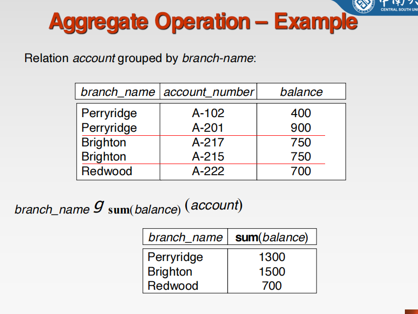


## 元组关系演算与域关系演算

> 在 ch 2 6


# ch2 6

## 关系演算

1. 是一种非过程化查询语言-A nonprocedural query language
2. 是以数理逻辑中的谓词演算为基础
3. 按照谓词变量的不同，可分为元组关系演算域关系演算
   - 元组关系演算的谓词变量是元组演算
   - 关系域演算的谓词变量是域变量

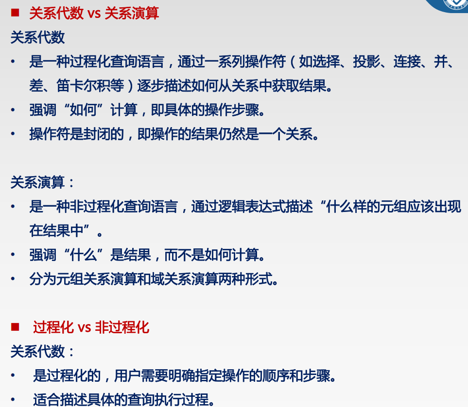

## 元组关系演算

元组关系演算是以**元组变量** 作为谓词变量的基本对象 。你可以把它理解为：我们操作的基本单位是一整行（一个元组）。

#### 基本形式

查询表达式的基本形式为： {t∣P(t)} 

- **t**: 是一个元组变量。
- **P(t)**: 是一个以元组变量 t 为参数的**公式 (Formula)**，这个公式描述了结果元组 t 必须满足的条件。
- **含义**: 结果是所有使得公式 P(t) 为真的元组 t 的集合。

#### 公式 P(t) 的构成

公式 P(t) 是由原子公式、逻辑运算符和量词递归构成的 。

- **原子公式 (Atomic Formula)**:

  - `t ∈ r`: 元组 t 是关系 r 中的一个元组。
  - `t[A] θ c`: 元组 t 的属性 A 的值与常量 c 满足比较关系 θ (如 `=`、`>`、`<`)。
  - `t[A] θ u[B]`: 元组 t 的属性 A 与元组 u 的属性 B 的值满足比较关系 θ。

- **逻辑运算符**:

  - `¬`(非)、`∧` (与)、`∨` (或)。如果 P1 和 P2 是公式，那么 `¬P1`、`P1 ∧ P2`、`P1 ∨ P2`也是公式 


- **量词**:

  - 存在量词 `∃` (Exists): 

    ```
    ∃t ∈ r (P(t))
    ```

    表示关系 r 中存在一个元组 t 使得 P(t) 为真 
    
  - 全称量词 `∀` (For All): 

    ```
    ∀t ∈ r (P(t))
    ```

    表示关系 r 中所有元组 t 都使 P(t) 为真 
    
  - 使用了量词的元组变量被称为**约束变量**，否则称为**自由变量** 

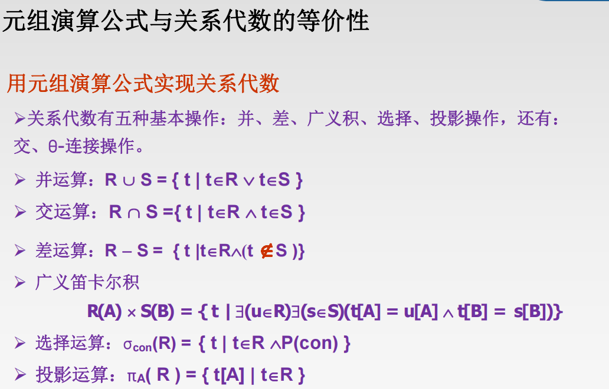

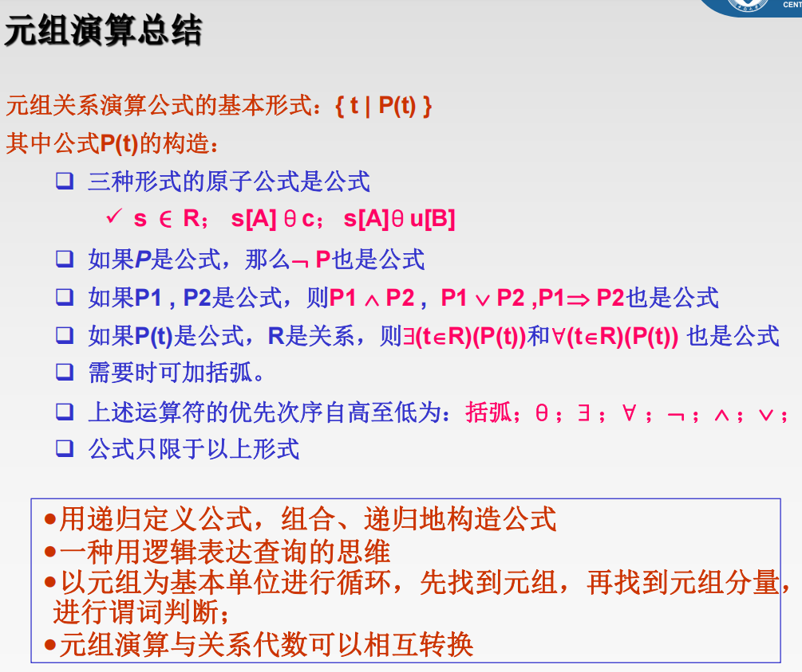


## 域关系演算

域关系演算是以**域变量** 作为谓词变量的基本对象 。你可以把它理解为：我们操作的基本单位是每一列中的具体值（一个域变量）。

#### 基本形式

查询表达式的基本形式为： {<x1,x2,...,xn>∣P(x1,x2,...,xn)} 

- **x1,x2,...,xn**: 是域变量，代表不同属性列的值。
- **P(x1,x2,...,xn)**: 是一个以域变量为参数的公式。
- **含义**: 结果是由域变量 x1,x2,...,xn 构成的元组的集合，这些元组满足公式P的条件。

#### 公式 P 的构成

- 原子公式:
  - `<x_1, x_2, ..., x_n> ∈ R`: 由域变量组成的元组属于关系 R。
  - `x θ c`: 域变量 x 与常量 c 满足比较关系 θ。
  - `x θ y`: 域变量 x 与域变量 y 满足比较关系 θ。
- **逻辑运算符和量词**: 与元组关系演算相同，但作用于域变量。

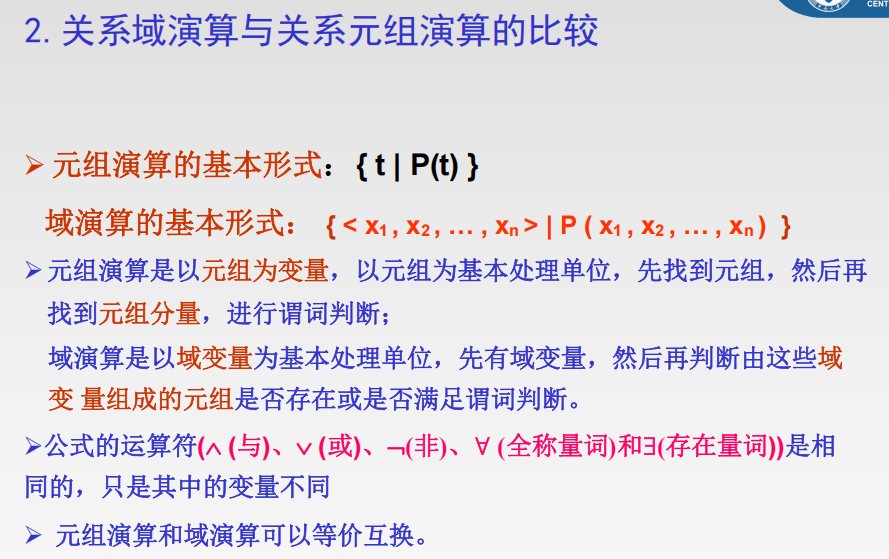


## 两者比较

| 特征         | 元组关系演算                                       | 域关系演算                                                   |
| ------------ | -------------------------------------------------- | ------------------------------------------------------------ |
| **基本变量** | 元组变量 (Tuple Variable)，如 `t`、`u`             | 域变量 (Domain Variable)，如 `x`、`y`                        |
| **处理单位** | 整个元组（一整行）                                 | 单个属性值（单元格的值）                                     |
| **查询形式** | {t∣P(t)}                                           | {<x1,...,xn>∣P(x1,...,xn)}                                   |
| **思维方式** | 先找到满足条件的**元组**，再从元组中取出所需属性。 | 先找到满足条件的**属性值的组合**，这些值的组合构成结果元组。 |
| **表达能力** | 在安全表达式范围内，两者表达能力**等价** 。        | 在安全表达式范围内，两者表达能力**等价** 。                  |

> 简单来说，**元组演算**更像是在说：“给我**那些**符合条件的**行**”，而**域演算**更像是在说：“给我**那些**符合条件的**值的组合**”。虽然实现方式不同，但它们都能描述相同的查询需求，并且共同构成了关系数据库查询语言（如SQL）的理论基础 。


# ch3 4

### SQL 概览

SQL (Structured Query Language) 是一种集**数据定义 (DDL)**、**数据操纵 (DML)** 和 **数据控制 (DCL)** 于一体的综合性、非过程化数据库语言 1。它的主要操作由 `Create`、`Alter`、`Drop`、`Insert`、`Delete`、`Update`、`Select`、`Grant`、`Revoke` 等关键字引导 2。


------

### 数据定义语言 (DDL)

DDL用于定义和管理数据库对象（如表、约束、视图等）的结构

#### 数据类型

SQL支持多种数据类型来定义列的取值范围

- 字符串: `char(n)`(定长), `varchar(n)`(变长), `text`

- 数值: `int`, `smallint`, `bigint`(整数)`numeric(p,d)`(定点数)`real`, `float`(浮点数)

- 日期/时间: `date`, `time`, `datetime`

- 其他: `boolean`, `xml`image`等

#### 表操作

- 创建表 (`CREATE TABLE`) : 定义一个新的关系（表），包括其所有属性（列）的名称、数据类型和完整性约束
  SQL

  ```sql
  create table instructor (
      ID          char(5),
      name        varchar(20) not null,
      dept_name   varchar(20),
      salary      numeric(8,2),
      primary key (ID), -- 主码约束
      foreign key (dept_name) references department, -- 外码约束
      check (salary > 2999) -- 检查约束
  );
  ```

- 完整性约束 (Integrity Constraints):
  - `not null`: 确保该列的值不能为空

  - `primary key`: 定义主码，唯一标识一个元组，其值不能为null 

  - `foreign key`: 定义外码，建立与另一个表主码的关联，保证参照完整性 

  - `unique`: 定义唯一键，确保该列的值唯一，但允许为空

  - `check (P)`: 确保列值满足谓词P所定义的条件

- 修改表 (`ALTER TABLE`): 用于向已存在的表添加、删除或修改列 
  - ```sql
    ALTER TABLE r ADD A D;
    ```
     -- 增加列
  - ```sql
    ALTER TABLE r DROP COLUMN A;
    ```

     -- 删除列

- 删除表 (`DROP TABLE`): 彻底删除一个表的所有结构和数据


------

### 数据查询语言 (DQL)

DQL是SQL的核心部分，用于从数据库中检索数据。

#### 基本查询结构

一个典型的SQL查询结构为 `SELECT ... FROM ... WHERE ...`，其逻辑上等价于关系代数：ΠA(σP(r1×r2×...)) 

- `SELECT` 子句: 指定查询结果中需要显示的列

  - \*  代表所有列 23

  - DISTINCT  用于去除结果中的重复行

  - 可使用算术表达式，如 `salary / 12`

  - 可使用 `AS` 为列或表达式创建别名

- `FROM` 子句: 列出查询所涉及的一个或多个表

- `WHERE` 子句: 设置行的筛选条件，对应关系代数中的“选择”操作 28

  - 支持 `AND`,`OR`, `NOT`逻辑运算符

  - 支持 

    ```sql
  BETWEEN a AND b
    ```

     进行范围判断
  
  - 支持 `LIKE` 进行模糊查询 (`%`匹配任意多个字符, `_` 匹配单个字符)        *`no like`表示不匹配*

- `ORDER BY` 子句: 对最终结果进行排序 (`ASC` 升序, `DESC` 降序) 

#### 连接查询

用于组合多个表中的信息

- 内连接 (`INNER JOIN`): 返回两个表中连接列相匹配的行

  。这是最常用的一种连接。

  | 特性              | `INNER JOIN`                     | `NATURAL JOIN`                   |
  | ----------------- | -------------------------------- | -------------------------------- |
  | **连接条件**      | 使用 `ON` 子句**明确指定**       | **自动推断**（所有同名列）       |
  | **列名要求**      | 不要求连接列同名                 | **必须**有同名列                 |
  | **结果列**        | 包含两个表的所有列，同名列会并存 | **合并**同名列，只显示一次       |
  | **安全性/可读性** | **高**，连接逻辑清晰可见         | **低**，连接逻辑是隐式的，有风险 |
  | **使用频率**      | **极高**，行业标准               | **极低**，不推荐在生产环境使用   |

  `JOIN` 等价于 `INNER JOIN`

- 外连接 (`OUTER JOIN`): 除了返回匹配的行，还会返回一个表中没有匹配上的行，未匹配的列用`NULL`填充

  - `LEFT JOIN`: 保留左表的所有行

  - `RIGHT JOIN`: 保留右表的所有行

  - `FULL JOIN`: 保留两个表的所有行
  
- 连接条件:

  - `ON <predicate>`: 明确指定连接条件，如 

    ```sql
    ON loan.loan_number = borrower.loan_number
    ```
  
  - `USING (A1, ...)`: 当连接列同名时，可使用 `USING` 简化 `ON`

  - `NATURAL JOIN`: 自动在所有同名列上进行等值连接，并合并同名列 41

#### 集合操作

- `UNION`: 合并两个查询的结果，并自动去重

  ```sql
UNION ALL
  ```

   保留所有行（不去重）

- `INTERSECT`: 返回两个查询结果的交集，并去重

- `EXCEPT`: 返回在第一个查询结果中但不在第二个中的行，并去重

  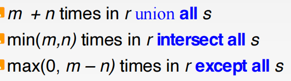

#### 聚集函数与分组

- 聚集函数: 对一组值进行计算返回单个值，如 `AVG`, `MIN`, `MAX`, `SUM`, `COUNT`
  
  > 聚集函数会忽略 `NULL`值（`COUNT(*)`除外）


- `GROUP BY` 子句: 将结果集按一个或多个列进行分组，以便对每个组应用聚集函数

- `HAVING` 子句: 用于对分组后的结果进行筛选，其作用于组，而 `WHERE`作用于行

| 特性                 | `WHERE`                   | `HAVING`                       |
| -------------------- | ------------------------- | ------------------------------ |
| **作用对象**         | **单条数据行** (原始数据) | **数据分组** (聚合后)          |
| **执行时机**         | **`GROUP BY` 之前**       | **`GROUP BY` 之后**            |
| **能否使用聚合函数** | ❌ **不能**                | ✅ **可以**                     |
| **依赖关系**         | 独立，不依赖 `GROUP BY`   | 几乎总是与 `GROUP BY` 一起使用 |


>
> ### `WHERE` 与 `HAVING` 的结合使用
>
> 在一个查询中同时使用 `WHERE` 和 `HAVING` 是非常常见的，它们分别在不同阶段完成过滤任务。
>
> **SQL查询执行顺序（简化版）**： `FROM` -> `WHERE` -> **`GROUP BY`** -> **`HAVING`** -> `SELECT` -> `ORDER BY`
>
> #### **示例**
>
> **需求**：统计 **2025年**的订单中，总销售额**超过400元**的城市。
>
> **查询**：
>
> ```sql
> SELECT
>     city,
>     SUM(amount) AS total_amount
> FROM
>     orders
> WHERE
>     YEAR(order_date) = 2025 -- 第1步过滤：只保留2025年的订单记录
> GROUP BY
>     city                     -- 第2步分组：对剩下的记录按城市分组
> HAVING
>     SUM(amount) > 400;       -- 第3步过滤：只保留总额>400的分组
> ```


#### 子查询

子查询是嵌套在另一个SQL查询中的`SELECT`语句

- `IN`: 测试一个值是否存在于子查询返回的集合中

- `SOME` / `ANY`: 与比较运算符连用，表示与子查询结果中的至少一个值满足比较关系

- `ALL`: 与比较运算符连用，表示与子查询结果中的所有值都满足比较关系

- `EXISTS`: 测试子查询的结果集是否不为空

- 派生关系: 在`FROM`子句中使用子查询，可以将其结果作为一个临时表来使用

| 对比项                 | 简单等于号 `=`       | `EXISTS`                     | `IN` / `=SOME` / `=ANY`  |
| ---------------------- | -------------------- | ---------------------------- | ------------------------ |
| **比较对象**           | 一个值 vs **一个值** | 一个值 vs **一个查询结果集** | 一个值 vs **一个值列表** |
| **核心逻辑**           | 完全相等             | **存在性**判断               | **成员资格**判断         |
| **能否处理多行子查询** | ❌ **不能**           | ✅ **可以**                   | ✅ **可以**               |

------

### 数据操纵语言 (DML)

DML用于修改数据库中的数据

- `INSERT INTO ... VALUES ...`: 插入一行指定值的数据

- `INSERT INTO ... SELECT ...`: 将一个查询的结果集插入到表中

  - 语法格式

    > #### 语法格式
    >
    > PPT中提到了两种主要的使用方式：
    >
    > 1. **插入指定的元组值**:
    >
    >    ```sql
    >    INSERT INTO table_name (column1, column2, ...)
    >    VALUES (value1, value2, ...);
    >    ```
    >
    >    - 这种方式直接提供要插入的一行数据。列名列表是可选的，但为了清晰和稳定，建议总是写上。
    >
    > 2. **插入子查询的结果**:
    >
    >    ```sql
    >    INSERT INTO table_name
    >    SELECT ... FROM ... WHERE ...;
    >    ```
    >
    >    - 这种方式会将 `SELECT` 语句查询出的所有结果行一次性插入到目标表中。

- `UPDATE ... SET ... WHERE ...`: 更新满足`WHERE`条件的行中的列值

  - 语法格式

    > #### 语法格式
    > ```sql
    > UPDATE table_name
    > SET column1 = value1, column2 = value2, ...
    > WHERE condition;
    > ```
    >
    > - `SET` 子句指定要修改的列和它们的新值。
    > - `WHERE` 子句指定要更新哪些行。**如果省略 `WHERE` 子句，表中所有的行都会被更新！**

- `DELETE FROM ... WHERE ...`: 删除满足`WHERE`条件的行

  - 语法格式

    > #### 语法格式
    > ```sql
    > DELETE FROM table_name
    > WHERE condition;
    > ```
    >
    > - `WHERE` 子句指定要删除哪些行。**如果省略 `WHERE` 子句，表中所有的数据都将被删除！**

------

### 视图 (Views)

视图是一个**虚拟表**，其内容由查询定义，本身不存储数据

- 创建: 

  ```sql
CREATE VIEW view_name AS <query expression>
  ```

- 优点: 简化复杂查询、提供数据安全性（隐藏部分数据）

- 更新: 只有在简单的、基于单个基表的视图上才能进行数据修改操作

  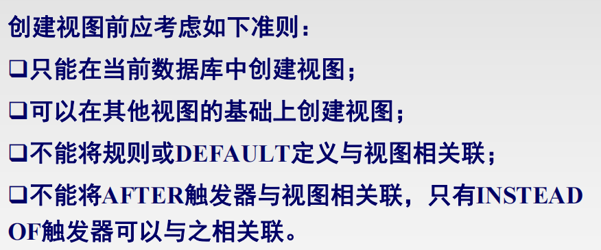

  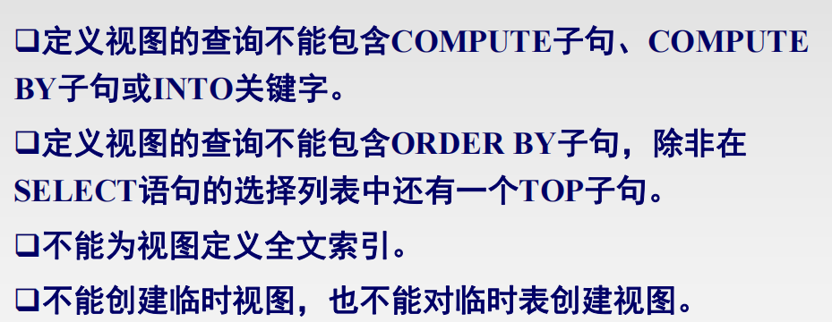
  
  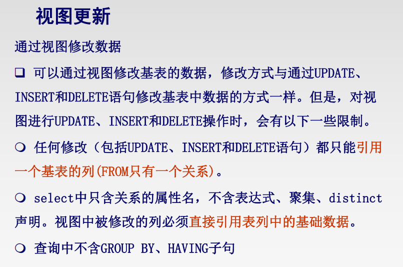

------

### 数据控制语言 (DCL)

DCL用于授予或撤销用户对数据库对象的访问权限。

- `GRANT`: 授予权限

  ```sql
GRANT <privilege list> ON <object> TO <user list>
  ```

  。可使用 
  
  ```sql
WITH GRANT OPTION
  ```

   允许被授权者再授权 

- `REVOKE`: 撤销权限。

  ```sql
  REVOKE <privilege list> ON <object> FROM <user list>
  ```

| 约束类型          | 描述                                                         | 示例                                            | 
| ----------------- | ------------------------------------------------------------ | ----------------------------------------------- | 
| **`NOT NULL`**    | **非空约束**：确保列中的值永远不为 `NULL`。                  | `name VARCHAR(20) NOT NULL`                     |
| **`UNIQUE`**      | **唯一性约束**：保证在一个或多个列上的所有值都是唯一的。它定义了一个**候选码**，但允许值为 `NULL`（与主码不同）。 | `UNIQUE (A1, A2, ..., Am)`                      |
| **`PRIMARY KEY`** | **主码约束**：唯一标识表中的每一行。它隐含了 `UNIQUE` 和 `NOT NULL` 两种约束。 | `PRIMARY KEY (ID)`                              |
| **`FOREIGN KEY`** | **外码（参照）约束**：确保一个表中的列值必须在另一个表的主码（或唯一键）中存在，或者为 `NULL`。它用于强制**参照完整性**。 | `FOREIGN KEY (dept_name) REFERENCES department` |
| **`CHECK`**       | **检查约束**：一个谓词（Predicate），用于限制列中可以接受的值。只有当谓词 `P` 的计算结果为 `TRUE` 时，数据才能被插入或更新。 | `CHECK (assets >= 0)`                           |

断言是一种更强大的完整性约束，它表达了一个我们希望**整个数据库在任何时候都必须满足**的条件 。

- **与 `CHECK` 的区别**:
  - `CHECK` 约束只作用于**单个表**的行。
  - `ASSERTION` 作用于**整个数据库**，可以涉及多个表之间的复杂关系。

| 特性         | `CHECK` 约束                             | `ASSERTION` 断言                     |
| ------------ | ---------------------------------------- | ------------------------------------ |
| **作用范围** | 单个表或域                               | 整个数据库，可跨多个表               |
| **触发时机** | 当其所在的表发生 `INSERT` 或 `UPDATE` 时 | 任何可能导致断言失效的数据库更新操作 |
| **性能开销** | 相对较小                                 | 可能非常大，影响系统性能             |

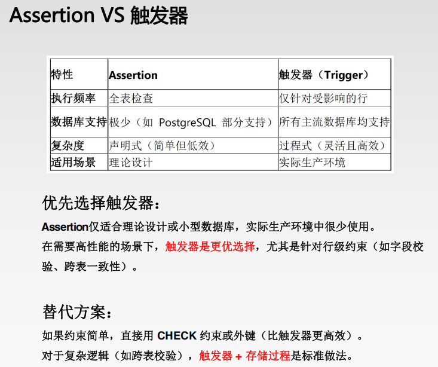


------

### 流程控制语句

#### 变量

在存储过程、函数等程序块中，可以使用变量来临时存储数据

- **局部变量 (Local Variables)**

  - 作用: 作用范围仅限于其被定义的 

    ```
    BEGIN...END
    ```

     语句块内

  - MySQL 语法:SQL

    ```mysql
    -- 1. 声明变量
    DECLARE var_name data_type [DEFAULT default_value];
    
    -- 2. 赋值
    SET var_name = value;
    -- 或者使用 SELECT ... INTO
    SELECT column_name INTO var_name FROM table_name WHERE condition;
    ```

  - **与SQL Server区别**: SQL Server 中局部变量以 `@` 开头。在 MySQL 的存储过程中，局部变量直接用 `DECLARE` 声明，不需要 `@`。以 `@` 开头的变量（如 `@myvar`）是用户自定义的会话变量，其作用域是整个用户会话。

- **全局变量 (Global Variables)**

  - 作用: 反映服务器的当前状态，由系统定义，用户不能创建
  - **MySQL 语法**: 全局变量以 `@@` 开头，例如 `@@version`, `@@autocommit`。这一点与 SQL Server 类似。

------

#### 条件与分支语句

用于根据条件判断来控制程序的执行流程

- **`IF` 语句**

  - **作用**: 根据布尔表达式的结果来执行不同的代码块。

  - MySQL 语法:

    ```mysql
    IF condition THEN
       statements;
    [ELSEIF another_condition THEN
       statements;]
    [ELSE
       statements;]
    END IF;
    ```

  - **与SQL Server区别**: MySQL 的 `IF` 语句需要 `THEN` 和 `END IF;` 关键字来明确标识代码块的开始和结束，这是与 T-SQL 的主要区别

- **`CASE` 语句**

  - 作用: 用于处理多重条件判断，比嵌套的`IF` 语句更清晰

    ```mysql
    -- 简单 CASE 表达式
    CASE case_value
        WHEN when_value1 THEN statements;
        WHEN when_value2 THEN statements;
        ...
        [ELSE statements;]
    END CASE;
    
    -- 搜索 CASE 表达式
    CASE
        WHEN search_condition1 THEN statements;
        WHEN search_condition2 THEN statements;
        ...
        [ELSE statements;]
    END CASE;
    ```

------

#### 循环语句

用于重复执行一段 SQL 代码块

- **`WHILE` 语句**

  - **作用**: 当指定的条件为真 (`TRUE`) 时，重复执行循环体内的语句。

  - MySQL 语法:

    ```mysql
    [label:] WHILE condition DO
        statements;
    END WHILE [label];
    -- 普通的while不需要，需要用上LEAVE或ITERATE时才有[label:]和[label]
    ```
  
- **循环控制**

  - **`LEAVE`**: 用于**跳出**整个循环或带有标签的 `BEGIN...END` 块。相当于 T-SQL 中的 `BREAK`。
  - **`ITERATE`**: 用于**跳过**当前循环的剩余部分，直接进入下一次循环。相当于 T-SQL 中的 `CONTINUE`。
  - **`LOOP` 语句**: MySQL 还支持 `LOOP...END LOOP` 结构，可以实现一个简单的无限循环，通常需要内部的 `LEAVE` 语句来退出。

- **示例 (MySQL 版本)**:

  ```mysql
  DECLARE i INT DEFAULT 0;
  my_loop: WHILE i < 10 DO
      SET i = i + 1;
      IF i = 5 THEN
          ITERATE my_loop; -- 跳过当i=5时的打印
      END IF;
      IF i > 8 THEN
          LEAVE my_loop; -- 当i>8时退出循环
      END IF;
      -- 此处可以执行其他语句，如打印i
  END WHILE my_loop;
  ```

------

#### 其他流程控制

- `GOTO` 语句: PPT中提到了 `GOTO` 语句

  注意：MySQL 的存储过程不支持 `GOTO` 语句

  应使用 `IF`、`CASE` 和循环结构来组织逻辑。

- `RETURN` 语句: PPT中提到 `RETURN` 用于无条件终止过程

  注意：在 MySQL 中，`RETURN` 语句仅用于存储函数 (Function) 中返回值

  。要从存储过程 (Procedure) 中退出，应使用 `LEAVE` 语句配合一个标记在最外层 

  ```
  BEGIN...END
  ```

   块的标签。

------

#### 存储过程

存储过程是预先编译好并存储在数据库中的一组SQL语句的集合，可通过名称调用执行

- 优点: 提高性能、模块化设计、确保数据库安全

- 缺点: 可移植性差、调试和维护相对困难

- MySQL 语法:

  ```mysql
  SHOW PROCEDURE STATUS; -- 查看当前数据库的存储过程
  SHOW CREATE PROCEDURE PROCEDUCE_NAME; -- 查看存储工程的具体代码
  ```
  
  
  
  ```mysql
  DELIMITER // -- 临时修改语句结束符
  
  CREATE PROCEDURE procedure_name(
      [IN | OUT | INOUT] param_name data_type,
      ...
  )
  BEGIN
      -- 变量声明
      DECLARE var_name data_type;
      -- 过程体 (SQL语句和流程控制)
      statements;
  END //
  
  DELIMITER ; -- 恢复默认结束符
  
  -- 调用存储过程
  CALL procedure_name(arguments);
  
  -- 删除存储过程
  DROP PROCEDURE [IF EXISTS] procedure_name;
  ```
  
  - **参数模式**: `IN` (输入参数，默认), `OUT` (输出参数), `INOUT` (输入输出参数)。
  
  | 命令                | 作用                                              |
  | ------------------- | ------------------------------------------------- |
  | **`DELIMITAER //`** | 告诉客户端：**“请用 `//` 作为新的指令结束符”**    |
  | **`END //`**        | 标志着**整个 `CREATE PROCEDURE` 语句**的结束      |
  | **`DELIMITER ;`**   | 告诉客户端：**“现在恢复使用 `;` 作为指令结束符”** |

------

#### 条件和异常处理程序

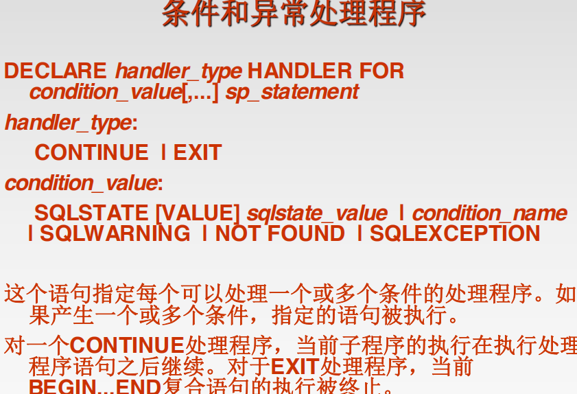

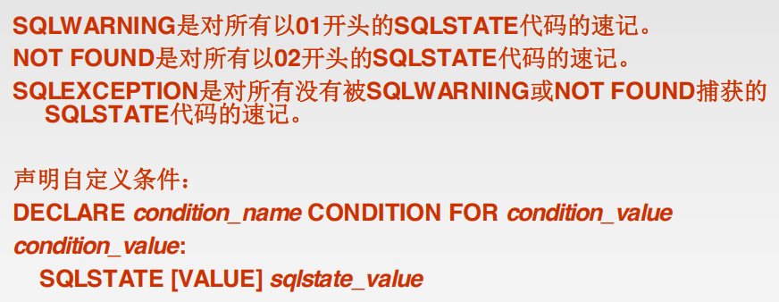

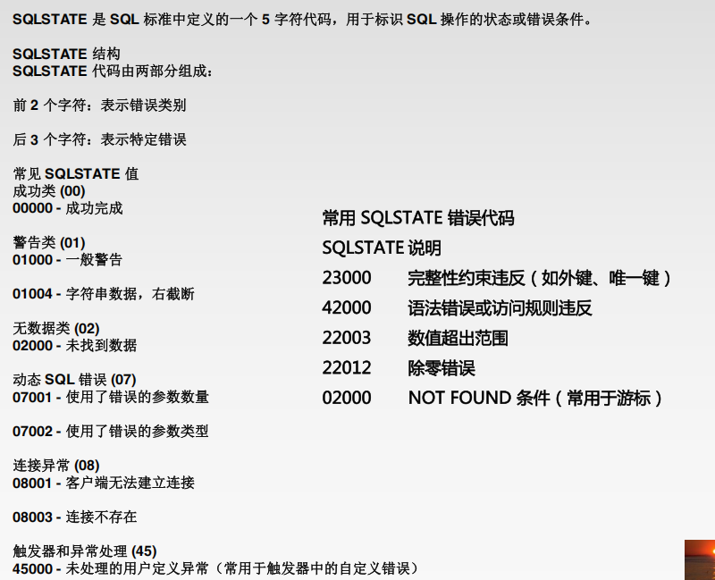

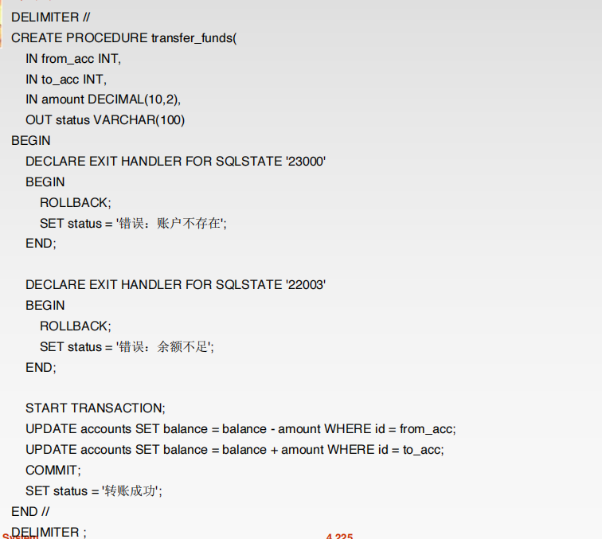

----

#### 触发器

触发器是与表相关联的、在特定事件（`INSERT`, `UPDATE`, `DELETE`）发生时自动执行的一类特殊的存储过程

- **作用**: 常用于强制复杂的业务规则和数据完整性。

- **触发时机**: `BEFORE` (事件发生前) 或 `AFTER` (事件发生后)。

- 触发器只能在永久表上创建，不能对临时表或视图创建触发器

  - 临时表

    ```mysql
    CREATE TEMPORARY TABLE temp_table_name (
        column1 data_type,
        column2 data_type,
        ...
    );
    ```

- `OLD` 和 `NEW`:

  - 在 `INSERT` 触发器中，`NEW` 代表将要插入的新行。
  - 在 `DELETE` 触发器中，`OLD` 代表被删除的旧行。
  - 在 `UPDATE` 触发器中，`OLD` 代表更新前的行，`NEW` 代表更新后的行。
  
- MySQL 语法:

  

  ```mysql
  CREATE TRIGGER trigger_name
  {BEFORE | AFTER} {INSERT | UPDATE | DELETE}
  ON table_name FOR EACH ROW
  BEGIN
      -- 触发器动作体
      -- 例如: IF NEW.score < 0 THEN SET NEW.score = 0; END IF;
  END;
  
  -- OLD.xxx, NEW.xxx
  ```
  
- **注意**: 一个表上同一事件、同一触发时机的触发器只能有一个。例如，不能有两个 `BEFORE INSERT` 触发器。


------

#### 游标

游标提供了一种对查询结果集进行逐行处理的方法，是面向集合的 SQL 与面向行的程序设计之间的桥梁 13。


- **使用步骤**:

  1. **声明游标 (`DECLARE CURSOR`)**: 定义一个游标并将其与一个 `SELECT` 语句关联。
  2. **声明 `NOT FOUND` 处理器 (`HANDLER`)**: 定义一个处理器，用于在游标取不到数据时（即遍历结束时）执行特定操作，如设置一个标志位。
  3. **打开游标 (`OPEN`)**: 执行 `SELECT` 语句，将结果集加载到游标中。
  4. **提取数据 (`FETCH`)**: 从游标中提取一行数据到变量中。
  5. **处理数据**: 在循环中对提取出的行进行操作。
  6. **关闭游标 (`CLOSE`)**: 释放游标占用的资源，但游标定义仍在。
  7. **(可选) 释放游标 (`DEALLOCATE`)**: 如果不再需要，可以彻底删除游标定义。

- **MySQL 语法示例**:

  ```mysql
  DELIMITER //
  CREATE PROCEDURE process_students()
  BEGIN
      DECLARE done INT DEFAULT FALSE;
      DECLARE s_id INT;
      DECLARE s_name VARCHAR(255);
  
      -- 1. 声明游标
      DECLARE cur_student CURSOR FOR SELECT id, name FROM student;
  
      -- 2. 声明 NOT FOUND 处理器
      DECLARE CONTINUE HANDLER FOR NOT FOUND SET done = TRUE;
  
      -- 3. 打开游标
      OPEN cur_student;
  
      read_loop: LOOP
          -- 4. 提取数据
          FETCH cur_student INTO s_id, s_name;
  
          -- 判断是否遍历结束
          IF done THEN
              LEAVE read_loop;
          END IF;
  
          -- 5. 处理数据
          -- (例如: UPDATE another_table SET ... WHERE student_id = s_id;)
      END LOOP;
  
      -- 6. 关闭游标
      CLOSE cur_student;
  END //
  DELIMITER ;
  ```


# ch7

E-R模型是一种**概念数据模型**，用于在数据库设计的**概念设计阶段**描述现实世界的数据及其相互关系，它独立于任何具体的数据库管理系统 (DBMS)

### 数据库设计过程

1. **需求设计阶段 (Requirement-design phase)**: 与领域专家和用户沟通，明确用户需求。
2. **概念设计阶段 (Conceptual-design phase)**: 使用E-R模型将用户需求转换为概念化的图示（E-R图）。
3. **逻辑设计阶段 (Logical-design phase)**: 将E-R图转换为具体的数据库模式（如关系模式）。
4. **物理设计阶段 (Physical-design phase)**: 确定数据的物理存储结构和存取方法。

------

### E-R模型的核心概念

#### 实体与实体集

- 实体 (Entity): 现实世界中一个可区分于其他对象的“事物”或“对象”

  。例如，一个特定的学生、一门特定的课程。

- 实体集 (Entity Set): 具有相同类型和相同属性的所有实体的集合

  。例如，所有学生的集合、所有课程的集合。在E-R图中用矩形表示

- 属性 (Attribute): 实体所具有的某一特性

  。例如，学生的“姓名”、“学号”。在E-R图中用椭圆形表示

#### 属性的类型

- **复合属性 (Composite)**: 可以分解为更小部分的属性。例如，“地址”可以分解为“省”、“市”、“街道”。
- **多值属性 (Multivalued)**: 一个实体可以有多个值的属性。例如，一个人的“电话号码”可能有多个。在E-R图中用**双椭圆**表示。
- **派生属性 (Derived)**: 可以从其他属性计算得出的属性。例如，“年龄”可以由“出生日期”计算得出。在E-R图中用**虚线椭圆**表示。

#### 联系与联系集

- 联系 (Relationship): 多个实体之间的相互关联

- 联系集 (Relationship Set): 同一类型联系的集合，表示实体集之间的关联规则。
  - 在E-R图中用菱形表示

- 联系的度 (Degree): 参与一个联系集的实体集的数量

  - 最常见的是二元联系（涉及两个实体集）。

- 角色 (Roles): 当同一个实体集在一次联系中扮演不同角色时，需要用角色名加以区分。例如，在“员工”实体集内部的“领导”联系中，可分为“管理者”和“被管理者”两个角色 。

------

### E-R图中的约束

约束用于更精确地定义数据模型。

#### 映射基数

描述一个实体通过联系集能与另一个实体集中的多少个实体相关联。主要有四种类型：

- **一对一 (One-to-One)**
- **一对多 (One-to-Many)**
- **多对一 (Many-to-One)**
- **多对多 (Many-to-Many)**

在E-R图中，通常用**带箭头的线表示“一”**，用**不带箭头的线表示“多”**


#### 参与约束

- 全部参与 (Total Participation): 实体集中的每一个实体都必须参与到联系中。
  - 在E-R图中用双线连接表示

- **部分参与 (Partial Participation)**: 实体集中的实体可以不参与联系。
  - 用**单线**表示


#### 码 (Keys)

- 超码 (Super Key): 能唯一确定一个实体的一个或多个属性的集合
- 候选码 (Candidate Key): 最小的超码，不含多余属性
- 主码 (Primary Key): 从候选码中选定的一个，用于唯一标识实体。
  - 在E-R图中，主码的属性名下会加下划线


------

### 弱实体集

- 定义: 一个没有自己主码的实体集，其存在依赖于另一个“标识实体集”

- 标识关系 (Identifying Relationship): 弱实体集与其标识实体集之间的联系，必须是多对一且弱实体集全部参与

  - 在E-R图中用双菱形表示

- 分辨符 (Discriminator): 也称部分码，是弱实体集中能区分依赖于同一个强实体的那些实体的属性集。

  - 在E-R图中用虚下划线表示

- 弱实体集的主码: 由其所依赖的标识实体集的主码加上自身的分辨符共同构成
  - 在E-R图中，弱实体集本身用双矩形表示


------

### 扩展E-R特性

#### 特殊化与一般化

- 特殊化 (Specialization): 自顶向下的设计过程，将一个实体集（父类）根据某些特征划分为若干个子实体集（子类）
- 一般化 (Generalization): 自底向上的设计过程，将多个具有共同特征的实体集抽象成一个更高级的实体集（父类）
- 两者在E-R图中都用一个三角形表示，标记为 ISA（“is a”的缩写）
- 属性继承: 子类实体集会继承父类实体集的所有属性和联系

#### 特殊化/一般化的约束

- 不相交/重叠约束 (`disjoint`/`overlapping`):
  - `disjoint`: 一个父类实体最多只能属于一个子类
  - `overlapping`: 一个父类实体可以同时属于多个子类
- 完全/部分约束 (`total`/`partial`):
  - `total`: 一个父类实体必须属于至少一个子类
  - `partial`: 一个父类实体可以不属于任何子类

------

### 从E-R模型到关系模式的转换

转换的基本原则：

1. 强实体集: 每个强实体集转换为一个独立的关系模式（表），其属性和主码与实体集对应
2. 弱实体集: 每个弱实体集转换为一个关系模式，其属性包括弱实体集自身的属性，以及其所依赖的强实体集的主码（作为外码和主码的一部分）
3. 多对多联系: 转换为一个独立的关系模式，其主码由参与联系的各实体集的主码组合而成，并包含联系自身的属性
4. 一对多联系: 不创建新表，而是在“多”端实体集对应的关系模式中，增加一个属性，该属性是“一”端实体集的主码（作为外码）
5. 一对一联系: 与一对多类似，可以将任意一端的主码作为外码放入另一端的关系模式中
6. 多值属性: 转换为一个独立的关系模式，其主码由原实体集的主码和该多值属性共同构成
7. 特殊化/一般化: 通常有两种处理方法，一是为父类和每个子类都创建一个关系模式；二是只为每个子类创建关系模式，每个模式包含父类的所有继承属性

| E-R 图组件   | 转换规则                     |
| ------------ | ---------------------------- |
| **实体**     | 转换为一张**表**             |
| **复合属性** | 转换为多个**列**             |
| **多值属性** | 转换为一张**新表**           |
| **派生属性** | **不转换**为列，通过查询计算 |
| **1:1 关系** | 在任意一方添加**外键**       |
| **1:N 关系** | 在 **"N" 端**添加外键        |
| **M:N 关系** | 转换为一张**新的中间表**     |

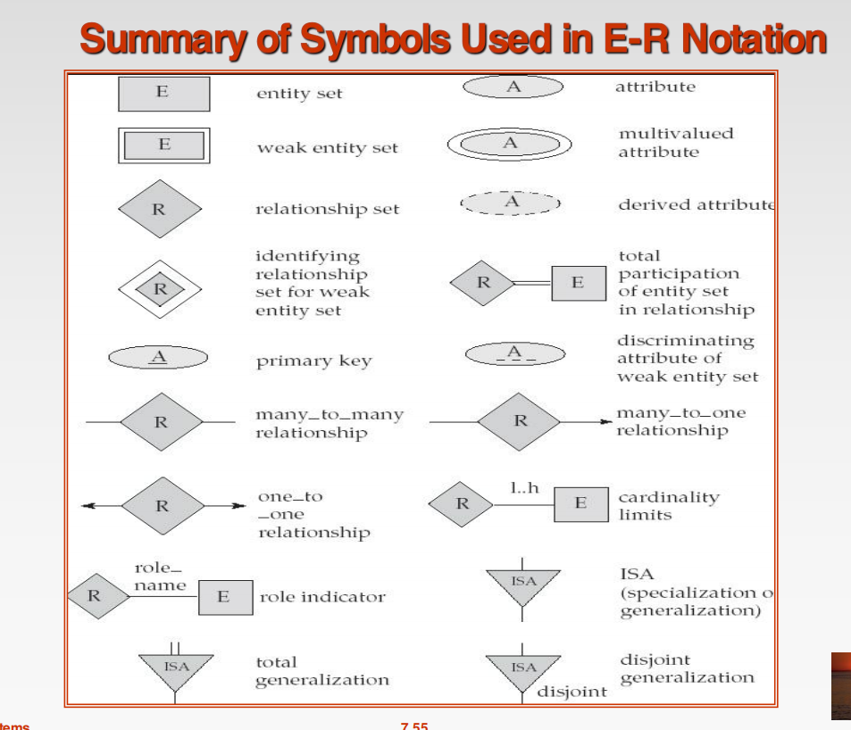

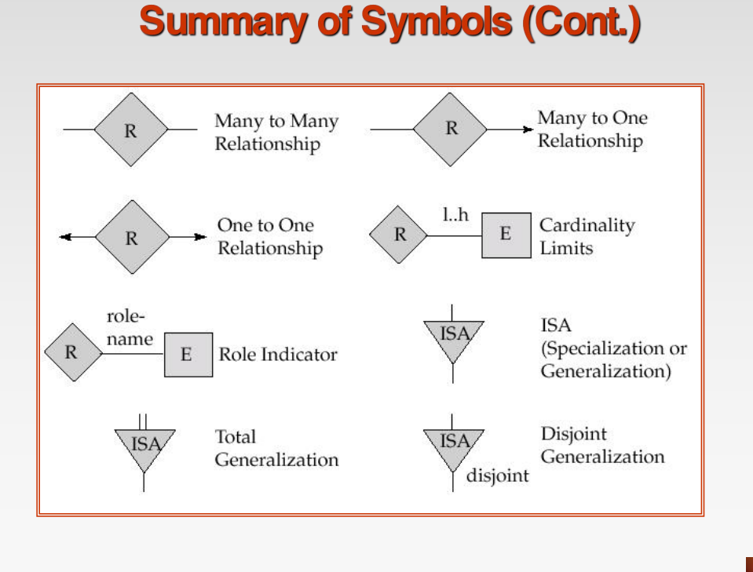

----

E-R图三条设计原则：

> - **相对原则**：关系、 实体、 属性、 联系等,是对同一对象抽象过程的不同解释和理解。即建模过程实际上是一个对对象的抽象过程,不同的人或同一人在不同的情况下,抽象的结果可能不同。
>
> - **一致原则**：同一对象在不同的业务系统中的抽象结果要求保持一致。业务系统是指建立系统的各子系统。如财务系统与人事系统
>
> - **简单原则**：为简化E―R模型,现实世界的事物能作为属性对待的,尽量归为属性处理。


# ch8

规范化 (Normalization) 是一套理论和方法，用于设计结构良好、冗余度低、逻辑清晰的关系模式（表结构），以避免数据在更新、插入、删除时发生异常。

### 为什么需要规范化？

一个设计不佳的关系模式通常会存在以下问题：

- **数据冗余 (Data Redundancy)**: 同样的信息被重复存储，浪费存储空间。
- **更新异常 (Update Anomaly)**: 修改一项数据时，需要修改多行记录，一旦遗漏就会导致数据不一致。
- **插入异常 (Insertion Anomaly)**: 想要插入某个实体的信息，但由于其部分属性为空（尤其是作为主码一部分的属性），导致无法插入。例如，一个新开设的课程还没有学生选修，就无法将课程信息插入到 `(学号, 课程号, 成绩)` 这种模式中。
- **删除异常 (Deletion Anomaly)**: 删除某条记录时，连带删除了另一份不想丢失的信息。例如，某学生退选了最后一门课，删除其选课记录时，可能把该学生的基本信息也删除了。

**核心思想**：通过**分解 (Decomposition)** 关系模式，将一个包含多个主题的大表拆分成多个只描述一个主题的小表，来解决以上问题。

------

### 理论基础：函数依赖 (FD)

函数依赖是属性之间的一种约束关系，是进行规范化判断的理论依据。

- **定义**: 在关系R中，对于属性（或属性组）X和Y，如果对于X的每一个具体值，Y都有一个**唯一**的值与之对应，则称Y**函数依赖**于X，记作 XtoY。其中X称为**决定因素**。
- **完全函数依赖 (Full Functional Dependency)**: 在 XtoY 中，如果X的任何一个真子集都不能决定Y，则称Y对X完全函数依赖。
- **部分函数依赖 (Partial Functional Dependency)**: 在 XtoY 中，如果X的某个真子集可以决定Y，则称Y对X部分函数依赖。**这是2NF要解决的问题**。
- **传递函数依赖 (Transitive Functional Dependency)**: 在 XtoY 和 YtoZ 中，如果Y不函数依赖于X，且Y不包含于X，则称Z对X传递函数依赖。**这是3NF要解决的问题**。


> 还有多值依赖和连接依赖

------

### 各级范式 (NF)

范式是关系模式满足的规范化程度的级别。一个高等级的范式必定满足所有比它低等级的范式（例如，3NF必定是2NF）。

#### 第一范式 (1NF)

- **定义**: 关系中的所有属性都是**原子性**的，即不可再分割。
- **要求**: 这是关系模型的基本要求。任何不满足1NF的表（例如，**某个字段包含多个值或组合值**）都应通过“行列转换”变为1NF。

#### 第二范式 (2NF)

- **定义**: 在满足1NF的基础上，消除所有**非主属性**对码（Candidate Key）的**部分函数依赖**。
- **目标**: 确保表中每一列都和整个主码相关，而不能只和主码的某一部分相关。
- 示例: 关系模式 `选课(学号, 课程号, 成绩, 学分)` ，主码是 `(学号, 课程号)` 
  - 其中 `(学号, 课程号) → 成绩` 是完全函数依赖。
  - 但 `课程号 → 学分`，导致 `(学号, 课程号) → 学分` 是部分函数依赖。
  - **分解为2NF**: `选课(学号, 课程号, 成绩)` 和 `课程(课程号, 学分)`。

#### 第三范式 (3NF)

- **定义**: 在满足2NF的基础上，消除所有**非主属性**对码的**传递函数依赖**。
- **目标**: 确保表中的非主属性之间不能存在依赖关系，所有非主属性都必须且只直接依赖于主码。
- 示例: 关系模式 `学生(学号, 姓名, 所在系, 系主任)` ，主码是 `学号` 
  - 其中存在函数依赖：`学号 → 所在系` 和 `所在系 → 系主任`。
  - 这就构成了 `系主任` 对 `学号` 的传递依赖。
  - **分解为3NF**: `学生(学号, 姓名, 所在系)` 和 `系(所在系, 系主任)`。

#### Boyce-Codd范式 (BCNF)

- **定义**: 在满足3NF的基础上，消除**所有属性**（包括主属性）对码的部分和传递依赖。更严格的定义是：对于任何非平凡的函数依赖 XtoY，X都必须是一个**超码 (Super Key)**。

- **目标**: 解决主属性内部或对非码属性的依赖问题，是更严格的3NF。

- **与3NF的区别**: 3NF允许决定因素不是码（只要被决定的不是主属性），而BCNF要求**所有决定因素都必须包含码**。

- 示例: 关系 

  ```
  授课(学生, 教师, 课程)
  ```

  ，假设一个教师只教一门课。

  - 存在函数依赖 `教师 → 课程`。
  - 候选码是 `(学生, 教师)` 和 `(学生, 课程)`。
  - 由于决定因素 `教师` 不是超码，所以该关系不满足BCNF（但满足3NF，因为课程是主属性）。

| 依赖类型           | 定义                                                         | 违反的范式 |
| ------------------ | ------------------------------------------------------------ | ---------- |
| **部分依赖**       | **非主属性**依赖于**组合码的一部分**                         | **2NF**    |
| **传递依赖**       | **非主属性**依赖于**另一个非主属性**                         | **3NF**    |
| **决定因素非超码** | 某个属性组 `X` 能决定 `Y`，但 `X` 本身不能唯一确定整行记录（不是超码）。这里的 `X` 和 `Y` **可以是主属性**。 | **BCNF**   |


#### 第四范式 (4NF)

- **理论基础**: **多值依赖 (Multivalued Dependency, MVD)**。当一个属性X的值可以对应**一组独立**的Y值和**一组独立**的Z值时，就存在多值依赖。记作 XtotoY。

- **定义**: 在满足BCNF的基础上，消除非平凡的且非函数依赖的多值依赖。

- **目标**: 将相互独立的多个多值属性分离到不同的关系中。

- 示例: 

  ```
  课程信息(课程, 教师, 参考书)
  ```

  ，如果一门课可由多个老师教，同时有多本参考书，且教师和参考书之间没有直接关系。

  - 存在多值依赖 `课程 →→ 教师` 和 `课程 →→ 参考书`。
  - **分解为4NF**: `授课(课程, 教师)` 和 `书目(课程, 参考书)`。

------

### 关系模式的分解准则

理想的分解需要满足两个核心性质：

1. **无损连接性 (Lossless Join)**: 分解后的关系必须能够通过自然连接（Natural Join）完全恢复出原始关系的信息，不能产生多余的元组（有损连接），也不能丢失信息。
2. **函数依赖保持性 (Dependency Preservation)**: 原始关系中所有的函数依赖，在分解后的各个关系中依然能够通过约束来体现。

**在实际应用中，有时为了达到更高的范式（如BCNF），可能会破坏函数依赖保持性。在这种情况下，通常会权衡利弊，选择满足3NF且保持函数依赖的分解方案。**

**总结**: 规范化的过程就是逐步消除不合适的依赖关系，使关系模式的结构更合理、更不易出错。通常，在实际设计中达到**3NF**或**BCNF**就已经足够。

好的，我们来根据 `数据库系统PPT-ch8-规范化.pdf` 的内容，从 **8.6节 函数依赖公理与模式分解** 开始进行一个全面且详细的总结。

这部分内容是数据库范式理论的数学基础，它解释了如何从已知的函数依赖推导出新的依赖，以及如何科学地分解关系模式。

### 函数依赖公理与模式分解

#### 函数依赖公理 (Armstrong公理) 

为了能够从一个给定的函数依赖集 F 推导出所有逻辑上被 F 蕴含的函数依赖，我们需要一套推导规则。Armstrong公理系统就是这样一套基础规则。

- A1 (自反律 - Reflexivity): 若属性集 Y 是属性集 X 的子集 (Y⊆X)，则 X→Y 成立。
  - **解释**: 这个规则是平凡的，一个属性集总能决定它自己或它的任何一部分。
- A2 (增广律 - Augmentation): 若 X→Y，则对于任意属性集 Z，都有 XZ→YZ 成立。
  - **解释**: 如果 X 能决定 Y，那么在 X 的基础上增加一些属性 Z，同样也能决定在 Y 基础上增加相同属性 Z 后的结果。
- A3 (传递律 - Transitivity): 若 X→Y 且 Y→Z，则 X→Z 成立。
  - **解释**: 函数依赖可以像链条一样传递。

基于这三条基本公理，可以推导出三个常用的推论 ：

- **合成规则 (Union Rule)**: 若 X→Y 且 X→Z，则 X→YZ。
- **分解规则 (Decomposition Rule)**: 若 X→YZ，则 X→Y 且 X→Z。
- **伪传递规则 (Pseudotransitivity Rule)**: 若 X→Y 且 YW→Z，则 XW→Z。

#### 属性闭包

属性闭包是进行函数依赖相关计算的核心工具。

- **定义**: 在关系模式 R(U, F) 中，被属性集 X 函数决定的**所有属性的集合**称为 X 关于函数依赖集 F 的闭包，记作 X+。 

- **作用**:

  - 判断一个函数依赖 X→Y 是否能被 F 推导出来，只需计算 X+，看 Y 是否是 X+ 的子集 (Y⊆X+)。
  - 计算候选码：如果一个属性集 X 的闭包 X+ 包含了关系 R 的所有属性，那么 X 就是 R 的一个**超码**。如果此时 X 又是最小的，那它就是一个**候选码**。

- **计算算法 **: 

  1. **初始化**: 令结果 `result` = X。
  2. **循环迭代**: 不断扫描函数依赖集 F 中的每一个函数依赖 Y→Z。
  3. **检查与合并**: 如果 Y 是当前 `result` 的子集 (Y⊆result)，就将 Z 合并到 `result` 中 (`result` = `result` ∪ Z)。
  4. **结束**: 重复第2步和第3步，直到 `result` 不再发生变化为止。最终的 `result` 就是 X+。

- **示例 **:

  - 关系 R(A,B,C,D,E,G)，F = {A→D, AB→C, BG→C, ED→G, C→E}。求 (AC)+。

  1. 初始化：`result` = {A, C}
  2. 第一轮扫描F:
     - 因为 A ⊆ {A,C}，根据 A→D，将 D 加入 `result`。`result` = {A, C, D}。
     - 因为 C ⊆ {A,C,D}，根据 C→E，将 E 加入 `result`。`result` = {A, C, D, E}。
  3. 第二轮扫描F:
     - 因为 ED ⊆ {A,C,D,E}，根据 ED→G，将 G 加入 `result`。`result` = {A, C, D, E, G}。
  4. 第三轮扫描F: `result` 不再变化。
  5. 最终结果：(AC)+={A,C,D,E,G}。

#### 最小覆盖

为了简化函数依赖集，我们通常需要找到一个与原集合等价的、最简化的版本，即最小覆盖。

- 定义: 一个函数依赖集 F 是最小的，如果它满足以下三个条件：
  1. F 中所有函数依赖的**右部都是单属性**。
  2. F 中没有函数依赖的**左部存在冗余属性**。
  3. F 中**没有冗余的函数依赖**。

#### 8.6.4 关系模式的分解

将一个关系模式分解为多个模式时，必须遵循两个基本准则，以确保分解的正确性。

- **无损连接性 (Lossless-Join Property)**

  - 定义: 分解不能丢失信息，即分解后的多个关系通过自然连接必须能

    精确地还原为原始关系。

  - 检验算法 (Tableau/矩阵法):构造一个 k 行 n 列的表（k为分解出的关系数，n为总属性数）。

    1. 如果属性 Aj 在关系 Ri 中，则表中第 i 行第 j 列填入符号 aj；否则填入 bij

    2. 反复利用给定的函数依赖集 F。对于F中的每个依赖 X→Y，在表中查找在 X 对应的列上值完全相同的行。如果找到了，就将这些行在 Y 对应的列上的值也变得相同。

    3. 如果经过反复修改后，表中出现了

       某一行全部为 aj 符号（即 a1,a2,...,an），则该分解是无损连接的。否则不是。

- **函数依赖保持性 (Dependency-Preserving Property)**

  - 定义: 原始关系中的所有函数依赖，在分解后的新关系中仍然能够被体现和强制执行。

  - **检验**: 需要检查原始的函数依赖集 F 中的每一个依赖，是否都能从分解后的各个关系模式的依赖集（即F在每个新关系上的投影）中推导出来。

  - 权衡: 一个好的分解必须是无损连接的

    。在此基础上，我们尽量追求保持函数依赖

    。但有时为了达到更高的范式（如BCNF），可能会牺牲依赖保持性。在这种情况下，通常会选择一个满足3NF的、既无损又保持依赖的分解方案。

   


- - - **一个无损连接的分解不一定具有依赖保持性；一个依赖保持的分解也不一定具有无损连接性。**

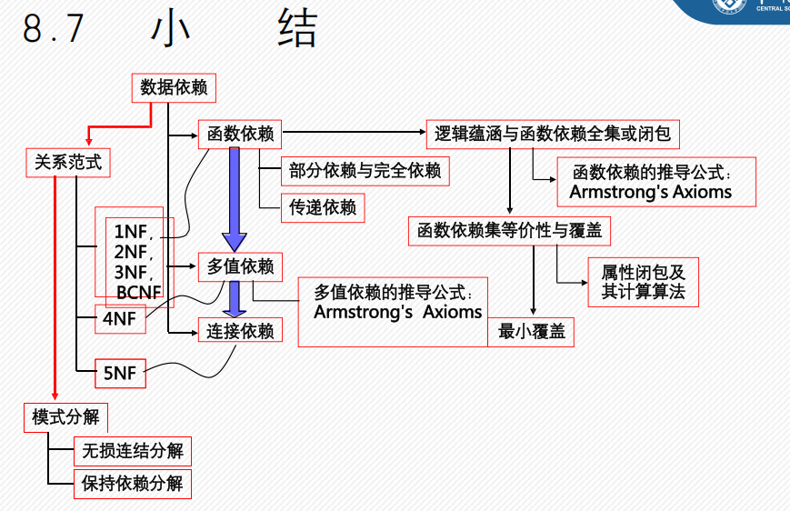


# ch9


# ch10

### 索引基本概念

- 什么是索引？

  索引是一种用于加速数据检索的数据结构。它类似于书籍的目录，允许数据库系统在不扫描整个表的情况下快速定位到所需的记录。

- **核心组成**:

  - 搜索码 (Sarch Key): 用于查找记录的一个或一组属性
  - 索引项 (Index Entry): 通常由 <搜索码, 指针> 对组成，指针指向包含该搜索码的数据记录

- **两大基本类型**:

  - 有序索引 (Ordered Indices): 索引项按搜索码的值排序存储
  - 散列索引 (Hash Indices): 使用散列函数将搜索码均匀分布到不同的“桶”中

------

### 有序索引

有序索引通过将索引项排序来支持高效的等值查询和范围查询。

#### 主索引 vs. 辅索引

- **主索引 (Primary Index)**:
  - 也称为聚簇索引 (Clustering Index)
  - 其搜索码定义了文件中记录的物理顺序。这意味着，数据文件本身是按照主索引的搜索码排序的。
  - 一个表**只能有一个**聚簇索引。
- **辅索引 (Secondary Index)**:
  - 也称为非聚簇索引 (Non-clustering Index)
  - 其索引顺序与文件中记录的物理顺序不同。
  - 辅索引的指针指向的是数据记录本身，而不是一个物理块。

#### 稠密索引 vs. 稀疏索引

- **稠密索引 (Dense Index)**:
  - 为文件中的每一个搜索码值都创建一个索引项 。
  - **优点**: 定位记录速度快。
  - **缺点**: 占用空间大，维护开销高。
  - 辅索引必须是稠密的。
- **稀疏索引 (Sparse Index)**:
  - 只为文件中的部分搜索码值创建索引项。
  - 要求: 数据文件必须是按搜索码顺序存储的（即只能用于主索引或聚簇文件）。
  - 查找过程: 找到小于等于目标值的最大索引项，然后从该项指向的记录开始顺序查找。
  - 优点: 占用空间小，维护开销低。
  - 缺点: 查找速度通常慢于稠密索引。

#### 多级索引

当索引本身变得非常大，无法一次性装入内存时，访问磁盘的开销会变得巨大。

- 解决方案: 可以将主索引文件本身也看作一个顺序文件，并为其建立一个稀疏索引。
  - 内层索引 (Inner Index): 原始的主索引。
  - 外层索引 (Outer Index): 主索引的稀疏索引。
  - 这个过程可以重复，形成更多级别的索引，直到最外层索引可以被载入内存。**B+树**就是多级索引的一种经典实现。

------

### B+树索引

B+树是数据库中最常用的一种索引结构，它是一种自平衡的树，能够保持数据有序，并允许高效的插入、删除和查找操作。

#### 为什么使用 B+ 树？

- 优点: 解决了索引顺序文件因频繁增删导致性能下降和需要定期重组的问题

  。B+树通过小的、局部的改变来自动重组，保持平衡。

- 与B树的区别 (PPT Page 20-23):

  - 数据存储: B+树中，所有数据记录都只存储在叶子节点上。非叶子节点只存储键值和指针，这使得非叶子节点可以容纳更多的键，从而降低树的高度，减少磁盘I/O次数。
  - 范围查询: B+树的所有叶子节点通过一个双向链表连接，非常适合进行范围查询和全表遍历

#### B+ 树的结构

- 所有从根节点到叶子节点的路径长度相同
- 每个非根、非叶子节点拥有 `⌈n/2⌉` 到 `n`  个子节点 ( `n` 为节点容量) 
- 所有叶子节点构成一个有序链表。

#### B+ 树的操作

- 查询: 从根节点开始，逐层向下查找，直到定位到叶子节点中的目标记录。由于树高很低（通常3-4层），查询效率非常高 

- 插入:找到应该插入的叶子节点 

  1. 如果叶子节点有空间，直接插入 

  2. 如果叶子节点已满，则需要分裂 (Split) 该节点：

     > 将节点中的一半键值移到一个新节点中，并将新节点的最小键值和指向新节点的指针插入到父节点中 

  3. 如果父节点也满了，则继续向上传播分裂，最坏情况下会导致根节点分裂，树的高度增加1 。

- 删除:找到并删除叶子节点中的对应项。

  1. 如果删除后节点条目数少于  `⌈(n-1)/2⌉` （即“欠满”），需要进行调整：
     - 借用 (Borrow): 如果相邻的兄弟节点有富余，可以从兄弟节点借一个条目过来 。
     - 合并 (Merge): 如果兄弟节点也没有富余，则将该节点与兄弟节点合并。合并操作可能会导致父节点也欠满，需要递归向上调整 

------

### 散列索引

散列索引通过散列函数将搜索码映射到一个“桶”（通常是一个磁盘块）的地址上，理论上可以实现O(1)复杂度的查找。

- **静态散列 (Static Hashing)**:
  - 使用固定的散列函数和桶数量 
  - 缺点: 数据库增长时，桶溢出 (Overflow) 会严重影响性能；数据库缩小时，会浪费大量空间 。溢出通常通过溢出链 (Overflow Chaining) 来解决 
- **动态散列 (Dynamic Hashing)**:
  - 允许桶的数量动态调整，以适应数据量的变化 
  - 可扩展散列 (Extendable Hashing) 是其中一种实现：
    - 使用一个可动态增长和缩小的桶地址表 (Bucket Address Table)
    - 不使用完整的散列值，而是使用其前 `i` 位作为地址表的索引 
    - 当桶溢出时，根据需要分裂桶并可能使桶地址表的大小加倍 

------

### 位图索引

- 适用场景: 适用于基数非常小（即不同值的数量很少）的列，如“性别”、“国家”等

- 原理: 为列中的每个可能的值创建一个位图 (Bitmap)。每个位图的长度等于表中的记录数。如果第 

  `n`  条记录的列值为 `v`，则在值对应的位图的第 `n` 位记为1，否则为0 

- 查询: 对于涉及多个条件的查询（如“查找性别为男且收入等级为L1的记录”），可以通过对相应的位图进行高效的位运算 (AND, OR, NOT) 来快速得到结果 

------

### 6. MySQL中的索引实践

PPT中还结合MySQL对索引的实际应用进行了总结：

- 逻辑分类:

  - **普通索引**: 仅用于加速查询。
  - **唯一索引**: 保证列值唯一，同时加速查询。
  - **主键索引**: 一种特殊的唯一索引，不允许为空。
  - **组合索引**: 在多个列上创建的索引，遵循最左前缀原则

- 索引失效场景:  `LIKE`  以通配符开头、在索引列上使用函数、`OR`  条件的列没有都建立索引等情况，都可能导致索引失效

- SQL操作:

  - 创建索引 
  	```mysql
    CREATE INDEX index_name ON table_name (column_list)
    ```
  
  - 删除索引
    ```mysql
    DROP INDEX index_name ON table_name
    ```
  
  - 查看索引信息
    ```mysql
    SHOW INDEX FROM table_name
    ```
  
# 数据库的恢复技术
### 什么是事务？

**事务 (Transaction)** 是用户定义的一个数据库操作序列，这些操作在逻辑上构成一个单一的工作单元，要么全部被成功执行，要么全都不执行 。

- - - **注意：事务是恢复和并发的基本单位**

### 事务的四大特性 (ACID)

为了保证事务的正确性，它必须具备四个基本特性，通常用首字母缩写 **ACID** 来表示。这些特性共同确保了即使在并发访问和系统故障的情况下，数据库依然能保持数据的正确和一致。

| 特性                     | 英文        | 描述与解释                                                   | 课件中的体现                                                 |
| ------------------------ | ----------- | ------------------------------------------------------------ | ------------------------------------------------------------ |
| **原子性 (Atomicity)**   | Atomicity   | **“全有或全无”**。事务被视为一个不可分割的最小工作单元，其内部的所有操作要么全部成功提交，要么在任何一步失败后，全部回滚到事务开始前的状态，就像什么都没发生过一样。 | 课件中提到，在文件系统中，更新操作的原子性难以保证，并以转账为例说明“要么全部完成，要么根本不发生” 。 |
| **一致性 (Consistency)** | Consistency | 事务的执行必须使数据库从一个**一致性状态**转变到另一个**一致性状态**。事务开始前和结束后，数据库的完整性约束（如主码唯一、外码参照、check约束等）都没有被破坏。 | 课件中强调，DBMS 的一个特点是能“保证数据一致性（即使在硬件或软件发生错误时）”，并能“保证完整性约束” 。 |
| **隔离性 (Isolation)**   | Isolation   | 当多个事务并发执行时，一个事务的执行不应被其他事务干扰。即，一个事务内部的操作及使用的数据对并发的其他事务是隔离的，就好像每个事务都是在独立地执行一样。 | 课件中指出了文件系统在“并发访问 (Concurrent access)”方面的局限性，未经控制的并发会导致不一致性 。DBMS 通过并发控制（如锁机制）来保证隔离性。 |
| **持久性 (Durability)**  | Durability  | 一旦事务成功**提交 (Commit)**，它对数据库中数据的改变就是**永久性**的。即使后续系统发生崩溃或断电等故障，这些已提交的修改也不会丢失。 | 课件中提到，DBMS 提供了“恢复控制系统 (recovery control system)”来应对软硬件故障 ，这是实现持久性的基础。 |

  

