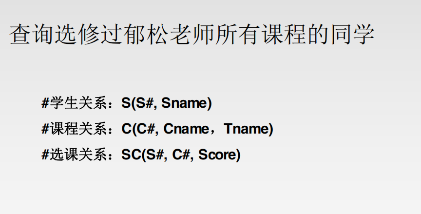
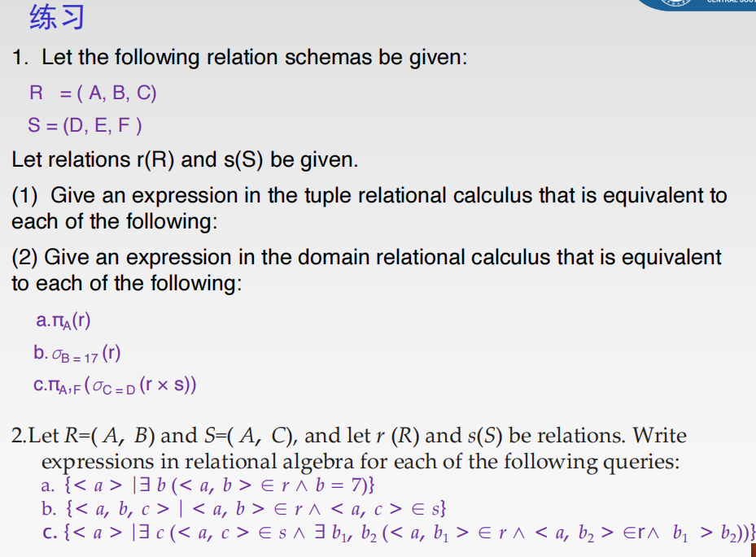

### 数据库系统三级结构

| 层次 (Level)                  | 别称 (Also known as)         | 描述 (Description)                                           | 对应的模式 (Schema)                                          |
| ----------------------------- | ---------------------------- | ------------------------------------------------------------ | ------------------------------------------------------------ |
| **外部层 (External Level)**   | 用户层 (User Level) / 子模式 | 描述特定用户能看到和使用的局部数据的逻辑结构和特征 。这是用户的数据视图 。 | **外模式 (External Schema)** 或 **子模式 (Subschema)**       |
| **概念层 (Conceptual Level)** | 逻辑层 (Logic Level)         | 描述数据库中全体数据的逻辑结构和特征，是数据库的总体视图 。它定义了存储哪些数据以及数据间的关系 。 | **概念模式 (Conceptual Schema)** 或 **模式 (Schema)**        |
| **内部层 (Internal Level)**   | 物理层 (Physical Level)      | 描述数据在计算机上的物理表示，即数据是如何在数据库中存储的 。 | **内模式 (Internal Schema)** 或 **存储模式 (Storage Schema)** |


### 各种码的关系

> ### 1. 超码 (Super Key)
>
> - 定义：在一个关系中，能唯一标识一个元组的属性或属性集被称为超码
>
> - **核心特点**：“能用就行，可能包含多余信息”。
>
> - 举例：在关系 
>
>   ```
>   学生(学号, 姓名, 身份证号, 专业)
>   ```
>
>    中：
>
>   - `{身份证号}` 是一个超码。
>   - `{学号}` 也是一个超码。
>   - 因此，`{学号, 姓名}`、`{身份证号, 专业}` 这种包含了唯一标识属性的组合，也都是超码。
>
> ### 2. 候选码 (Candidate Key)
>
> - 定义：不含有多余属性的超码，也就是最小的超码
>
>   。从超码中去掉任何一个属性，它就不再是超码了。
>
> - **核心特点**：“刚刚好，不多也不少”。
>
> - 举例：在关系 
>
>   ```
>   学生(学号, 姓名, 身份证号, 专业)
>   ```
>
>    中：
>
>   - `{学号, 姓名}` 是超码，但不是候选码，因为去掉 `姓名` 后，`{学号}` 仍然是超码。
>   - `{学号}` 是候选码。
>   - `{身份证号}` 也是候选码。
>   - 这个关系有两个候选码：`{学号}` 和 `{身份证号}`。
>
> ### 3. 主码 (Primary Key)
>
> - 定义：数据库设计者从一个关系的多个候选码中选出的一个，作为该关系元组的唯一标识
> - **核心特点**：“官方指定，唯一代表”。
> - 规则：
>   - 一个关系只能有一个主码
>   - 主码中的所有属性都不能为空值 (NULL)，这被称为实体完整性约束 (Entity Integrity)
> - **举例**：对于 `学生` 关系，我们可以从 `{学号}` 和 `{身份证号}` 这两个候选码中选择 `{学号}` 作为主码。
>
> ### 4. 备选码 (Alternate Key)
>
> - 定义：候选码中未被选为主码的其他候选码
> - **核心特点**：“候补选手”。
> - **举例**：在 `学生` 关系中，如果我们选了 `{学号}` 作为主码，那么 `{身份证号}` 就成为备选码。
>
> ### 它们之间的关系
>
> 范围关系：超码 > 候选码 > 主码
>
> 您可以这样理解：
>
> - 所有能唯一标识一行的属性组合都是**超码**。
> - 从中挑出那些最简洁、没有冗余属性的组合，就是**候选码**。
> - 再从这些候选者中，指定一个官方的、最常用的，就是**主码**。
> - 剩下的候选者就成了**备选码**。
>
> ------
>
> ### 其他重要的概念
>
> - **外码 (Foreign Key)**
>   - 定义：一个关系 R 中的属性（或属性组）X 不是 R 的码，但它与另一个关系 S 的主码相对应
>   - 作用：外码是用来建立和加强两个关系之间联系的。它确保了参照完整性 (Referential Integrity)，即外码的值要么必须是其引用的主码值，要么为空
>   - **举例**：`选课(学号, 课程号, 成绩)` 关系中，`学号` 是外码，参照 `学生` 表的主码；`课程号` 也是外码，参照 `课程` 表的主码。
> - **主属性 (Prime Attribute) 与 非主属性 (Non-prime Attribute)**
>   - 定义：含在任何一个候选码中的属性，称为主属性；不包含在任何候选码中的属性，称为非主属性 9
>   - 这个概念在**规范化理论（如第二范式、第三范式）**中至关重要。
>
> ### 总结表格
>
> 为了方便您区分，这里用表格总结一下：
>
> | **码的类型**               | **定义**               | **唯一性** | **最小性** | **是否可为NULL**  | **数量** |
> | -------------------------- | ---------------------- | ---------- | ---------- | ----------------- | -------- |
> | **超码 (Super Key)**       | 能唯一标识元组的属性集 | 是         | 不一定     | 可以              | 多个     |
> | **候选码 (Candidate Key)** | 最小的超码             | 是         | 是         | 否                | 多个     |
> | **主码 (Primary Key)**     | 被选中的一个候选码     | 是         | 是         | 否 (实体完整性)   | 唯一     |
> | **备选码 (Alternate Key)** | 未被选中的候选码       | 是         | 是         | 否                | 多个     |
> | **外码 (Foreign Key)**     | 参照另一关系主码的属性 | 否         | 不适用     | 可以 (参照完整性) | 多个     |


### ORDER BY和 GROUP BY

| 特性                 | `GROUP BY`                                         | `ORDER BY`                                         |
| -------------------- | -------------------------------------------------- | -------------------------------------------------- |
| **目的**             | **数据聚合**，按组进行统计计算                     | **数据排序**，改变结果的显示顺序                   |
| **对行的影响**       | **改变行数**，多行数据被合并成一行                 | **不改变行数**，只是重新排列行                     |
| **与聚合函数的关系** | **几乎总是**与聚合函数（`SUM`, `COUNT`等）一起使用 | **可以**对聚合函数的结果进行排序，但本身不执行聚合 |
| **在查询中的位置**   | 在 `WHERE` 之后，`ORDER BY` 之前                   | **总是**在查询语句的**最后**                       |


### SQL查询书写顺序

`FROM` -> `WHERE` -> `GROUP BY` -> `HAVING` -> `SELECT` -> `ORDER BY`


### 关系模式和关系

| 对比项   | **关系模式 (Relational Schema)**  | **关系 (Relation)**                                  |
| -------- | --------------------------------- | ---------------------------------------------------- |
| **比喻** | 表格的**表头** / 房子的**设计图** | **整个表格** (包含表头和所有数据行) / **建好的房子** |
| **本质** | 对表的**结构描述** (Blueprint)    | 表在某一时刻的**实例和数据** (Instance)              |
| **特性** | **静态的、稳定的**                | **动态的、可变的**（数据会增删改）                   |


### "", '', ``

| 符号      | 名称                  | 主要用途                      | 示例                                 | 推荐度               |
| --------- | --------------------- | ----------------------------- | ------------------------------------ | -------------------- |
| **```**   | 反引号 (Backtick)     | **标识符** (数据库、表、列名) | `SELECT \`id`, `name` FROM `users`;` | ⭐⭐⭐⭐⭐ **(强烈推荐)** |
| **`' '`** | 单引号 (Single Quote) | **字符串常量**                | `WHERE \`name` = '张三';`            | ⭐⭐⭐⭐⭐ **(强烈推荐)** |
| **`" "`** | 双引号 (Double Quote) | 默认是字符串，但行为可变      | `WHERE \`name` = "张三";`            | ⭐ **(不推荐使用)**   |


### 查询选修过郁松老师所有课程的同学

>
>
>------
>
>### 解题思路
>
>问题分解成以下几个步骤：
>
>1. 第一步：找出“郁松老师”总共教了多少门课程。
>
>   我们先从课程表 C 中计算出 Tname 为“郁松老师”的课程总数。假设这个数字是 N。
>
>2. **第二步：找出每个学生分别选修了“郁松老师”的几门课。**
>
>   - 我们需要将三张表连接（JOIN）起来：`S` (学生信息), `SC` (选课记录), `C` (课程信息)。
>   - 通过 `WHERE C.Tname = '郁松老师'` 条件，筛选出所有“学生选修郁松老师课程”的记录。
>   - 然后，按学生进行分组（`GROUP BY S.S#`）。
>
>3. **第三步：对比课程数量。**
>
>   - 对每个学生分组进行计数（`COUNT`），得到每个学生选修的郁松老师的课程数量。
>   - 使用 `HAVING` 子句，筛选出那些选课数量等于第一步中算出的总数 `N` 的学生。这些学生就是我们最终要找的。
>
>------
>
>### SQL 实现
>
>根据上面的思路，我们可以写出如下的SQL查询语句：
>
>```mysql
>SELECT
>    S.S#,
>    S.Sname
>FROM
>    S
>JOIN
>    SC ON S.S# = SC.S#
>JOIN
>    C ON SC.C# = C.C#
>WHERE
>    C.Tname = '郁松老师'  -- 1. 只关注郁松老师的课程
>GROUP BY
>    S.S#, S.Sname         -- 2. 按学生进行分组
>HAVING
>    COUNT(C.C#) = (       -- 3. 筛选出选课数量等于郁松老师课程总数的学生
>        SELECT COUNT(*)
>        FROM C
>        WHERE Tname = '郁松老师'
>    );
>```
>
>#### **代码讲解**
>
>- **`FROM S JOIN SC ON ... JOIN C ON ...`**: 通过 `S#` 和 `C#` 将三张表连接起来，这样我们就可以在一个查询中同时访问到学生姓名、选课关系和课程的老师信息。
>
>- **`WHERE C.Tname = '郁松老师'`**: 这是一个前置过滤。它确保我们接下来处理的数据，都只和“郁松老师”的课程相关。
>
>- **`GROUP BY S.S#, S.Sname`**: 将上面的结果按学生进行分组。执行完这一步后，每个学生会形成一个分组，组内是该学生选修的所有“郁松老师”的课程记录。
>
>- `HAVING COUNT(C.C#) = (...)`
>
>  : 这是最关键的一步。
>
>  - `COUNT(C.C#)`: 对每个学生分组进行计数，得到该学生选了郁松老师几门课。
>  - `(...)`: 括号里是一个**子查询**，它的作用就是我们思路中的第一步——计算出郁松老师总共教了多少门课。
>  - 整个 `HAVING` 子句的作用就是判断：该学生选的课的数量，是否等于郁松老师教的总课程数量。如果相等，该学生就被筛选出来。
>
>------
>
>### 另一种思路：双重 `NOT EXISTS`
>
>这是一种在逻辑上更接近关系演算的写法，对于一些人来说可能更难理解，但功能同样强大。
>
>它的逻辑是：“**查找一个学生，不存在（一门郁松老师的课，是这个学生没学过的）**”。
>
>```mysql
>SELECT S.S#, S.Sname
>FROM S
>WHERE NOT EXISTS (  -- 不存在...
>    SELECT 1
>    FROM C
>    WHERE C.Tname = '郁松老师'  -- 一门郁松老师的课
>    AND NOT EXISTS (          -- 并且这门课是该学生没学过的
>        SELECT 1
>        FROM SC
>        WHERE SC.S# = S.S# AND SC.C# = C.C#
>    )
>);
>```
>
>虽然这种方法也能实现，但对于大多数情况，`GROUP BY` + `HAVING COUNT` 的方法更加直观和常用。


### 作业一

- 

- 


### IN，EXISTS，EXCEPT

| 特性         | IN                                           | EXISTS                                         | EXCEPT                                                       |
| ------------ | -------------------------------------------- | ---------------------------------------------- | ------------------------------------------------------------ |
| **核心功能** | **值匹配**：检查一个值是否在一个集合里       | **存在性检查**：检查一个子查询是否有返回行     | **集合求差**：返回第一个结果集减去第二个结果集后的差集       |
| **处理方式** | 先执行子查询，再匹配主查询                   | 对主查询的每一行，执行一次子查询（找到即停）   | 执行两个完整的查询，然后对结果集进行比较和去重               |
| **关注点**   | 子查询返回的**具体值**                       | 子查询**是否返回行**（`TRUE`/`FALSE`）         | 两个结果集的**行差集**                                       |
| **性能考量** | 当子查询结果集很大时，性能可能不如 `EXISTS`  | 通常非常高效，尤其是对于大型表的关联检查       | 性能取决于两个结果集的大小，需要处理整个集合                 |
| **常见场景** | 筛选条件是一个已知的、不大的列表或子查询结果 | 检查主表的记录在另一张表中是否有对应的关联记录 | 找出只存在于一张表（或一个查询结果）而不在另一张表中的记录   |
| **等价转换** | `a IN (SELECT b FROM ...)`                   | `EXISTS (SELECT ... WHERE b=a)`                | 无直接等价，但 `NOT IN` 或 `NOT EXISTS` 有时可实现类似逻辑，但细节不同¹ |


### 双重否定和分组计数

| 特性           | 分组计数 (`GROUP BY/HAVING`)                                 | 双重否定 (`NOT EXISTS`)                                      |
| -------------- | ------------------------------------------------------------ | ------------------------------------------------------------ |
| **直观性**     | **非常直观**。逻辑符合人类的计数思维，易于理解和向他人解释。 | **相对抽象**。需要理解集合论和逻辑上的双重否定等于肯定，对初学者有门槛。 |
| **性能**       | 性能通常不错。但数据库需要完整计算每个分组的 `COUNT` 值之后才能进行比较。 | 在很多数据库中**可能性能更高**。因为它有“短路”特性：一旦发现某个客户缺少一个分行，就可以立即将该客户排除，无需再检查其他分行。 |
| **普适性**     | 非常通用，几乎所有支持SQL的数据库都支持这种语法。            | 同样非常通用，是SQL标准的一部分。                            |
| **写法复杂度** | 代码结构相对扁平，连接和分组是标准操作。                     | 嵌套子查询较深，尤其是用 `EXCEPT` 时，结构更复杂。           |
