# 数据结构

## 3.25

##### 	线性表

​	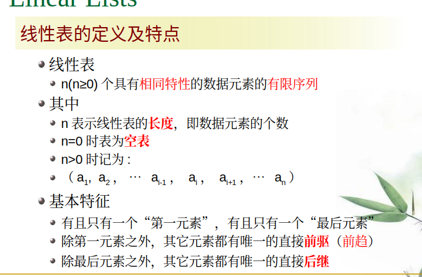	   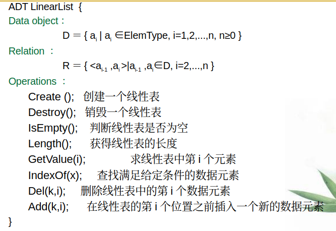	  				

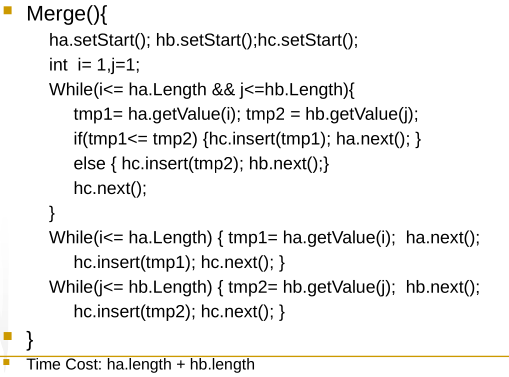

​			注意，我们这里从一开始算，不是从0开始


##### 	数据存储结构

###### 		顺序存储结构

​			在内存中开辟连续的存储空间，用连续的存储单元依次存放线性表的数据元素。
​			顺序存储的线性表，称为顺序表

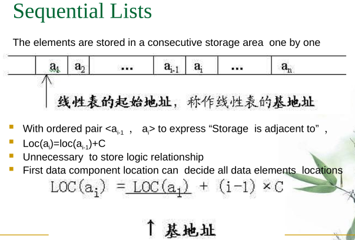

​			e.g. 

```C
				int * a = (int *)malloc(sizeof(int) * 100)
```


​			优缺点：

​						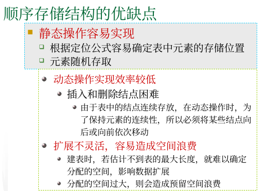		

###### 		链式存储结构

​	头结点可能不存储数据


## 3.28

##### 	链表(链式存储结构):

​							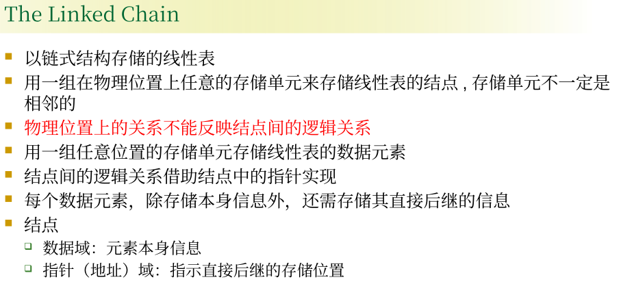	

​		

​			head是链表的唯一入口

###### 		创建一个新链表

```C++
//Create a new node :
		Node * p = (Node *)malloc(sizeof(Node)) /*C*/
		Node *p = new Node;    					/* C++ */
		Node p = new Node();					/*Java*/


```


## 4.1

​			head是链表的唯一入口

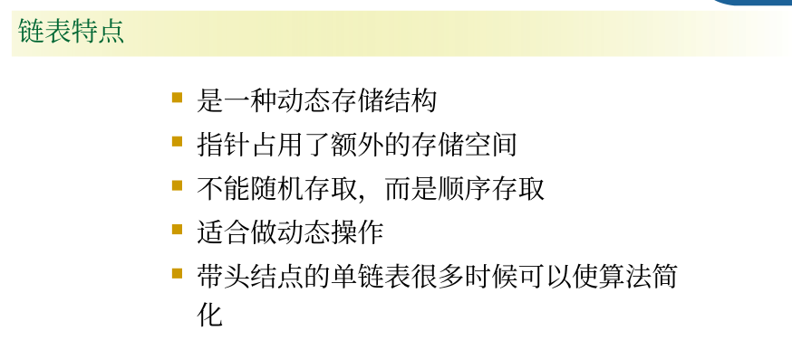


## 4.15

## 	双向链表

​				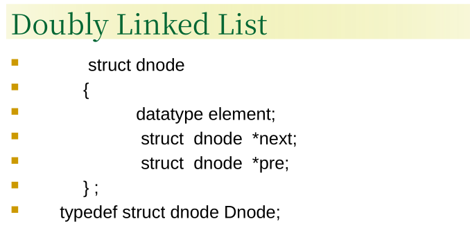		

## 	栈stack

​			栈是在程序设计中被广泛使用的一种线性数据结构，
​			其特点在于基本操作的特殊性，栈必须按“*后进先出*”的规则进行操作，
​			与线性表相比，它的插入和删除操作受更多的约束和限定，故又称为限定性的
​			线性表结构。

### 		栈的基本概念

​				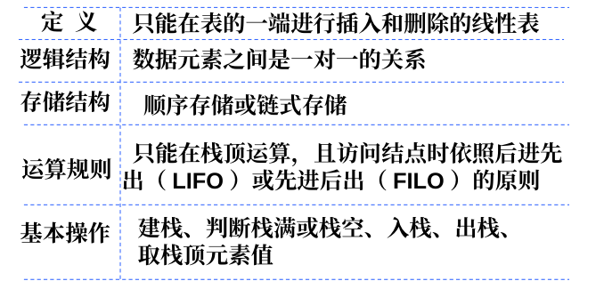

​				栈 S= (a1 , a2 , a3 , ……….,an-1 , an )

​				栈是仅在表的某一端（比如在表尾）进行插入、删除操作的线性表

​				表尾 ( 即 an 端 ) 称为栈顶 (top)
​				表头 ( 即 a1 端 ) 称为栈底 (bottom)
​				插入元素到栈顶的操作，称为入栈
​				从栈顶删除元素的操作，称为出栈

## 4.18

​	后进先出，在栈顶实现出栈和入栈

​	栈是一种特殊的线性表，可以使用线性表的基本操作实现栈（除了出栈和入栈）

​	用线性表的表尾作为栈顶

​	用链表实现的栈时，链表表头是栈顶，表尾是栈底


## 4.22

### 队列

#### 定义

​	只能在表的一端进行插入，在表的另一端进行删除的线性表

#### 逻辑结构

​	元素之间是一对一的关系

#### 存储结构

​	顺序队列和链队列

#### 运算规则

​	队尾入队、队头出队，遵循先进先出（FIFO）的原则

#### 基本操作

​	入队、出队、建空队列、判队空或队满


## 4.29

### 树结构

#### 定义

树是由n（n≥0）个结点组成的有限集合

当n＝0时称为空树

否则，在任一非空树中

必有一个称为根的结点；

当n>1时，其余结点可分为m(m>0)个互不相交的有限集T1,T2,……Tm

其中每一个集合本身又是一棵树，称为根的子树

#### 特点

​	非空树中至少有一个根结点

​	书中个字数是互不相交的集合

#### 树的基本术语

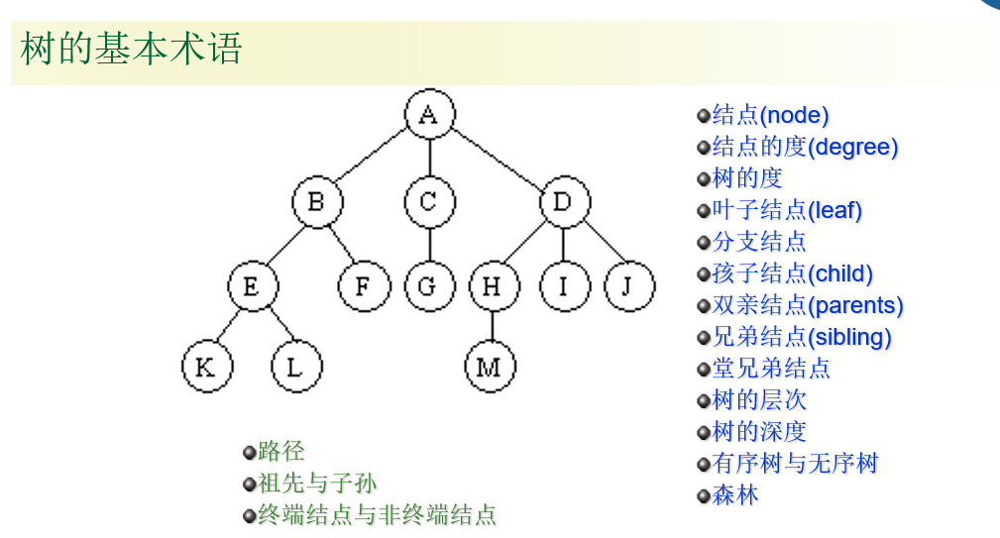

##### 结点

​	表示树中的元素，包括数据项及若干指向其子树的分支

##### 结点的度

​	结点拥有的子树数

##### 叶子

​	度为0的结点，也叫终端结点

##### 分支结点

​	度不为0的结点，也叫非终端结点

##### 内部结点

​	除根结点之外，分支结点也称为内部结点

##### 结点的层次

从根结点算起，根为第一层，它的孩子为第二层……

##### 堂兄弟

其双亲在同一层的结点互称为堂兄弟

##### 深度

树中结点的最大层次数

##### 有序树

如果将树中结点的各子树看成从左至右是有次序的(即不能互换)，则称该树为有序树，否则称为无序树。

有序树中最左边的子树的根称为第一个孩子，最右边的称为最后一个孩子

##### 森林

m(m != 0)棵互不相交的树的集合


## 5.6

树结构的逻辑特征

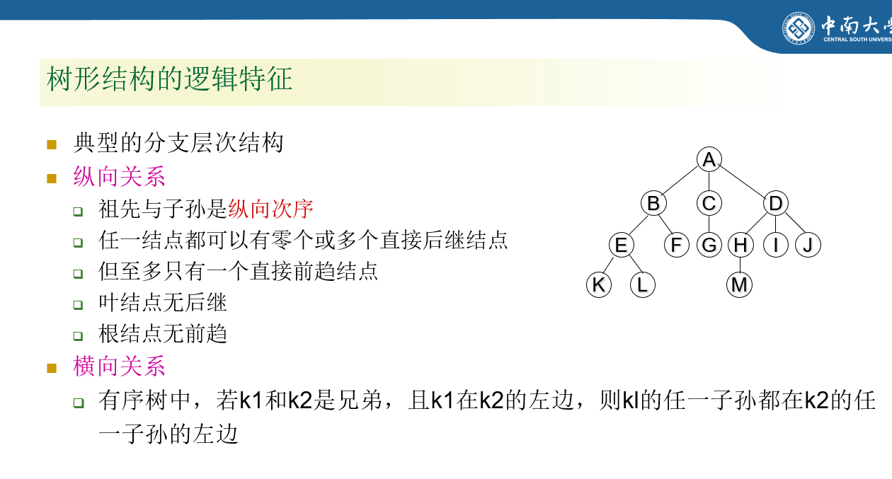

先根遍历，后根遍历，层次遍历


二叉树：左偏左孩子，右偏是右孩子

高度为k的二叉树有k到
$$
k—2^3
$$
​						个点


满二叉树的左孩子和其父亲的编号是两倍的关系

完全二叉树

​	度数：有几个孩子


- **叶子结点数 = 度为2的结点数 + 1**
- 换句话说，二叉树的叶子结点总是比度为2的结点多1。

- 完全二叉树最多只有一个度为1的点


## 5.9

- 二叉树

​	二叉链表实现

- 树的遍历：

​	先根、后根和层次

- 二叉树的遍历：

​	先序、后序、中序（还有层次）

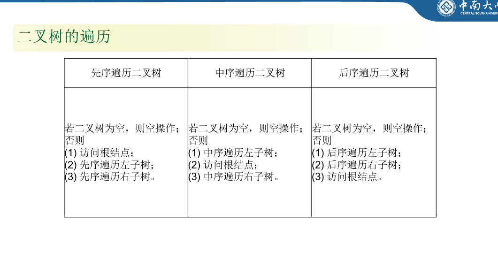

​							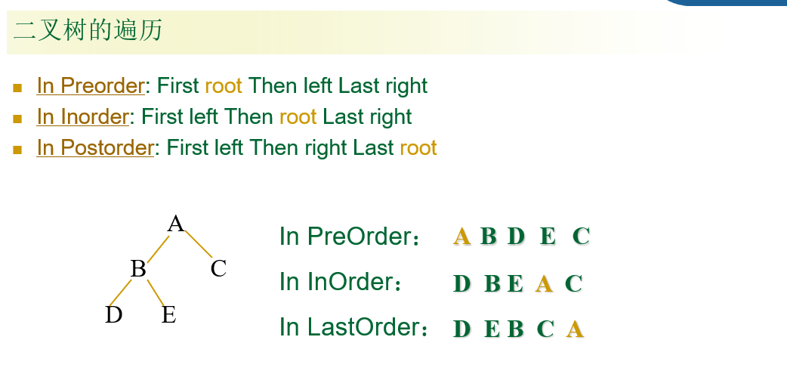


## 5.13

- 二叉树的唯一性

> 根据二叉树的先序遍历和中序遍历两种遍历（或者是后序和中序，先序和后序不行）可以完全确定一个二叉树
>
> - 如何得到该二叉树？
>   - 根据先序遍历获得根结点
>   - 根据中序遍历分出左子树和右子树
>   - 一层层向下分解，得到最终结果

- 线索二叉树
- 树和二叉树

> - 用孩子-兄弟存储法关联
>
> 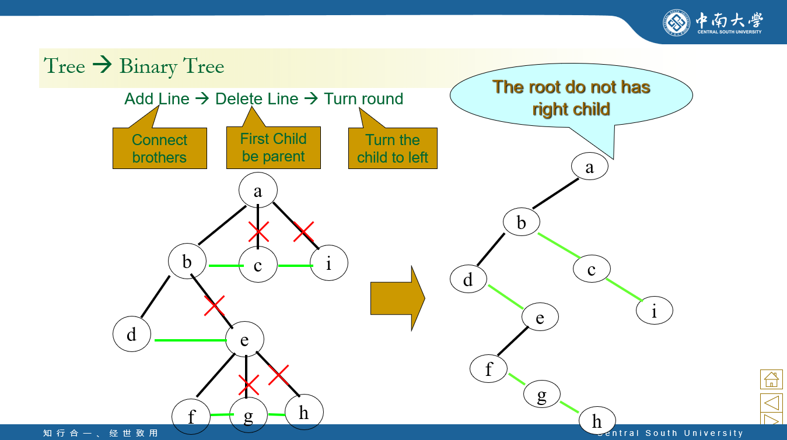
>
> - 用二叉树实现一般树的遍历
>
> 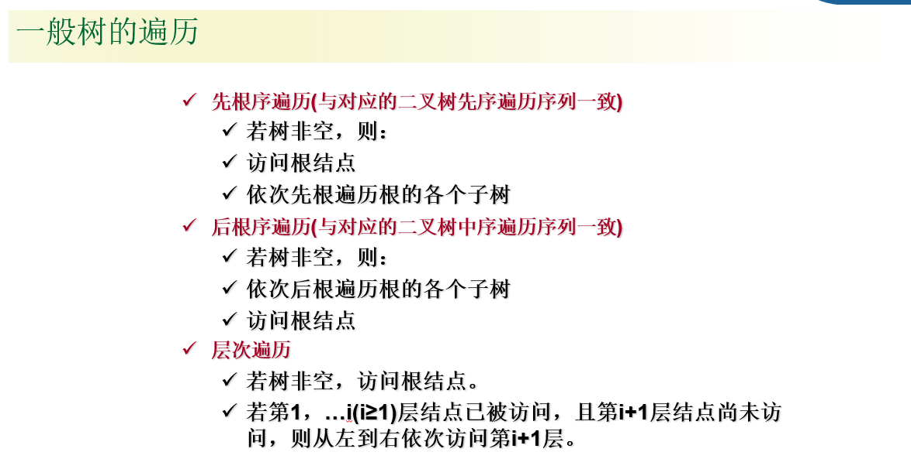


- Huffman Tree

> - 路径
>
>   若树中存在某个结点序列k1,k2,…,kj
>
>   满足Ki是ki+1的双亲
>
>   则该结点序列是树上的一条路径
>
>   径自上而下地经过了树上的每一条边
>
> - 路径长度
>
>   路径经过的边数，称为路径长度
>
> - 树的路径长度
>
>   从树根到树中每一个结点的路径长度之和
>
>   完全二叉树的路径长度最短
>
> - 结点的权
>
>   给树的结点赋以一定意义的数值，称为结点的权
>
> - 结点的带权路径长度
>
>   从树根到某结点的路径长度与该结点的权的积
>
> - 树的带权路径长度
>
>   树中所有叶子结点的带权路径长度之和

- 哈夫曼树
  - 由n个带权叶子结点构成的二叉树
  - 其中WPL最小的二叉树
  - 又叫最优二叉树，或最佳判定树

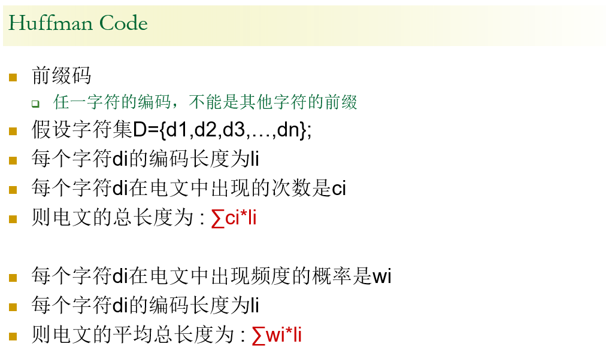

## 5.20

- Huffman Tree

  > 将叶子结点作为编码，则所有的编码一定不会是其他编码的前缀
  >
  > - 叶子结点表示字母
  > - 大的权值在上，小的在下
  >
  > 度为2的点 = 叶子结点 - 1
  >
  > 通过上述规律，得到huffman 太热一共有几个结点


- 图

  > 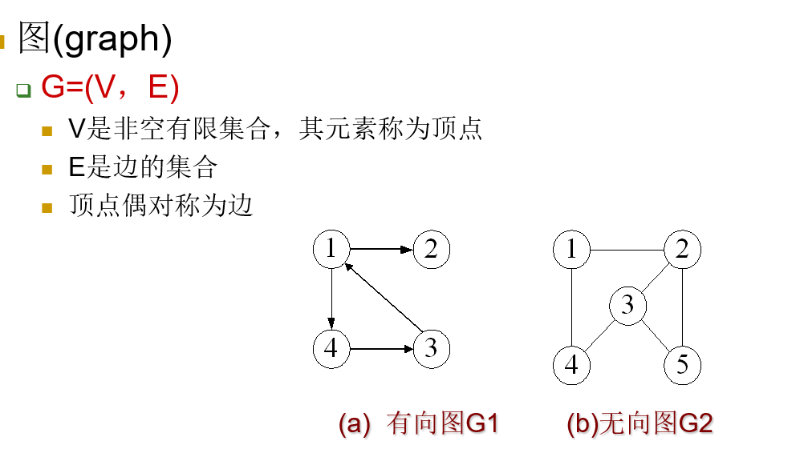
  >
  > - 图的基本术语
  >   - 路径
  >   - 路径的长度
  >   - 简单路径
  >   - 回路
  >   - 简单回路
  >   - 连通
  >   - 连通图
  >   - 连通分量
  
- - - 注意：有向图的弧头和弧尾。关系中是<弧尾，弧头>，其中弧头是有箭头那一边

## 5.23

- 生成树

  > **连通图**的生成树是一个极小连通子图
  >
  > 它含有图中全部顶点，但只有足以构成一棵树的n-1条边
  >
  > 一个图可以有许多棵不同的生成树
  >
  > - 生成树具有以下共同特点：
  >
  >   > 顶点个数与图的顶点个数相同
  >   >
  >   > 是图的极小连通子图
  >   >
  >   > 一个有n个顶点的连通图的生成树有n-1条边
  >   >
  >   > 生成树中任意两个顶点间的路径是唯一的
  >   >
  >   > 在生成树中再加一条边必然形成回路
  >   >
  >   > 含n个顶点n-1条边的图不一定是生成树

- 权

- 网：带权的图称为网

- 图的表示

  > - 邻接矩阵
  > - 邻接表
  >   - 出度邻接表
  >   - 入度邻接表

### 图的遍历

> - 从图中某顶点出发,沿一些边访问图中顶点,使每个顶点都被访问到，且仅被访问一次,叫做图的遍历
>   - *无重复，无遗漏*
>
> - *关键点*
>
>   - *图中可能存在回路*
>
>   - 图的顶点可能与其它顶点相通,在访问完某顶点后,可能沿着某些边回到曾经访问过的顶点
>
>   - *为避免重复访问**,**可设辅助数组visited[]*
>
>     - 将其初始化为0
>
>     - 遍历时,如果某顶点 i 被访问,将 visited [i]置 为1
>
>     - 以此防止顶点i被多次访问

- 图的深度优先搜索

  > 一定会和图的连通性相连

- 图的广度优先搜索

- 图的连通性

  > 连通图，从图中任一顶点出发，便可遍历图
  >
  > 非连通图，从图中任一顶点出发，不能访问到所有顶点，只能访问图的一个连通分量
  >
  > *怎样求图的连通分量？*
  >
  > 调用DFS或BFS，检查图的顶点
  >
  > 若被访问过，则该顶点落在已被求过的连通分量上
  >
  > 若未被访问过，则从该顶点出发遍历图，可求得图的另一个连通分量

## 5.27

### 生成树

- 最小生成树

  > - Prim算法
  >
  >   每次找已知点连未知点的最小边
  >
  >   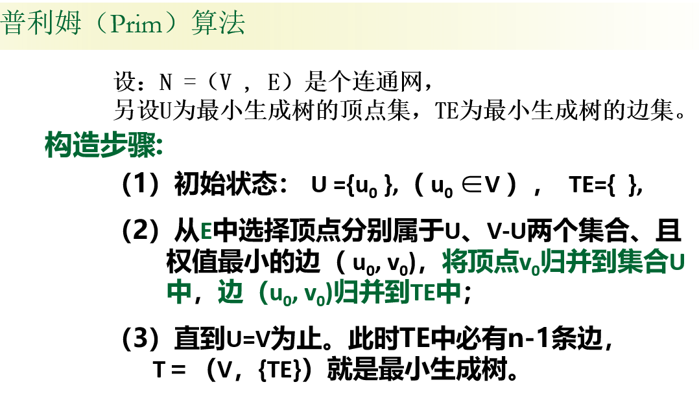
  >
  >   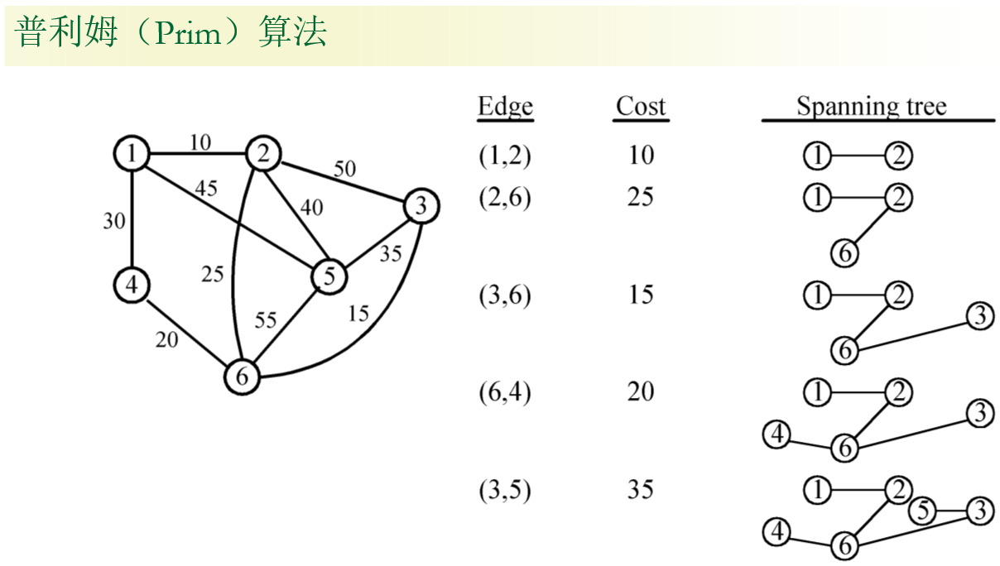
  >
  > - Kruskal算法
  >
  >   每次找最小边
  >
  >   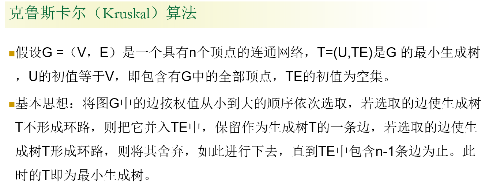
  >
  >   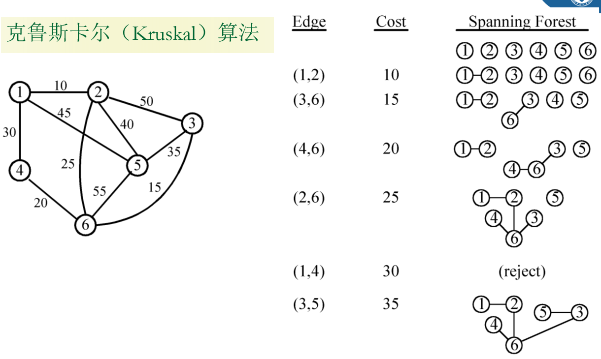

### 拓扑排序

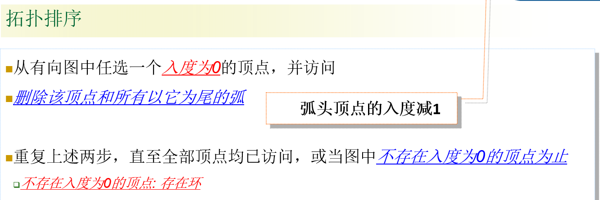

### 关键路径

### 最短路径

### 排序

- 简单排序
- 高等排序

#### 内排序

一次将所有的数据加载到内存

#### 外排序

将数据一块块分块后排序

#### 直接插入排序

#### 希尔排序

按步长排序 5, 3, 1的顺序排序，不稳定

在算法中，一旦做了超过1的步长，那么这个算法往往是不稳定的

#### 交换排序

- 冒泡排序

  提前退出(一定有f)

- 快速排序

  取第一个数，小的放左端，大的放右端，最后的就是该树的位置，如此往复

#### 选择排序

- 简单选择排序

- 锦标赛排序 nlogn，约定：左边更小一点  （改进后：堆排序）值关心变化了的比较结果

- 堆排序

  大顶堆，小顶堆


## 6.3

#### 交换排序

#### 堆排序

#### 归并排序

#### 基数排序

- 最高位优先法 需要分组
- 最低位优先法 无需分组

基数排序的数据是以链表形式出现的

| 特性             | 快速排序 (Quicksort)        | 归并排序 (Merge Sort) |
| ---------------- | --------------------------- | --------------------- |
| **平均速度**     | **通常更快** (因缓存效率高) | 相对较慢              |
| **最坏情况性能** | 差 (O(n2))                  | **稳定** (O(nlogn))   |
| **空间使用**     | **优** (O(logn))            | 差 (O(n))             |
| **排序稳定性**   | 不稳定                      | **稳定**              |
| **适用数据结构** | **数组**                    | 数组、**链表**        |

Export to Sheets

- 基数排序算法分析

  > 特点：不用比较和移动，改用分配和收集，时间效率高！


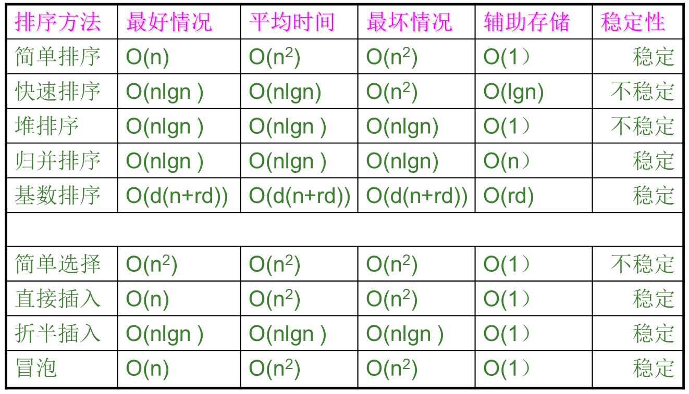

### 查找

- 线性查找

- 折半查找

- 二分查找

  > - 优缺点
  >
  >   虽然二分查找的效率高，但是要将表按关键字排序 
  >
  >   **只适用于顺序存储结构**
  >
  >   **为保持表的有序性，在顺序结构里插入和删除都必须移动大量的结点** 
  >
  >   适用于表结点比较稳定的，很少做插入或删除操作的顺序表
  >
  >   不适用于链表

## 6.6

### 哈希查找

#### 哈希冲突

- 开放地址法

  可能会向线性查找退化

- 链地址发

- 再哈希法

- 建立一个公共溢出区


# 考试地点

B座212-214

线索二叉树，平衡二叉树，拓扑排序，关键路径，字符串，数组，广义表不考

# 考试

- 1

  > 数据，数据结构，数据项，数据元素，算法
  >
  > 什么是算法？算法的特性？算法设计原则？评价标准
  >
  > 计算时间复杂度

- 2 线性表

  > 什么是线性表？特点，定义，基本操作，实现
  >
  > 顺序表（可以随机存取的线性表），链表
  >
  > - 顺序表
  >
  >   > 插入和删除（耗时！）
  >   >
  >   > 优点，缺点
  >   >
  >   > 适用情况
  >
  > - 链表
  >
  >   > 怎么插入和删除
  >   >
  >   > 定位（麻烦）
  >   >
  >   > 指针的行为，有头结点的链表
  >   >
  >   > 循环链表，双向链表

- 3 栈和队列

  > 定义，和线性表的关系
  >
  > 栈的实现（数组，链表）
  >
  > ​	实验：表达式求值，概念（中缀式，后缀式）
  >
  > 队列
  >
  > ​	栈结构和队列的特点
  >
  > ​	怎么使用链表实现
  >
  > ​	怎么使用数组实现（循环队列，如何入队，如何出队，判断队满/队空）

- 4 字符串，数组，广义表

  > 提了一下，不考

- 5 树形结构

  > 度，层次，父子关系
  >
  > 树的遍历方式，二叉树的遍历方式
  >
  > 双亲表示法
  >
  > 孩子-兄弟存储法
  >
  > 孩子-双亲表结构
  >
  > - 二叉树
  >
  >   > 二叉树的定义
  >   >
  >   > 求树的高度
  >   >
  >   > 叶子结点 = 度为2的点 + 1
  >   >
  >   > 二叉树的存储结构（二叉链表）
  >   >
  >   > 满二叉树和完全二叉树（编号：父亲为i，左子树2i，右子树2i+1）
  >   >
  >   > 二叉树遍历（先序，中序，后序）
  >   >
  >   > 求叶子结点个数，求树的深度
  >   >
  >   > 二叉树和树的转换关系
  >   >
  >   > 根据二叉树遍历结果，确定唯一一个二叉树
  >
  > - Huffman树
  >
  >   > 相关知识

- 6 图形结构

  > 图的定义，图的概念，邻接矩阵
  >
  > 遍历
  >
  > - 图的应用
  >
  >   > 最小生成树
  >   >
  >   > *拓扑，关键路径，最短路径*
  >   >
  >   > BFS，DFS

- 7 排序和查找

  > 排序
  >
  > > 直接插入排序
  > >
  > > 希尔排序
  > >
  > > 冒泡
  > >
  > > 快排
  > >
  > > 直接选择
  > >
  > > 竞标赛排序
  > >
  > > 堆排序（应该不考）
  > >
  > > 归并
  > >
  > > 基数
  > >
  > > - - - 掌握基本原理
  > >     - 排序的时间效率，稳定性
  > >     - 考的代码少
  >
  > 查找
  >
  > > 线性，折半，哈希
  > >
  > > 基本概念，如平均查找长度

- - - 以ppt为主，试一遍代码
