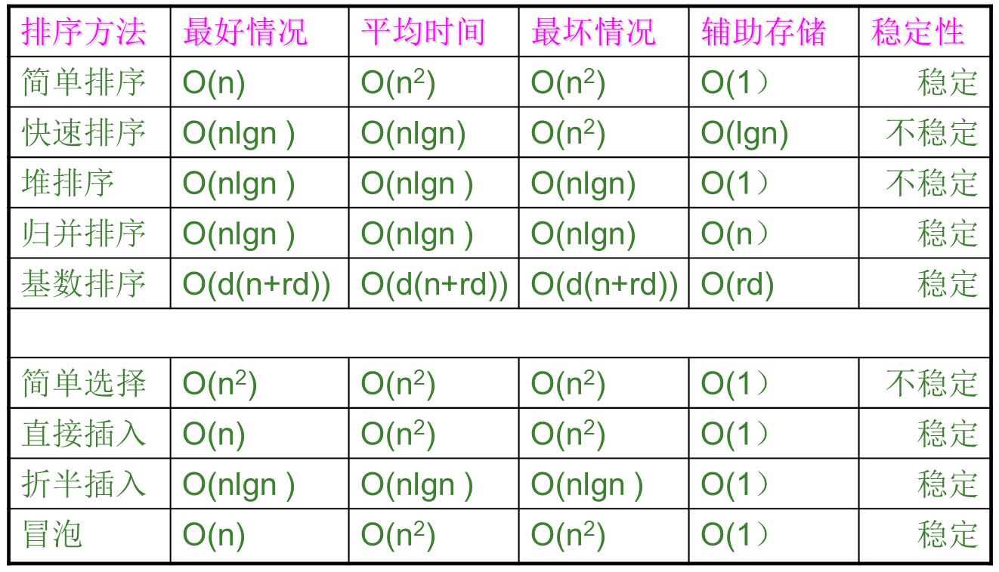

### 带有头结点链表的优势

带头结点的链表之所以能简化算法，核心原因在于它**统一了对所有位置的操作，消除了对“第一个数据结点”的特殊处理**。

没有头结点时，对第一个结点的插入和删除操作，与对其他结点的操作逻辑是完全不同的。而有了头结点，**任何位置的插入和删除都变成了“在某个结点之后”进行操作**，代码逻辑因此变得统一和简洁。

| 特性           | 不带头结点                                                   | **带有头结点 (优势)**                                 |
| -------------- | ------------------------------------------------------------ | ----------------------------------------------------- |
| **空链表判断** | `L == NULL`                                                  | `L->next == NULL`                                     |
| **操作统一性** | 插入/删除第一个结点是**特殊操作**                            | **所有结点的插入/删除操作逻辑统一**                   |
| **代码复杂度** | 较高，需要`if/else`处理边界                                  | **较低，代码更简洁、健壮**                            |
| **指针传递**   | 修改头指针时，需要传递指针的引用或地址(`Node* &L`或`Node** L`) | 函数永远不需要修改头指针本身，直接传值即可(`Node* L`) |
| **空间开销**   | 无额外开销                                                   | **有一个额外的头结点空间开销**                        |


### 数组实现队列

| 问题              | 描述                                                 | 主流解决方案                       |
| ----------------- | ---------------------------------------------------- | ---------------------------------- |
| **假溢出**        | 数组尾部满了，但头部有空间却无法使用                 | 使用**循环队列**                   |
| **队满/队空混淆** | 在循环队列中，`front == rear` 既可表示空，也可表示满 | **牺牲一个空间** 或 **使用计数器** |
| **容量固定**      | 数组大小固定，无法应对未知数据量                     | 使用**链式队列**或实现**动态扩容** |


### 树的基本术语

1. 结点

   表示树中的元素，包括数据项及若干指向其子树的分支

2. 结点的度

   结点拥有的子树数

3. 叶子

   度为0的结点，也叫终端结点

4. 分支结点

   度不为0的结点，也叫非终端结点

5. 内部结点

   除根结点之外，分支结点也称为内部结点 

6. 树的度:一棵树中最大的结点度数

7. 孩子:结点子树的根称为该结点的孩子

8. 双亲:孩子结点的上层结点叫该结点的双亲

9. 兄弟:同一双亲的孩子之间互成为兄弟

10. 祖先:结点的祖先是从根到该结点所经分支上的所有结点

11. 子孙:以某结点为根的子树中的任一结点都成为该结点的子孙

12. 结点的层次:从根结点算起，根为第一层，它的孩子为第二层……

13. 堂兄弟:其双亲在同一层的结点互称为堂兄弟

14. 深度:树中结点的最大层次数

15. 有序树:如果将树中结点的各子树看成从左至右是有次序的(即不能互换)，则称该树为有序树，否则称为无序树。

    有序树中最左边的子树的根称为第一个孩子，最右边的称为最后一个孩子

16. 森林:m(m != 0)棵互不相交的树的集合


### 树的遍历

| 遍历方式     | 核心思想   | 普通树             | **二叉树**         | 主要应用                     |
| ------------ | ---------- | ------------------ | ------------------ | ---------------------------- |
| **前序遍历** | 先处理根   | 根 → 子树          | **根 → 左 → 右**   | **复制树结构**               |
| **中序遍历** | 中间处理根 | **(无明确定义)**   | **左 → 根 → 右**   | 对二叉搜索树排序             |
| **后序遍历** | 最后处理根 | 子树 → 根          | **左 → 右 → 根**   | **释放树空间、计算表达式树** |
| **层次遍历** | 按层处理   | 从上到下，从左到右 | 从上到下，从左到右 | 广度优先搜索、找最短路径     |

| 术语 (Term)  | 主要应用场景           | 描述侧重点                           | 核心规则                 |
| ------------ | ---------------------- | ------------------------------------ | ------------------------ |
| **先根遍历** | 普通树 (General Trees) | 强调**根**与**子树森林**的关系       | 先访问**根**，再访问子树 |
| **前序遍历** | 二叉树 (Binary Trees)  | 强调**根、左、右**三者的处理**顺序** | **根** → 左 → 右         |
| **后根遍历** | 普通树 (General Trees) | 强调**根**与**子树森林**的关系       | 先访问子树，再访问**根** |
| **后序遍历** | 二叉树 (Binary Trees)  | 强调**根、左、右**三者的处理**顺序** | 左 → 右 → **根**         |


### 图的部分定义

| 中文名称 | 英文名称 | 是否允许重复顶点？ | 是否允许重复边？ |
| -------- | -------- | ------------------ | ---------------- |
| **游走** | Walk     | ✅ **允许**         | ✅ **允许**       |
| **迹**   | Trail    | ✅ **允许**         | ❌ **不允许**     |
| **路径** | Path     | ❌ **不允许**       | ❌ **不允许**     |

1. 简单路径

   顶点不重复出现的路径称为简单路径

2. 回路

   第一个顶点和最后一个顶点相同的路径称为回路或环

3. 简单回路

   除了第一顶点和最后一个顶点之外，其余顶点不重复出现的回路

4. 连通

   1. 无向图中，如果从顶点v到顶点v'有路径，则称v和v'是连通的

5. 连通图

   1. 如果图中任意两个顶点都是连通的，则是连通图

6. 连通分量

   1. 无向图的极大连通子图
   2. 连通图只有一个连通分量，即其自身
   3. 非连通的无向图有多个连通分量


### 图的存储结构

| 特性                     | 邻接矩阵 (Adjacency Matrix) | 邻接表 (Adjacency List) |
| ------------------------ | --------------------------- | ----------------------- |
| **空间复杂度**           | O(V2)                       | O(V+E)                  |
| **判断两点间是否有边**   | O(1)                        | O(textdegree(v))        |
| **遍历一个点的所有邻居** | O(V)                        | O(textdegree(v))        |
| **优点**                 | 查询快，实现简单            | 空间高效，遍历邻居快    |
| **缺点**                 | 空间浪费（稀疏图）          | 查询慢                  |
| **适用场景**             | **稠密图**                  | **稀疏图**              |

| 图的类型             | 对角线元素 `matrix[i][i]` 的值 | 含义                           |
| -------------------- | ------------------------------ | ------------------------------ |
| **简单图（最常见）** | **0**                          | **没有自环**                   |
| **允许自环的无权图** | **1** 或 **0**                 | 1代表有自环，0代表没有         |
| **带权图（无自环）** | **0**                          | 从顶点到自身的**成本/距离为0** |
| **带权图（有自环）** | **自环的权重**                 | 从顶点到自身的**成本/距离**    |


- - - 注意：邻接矩阵对角线默认是0(无距离)，默认没有边
    - 邻接表分为顶点表和边表


### DFS/BFS在图的应用

> 深度优先搜索（DFS）和广度优先搜索（BFS）是图遍历的两种核心算法。它们的主要区别在于**搜索路径的扩展方式**：DFS优先“纵向”深入，而BFS则是“横向”逐层扩展。
>
> ------
>
> ### 深度优先搜索 (DFS) - 深入探索的“探险家” 🧭
>
> DFS的策略是“不撞南墙不回头”。从一个起始点出发，它会沿着一条路径不断深入，直到无法再前进（到达终点或死胡同），然后才返回（回溯）到上一个路口，选择另一条路继续探索。
>
> - **核心数据结构**：**栈 (Stack)**。这个过程可以通过递归（使用系统调用栈）或手动维护一个栈来实现。
>
> #### **特点和优势**
>
> - **空间效率较高**：在最好情况下，其空间复杂度只与图的最长路径深度有关（O(depth)）。对于一个“瘦高”型的图，DFS比BFS占用更少的内存。
> - **天然适合寻找路径**：它能很快地找到一条从起点到终点的路径（但不一定是最短的）。
> - **具备回溯特性**：使其非常适合用于检测环路、进行拓扑排序（用于DAG）以及寻找图的连通分量等。
>
> ------
>
> ### 广度优先搜索 (BFS) - 稳步推进的“广播员” 🌊
>
> BFS的策略像是在水中投下一颗石子，波纹会一层一层地向外扩散。它从一个起始点出发，首先访问所有与它直接相邻的邻居，然后再去访问这些邻居的邻居，以此类推，逐层向外扩展。
>
> - **核心数据结构**：**队列 (Queue)**。通过“先进先出”的特性来保证逐层访问的顺序。
>
> #### **特点和优势**
>
> - **寻找无权图最短路径**：这是BFS最核心的优势。由于它是逐层遍历的，所以当它第一次找到目标节点时，所经过的路径必然是所有可能路径中最短的（边数最少）。
> - **解决“最少步数”问题**：非常适合用于解决类似“从A到B最少需要几步”的问题。
> - **全面性**：它会系统地探索图的每一层，不会像DFS那样可能会过早地深入到离起点很远的节点。
>
> ------
>
> ### 核心区别总结 📊
>
> | 特性           | 深度优先搜索 (DFS)               | 广度优先搜索 (BFS) |
> | -------------- | -------------------------------- | ------------------ |
> | **数据结构**   | **栈 (Stack)** 或递归            | **队列 (Queue)**   |
> | **搜索策略**   | 一条路走到黑，再回溯             | 逐层向外扩展       |
> | **空间复杂度** | O(V) (最坏)                      | O(V) (最坏)        |
> | **核心优势**   | 拓扑排序、检测环路、寻找连通分量 | **无权图最短路径** |
> | **路径结果**   | 找到的路径不一定最短             | 找到的路径一定最短 |
>
> ------
>
> ### 如何处理所有类型的图 🌐
>
> 无论是DFS还是BFS，其基本逻辑对于所有图类型都适用，但在处理非连通图时需要一个额外的步骤。
>
> #### **有向图 vs. 无向图**
>
> - 两种算法都完全适用于有向图和无向图。唯一的区别是，在**有向图**中，你只能沿着边的**箭头方向**进行遍历。
>
> #### **连通图 vs. 非连通图（多个子图）**
>
> - 这是一个非常重要的场景。如果你从图中的任意一个节点开始执行标准的DFS或BFS，你**只能遍历到与该节点处于同一个“连通分量”（Connected Component）中的所有节点**。对于非连通图（包含多个互相隔离的子图），其他子图的节点将不会被访问到。
>
> - **解决方案**：为了确保遍历到图中的每一个节点，你需要一个外部循环来驱动遍历过程。
>
>   **通用遍历伪代码如下：**
>
>   ```
>   创建一个 visited 数组，记录所有顶点是否被访问，初始值全为 false。
>   
>   for (图中的每一个顶点 v) {
>       if (visited[v] == false) {
>           // 从这个未被访问过的新连通分量的起点开始遍历
>           DFS(v); // 或者 BFS(v);
>       }
>   }
>   ```
>
>   通过这种方式，当完成第一个连通分量的遍历后，外层循环会继续检查，找到下一个尚未被访问的顶点（它必然属于另一个连通分量），并从它开始新一轮的遍历，直到所有顶点都被标记为 `visited`。


### Dijkstra算法和Floyed算法

| 特性           | Dijkstra 算法           | Floyd-Warshall 算法           |
| -------------- | ----------------------- | ----------------------------- |
| **解决问题**   | **单源**最短路径 (SSSP) | **所有顶点对**最短路径 (APSP) |
| **核心思想**   | 贪心算法                | 动态规划                      |
| **负权重边**   | ❌ **不能处理**          | ✅ **可以处理**                |
| **负权重环路** | ❌ **不能处理**          | ❌ **不能处理**                |
| **时间复杂度** | O(ElogV)                | O(V3)                         |
| **数据结构**   | 优先队列                | 二维矩阵                      |
| **图的表示**   | 邻接表（较优）          | 邻接矩阵（较优）              |

- 对于Dijkstra邻接矩阵

  > **优点** 👍
  >
  > - **代码实现直观、简单**：逻辑清晰，只用到了基础的数组和循环，不需要引入优先队列等数据结构。
  > - **对于稠密图效率高**：当图是**稠密图**时（边的数量 E 接近 V2），O(V2) 的复杂度与使用优先队列的 O(ElogV)（此时 E≈V2，复杂度近似为 O(V2logV)）相比，反而有优势。
  >
  > **缺点** 👎
  >
  > - **对于稀疏图效率低下**：当图是**稀疏图**时（边的数量 E 远小于 V2），O(V2) 的复杂度会远高于使用邻接表+优先队列的 O(ElogV) 版本。
  >
  > **总结**：总的来说，用邻接矩阵实现的Dijkstra是理解该算法背后贪心思想的绝佳范例。在处理**稠密图**或顶点数量不大的场景中，它是一种很好的选择。但在处理大规模稀疏图（例如，巨大的地图网络）时，为了追求更高的效率，通常会选择**邻接表 + 优先队列**的优化版本。


### Prim算法和Kruskal算法

| 特性               | Prim 算法                              | Kruskal 算法                               |
| ------------------ | -------------------------------------- | ------------------------------------------ |
| **贪心策略**       | **加点法**：从点出发，选最短边拉入新点 | **加边法**：从边出发，选最短且不构成环的边 |
| **过程中的图状态** | 始终是**一棵连通的树**                 | 从**森林**（多个连通分量）逐渐合并         |
| **关键数据结构**   | 优先队列                               | 并查集 & 排序                              |
| **时间复杂度**     | O(ElogV)                               | O(ElogE)                                   |
| **适用图类型**     | 适用于**稠密图**（边 E 接近 V2）       | 适用于**稀疏图**（边 E 远小于 V2）         |


### 几种排序算法

| 排序方法         | 最好情况时间复杂度 | 平均情况时间复杂度    | 最坏情况时间复杂度 | 空间复杂度 | 稳定性 |
| ---------------- | ------------------ | --------------------- | ------------------ | ---------- | ------ |
| **直接插入排序** | O(n)               | O(n²)                 | O(n²)              | O(1)       | 稳定   |
| **折半插入排序** | O(nlog₂n)          | O(nlog₂n)             | O(nlog₂n)          | O(1)       | 稳定   |
| **希尔排序**     | -                  | O(n¹·²⁵)～O(1.6n¹·²⁵) | -                  | O(1)       | 不稳定 |
| **冒泡排序**     | O(n)               | O(n²)                 | O(n²)              | O(1)       | 稳定   |
| **快速排序**     | O(nlog₂n)          | O(nlog₂n)             | O(n²)              | O(log₂n)   | 不稳定 |
| **简单选择排序** | O(n²)              | O(n²)                 | O(n²)              | O(1)       | 不稳定 |
| **堆排序**       | O(nlog₂n)          | O(nlog₂n)             | O(nlog₂n)          | O(1)       | 不稳定 |
| **归并排序**     | O(nlog₂n)          | O(nlog₂n)             | O(nlog₂n)          | O(n)       | 稳定   |
| **基数排序**     | O(d*(n+rd))        | O(d*(n+rd))           | O(d*(n+rd))        | O(n+rd)    | 稳定   |





### 堆

| 特性               | **自下而上建堆 (Bottom-up)**       | **自上而下建堆 (Top-down)**                 |
| ------------------ | ---------------------------------- | ------------------------------------------- |
| **应用场景**       | 从一个无序数组**一次性批量**建立堆 | **逐个向堆中插入**新元素                    |
| **处理对象**       | 将整个数组视为一个待调整的树       | 从空堆开始，逐个添加元素                    |
| **核心操作**       | **向下调整 (Sift-down)**           | **向上调整 (Sift-up)**                      |
| **起始点**         | 最后一个非叶子节点                 | 第一个元素（建立大小为1的堆），然后逐个插入 |
| **建堆时间复杂度** | **O(n)**                           | **O(n log n)**                              |
| **PPT中的描述**    | **详细描述并推荐**                 | 仅作为效率不高的对比方法被提及              |
