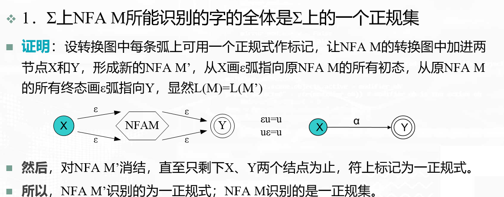
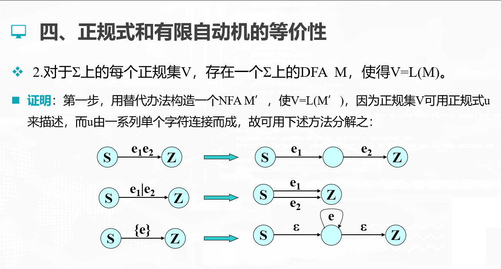

> > > # 编译原理 

---

# 编译原理简介

- [ ] 编译过程

- 三大系统软件：OS  Compiling System DBMS
> 机器语言->汇编语言->高级语言->工具语言

- 编译程序：
> 把某一种高级语言程序等价的转换成另一种低级语言程序的程序
- 解释程序：
> 把源语言写的源程序作为输入，但不产生目标程序，而是遍解释边执行源程序本身
- [ ] 词法分析

- 任务：输入源程序，对构成源程序的字符串镜像扫描和分解，之别出一个个单词符号
- 原则：构词原则
- 描述工具：正规式和有限自动机

- [ ] 语法分析

- 在词法分析的基础上，根据语言的语法规则把单词符号串分解成个类语法单位
- 原则：语法原则
- 描述工具：上下文无关文法

- [ ] 中间代码生成

- 任务：对各类不同语法范畴按语言的语义进行初步翻译
- 原则：语义原则
- 中间代码：三元式，四元式，树形结构等

- [ ] 优化

- 任务：对于前阶段产生的中间代码进行加工变换，以期在最后阶段产生更高效的目标代码。
- 原则：程序的等价变换原则

- [ ] 目标代码生成

- 任务：n把中间代码变换成特定机器上的目标代码。n依赖于硬件系统结构和机器指令的含义
- 目标代码的三种形式
> 绝对指令代码： 看直接运行
> 可重新定位带治疗代码：需要连接装配
> 汇编指令代码：需要进行汇编

## 高级程序语言简介

### 参数传递

- 三种形式

> 传地址	“指针”
>
> 传值	“栈传值”
>
> 传名	“内联”

### 存贮管理

- 静态存贮管理

> 编译时就安排好目标程序运行时的全部数据空间，并能确定每个数据项目的单元地址。

- 动态存贮管理

> 如果允许递归、可变数据结构，则必须动态分配。
>
> ​     **①栈式**：整个程序数据空间安排在一个栈中
>
> ​     **②堆式**：允许自由地申请和退还空间

# 高级语言及其语法描述

## 程序语言的定义

### 程序语言的定义

- 一个程序设计语言是一个记号系统，其完整的定义应包括语法和语义两个方面
- 阐明语法的一个工具是文法，这是形式语言理论的基本概念之一

### 程序语言的语法描述

- 基本概念

> **符号串集合的乘积**
>
> 令A、B为符号串集合，定义符号串集合乘积  AB＝{ xy |x∈A, y∈B}
>
> **符号串集合的方幂**
>
> 符号串集合A，定义A0 ={ε}, A1=A, A2=AA, A3=A2A, …, An＝An-1A=AAn-1，n>0
>
> **符号串集合的正闭包**
>
> A+=A1 ∪A2 ∪… ∪ An …
>
> **符号串集合的自反闭包**
>
> A* ={ε} ∪ A+

用图形化方式表示这种推导，形成一颗语法分析树

## 文法的形式化定义和分类

### 文法的形式化定义

- 文法定义成一个四元组G=(VN, VT, S, P)

> VN : 非空有限的非终结符集；
>
> VT : 非空有限的终结符集；
>
> S: 开始符号；
>
> P: 产生式集合。
>
> 其中， VN ∩ VT =Φ，S∈ VN
>
> P中产生式一般形式为: A→α|β，其中 A∈ VN ，α, β ∈（ VN ∪ VT ）* 

### 文法的分类

- 0型（无限制文法）

> G=(VN, VT, S, P)          
>
> 规则形式： ɑ→β; α ϵ (VN∪VT) +, βϵ (VN ∪ VT)*且α中至少含有一个非终结符    

- 1型（上下文有关）

> 规则α→β 有 1≦|α|≦|β|, 其中α=γ1Aγ2, β= γ1δγ2; A ϵ VN, δ ϵ (VN ∪ VT)+ , γ1, γ2 ϵ (VN ∪ VT)* .                  
>
> 规则形式 ：γ1A γ2 → γ1δγ2 ;

- 2型（上下文无关）

>规则形式：A→δ , A ϵ VN ，δϵ (VN ∪ VT) + 

- 3型（右线性和正规文法）

>**:** 规则形式: A→αB或A→α（右线性） A, B ϵVN, αϵ(VT)*。

---

- 四个文法类的定义是逐渐增加限制的，因此每一种正规文法都是上下文无关的，每一种上下文无关文法都是上下文有关的，而每一种上下文有关文法都是0型文法。
- 称0型文法产生的语言为0型语言。上下文有关文法、上下文无关文法和正规文法产生的语言分别称为上下文有关语言、上下文无关语言和正规语言。
- 现今大多数高级程序设计语言采用上下文无关文法来描述其语法已经足够了。

## 文法和语言

### 文法与语言

- **上下文无关文法定义的语言**

>  从文法的开始符号出发，反复使用产生式，对非终结符进行替换和展开，直至推导出语言的各种句子来

- **推导与归约的概念**

>  推导、最左推导、最右推导、规范推导

>  归约、最左归约、最右归约、规范归约

- **句型、句子、语言的形式定义**

- **语法分析树与二义性**

### 推导与归约

- 最左推导和最右推导
- 规范推导

> 最右直接推导又称为规范直接推导
>
> 最右推导又称为规范推导

- 最右归约和最左归约

> 最左推导的逆过程是最右归约，最右推导的逆过程是最左归约。最右推导也称为规范推导，由规范推导产生出的句型称为规范句型。

### 句型、句子、语言的定义

- 句型

> 设S是文法G的识别符号，如果S   u, 则称符号串u为文法G的句型

- 句子

>设S是文法G的识别符号，如果S   u, uÎVT*, 则称符号串u为文法G的句子

- 语言

>设S是文法G的识别符号，文法G的语言L(G)={u | S   u且uÎVT*}, 即文法的语言是文法所有句子的集合

- - 注意：句子是句型的子集，语言是句子的集合，不是句型的集合

---

- 文法等价

>若L(G1)=L(G2)，则称文法G1和G2是等价的。
>
>  也就是说，如果两个文法定义的语言一样，则称这两个文法是等价的

- - - 语言用L(G)表示，其中文法用G表示

## 语法分析树

- 语法树

- > 用一张树型结构的图来描述一个句子的推导

- 分析树

- > 用一张树型结构的图来描述一个句子的规约

- - 文法没有二义，那就长得一个样，所以常常笼统地称为语法分析树

### 文法的二义性

> 一个文法，如果它的一个句子有两棵或两棵以上的语法树，则称此句子具有二义性。如果一个文法含有二义性的句子，则该文法具有二义性。

> 换一个说法：如果一个文法存在某个句子对应两棵或两棵以上不同的语法树，则称该文法是二义的

- - 注意：“文法的二义性是不可判判定的” 

  - > 即可以证明有二义性，无法证明没有二义性

- - 文法用：-> 
  - 推导用：=>

# 词法分析

## 词法分析概述

- [ ] 任务

从左至右逐个字符地扫描源程序，产生一个个单词符号。把作为字符的源程序改造为单词符号串组成的中间程序，执行词法分析任务的程序称为**词法分析器**或称**扫描器**。

- [ ] 功能

读入源程序字符串，识别开具有独立含义的最小语法单位——单词（符号）；

把单词变换成长度统一的且为定长的属性字；

- [ ] 安排

常常把词法分析程序作为独立的一遍或作为被语法分析程序所调用的子程序。

> 1、作为独立的一遍：
>
> ​     语法分析前进行词法分析，把单词符号串形成中间文件存贮。
>
> 2、作为被语法分析器词用的子程序

- [ ] 实现方式

- 相对独立方式

> 当采用递归下降分析等技术实现一趟编译程序时常采用这种方式。

- 完全独立方式

> 采用词法分析工作完全独立的原因：
>
> - 简化设计，降低语法分析的复杂性
>
> - 提高编译效率
>
> - 增加编译系统的可移植性

- [ ] 输出形式

- 单词--是程序语言的基本语法符号。

- - - 如：基本字、标识符、常数、运算符、界符等。

- 词法分析器中单词的输出形式：

- - - （单词类别、单词内部码值）  通常用**二元式**表示

- 单词符号是程序语言的基本语法单位，一般分为下面5种：

- >关键字（基本字）：（个数确定，可全体编为一类，也可一字一类)
  >
  >标识符：（个数不确定，作为一类）
  >
  >常数：各种类型的常数 。(个数不确定，按类型分类)
  >
  >运算符：如+、-、*、/、<等。(个数确定，一符一类)
  >
  >界符：如，、；、（、）、: 等。(个数确定,一符一类)

## 状态转换图

### 状态转换图

- 状态转换图是一张有限方向图。用结点代表状态，状态之间用箭弧连接，箭弧上的标记（字符）代表在射出结状态下可能出现的输入字符或字符类。
- 一个状态转换图只包含有限个状态，有一个初态，终态用双圈表示。一个状态转换图可识别一定的字符串。

### 状态转换图的实现

- 每个结点对应一段程序，前面状态结的程序调用其后继结点的程序。

- 为了描述方便，引入一些标准过程（函数）与变量：

- > 1.全程字符变量Char：存放最新读入的源程序字符；
  >
  > 2.字符串TOKEN：存放构成单词符号的字符串；
  >
  > 3.过程GETChar：读入一个源程序字符，放入Char中，搜索指针前移；
  >
  > 4.过程GETNBC：反复调用 GETChar，直接读入的 Char< >’ ’ 为止；
  >
  > 5.过程CONCAT：把Char中字符连到TOKEN末尾去；
  >
  > 6.函数Letter/digit：判别Char中是否为字母/数字；
  >
  > 7.过程Return (c, val );
  >
  > 8.过程Retract：搜索器指针回拔一个字符。 

## 正规式与有限自动机

### 正规式与正规集

- 基本概念

- > 1.字母表Σ：
  >
  > - 元素的非空有限集合。如Σ={‘A’, ‘B’, ‘O’}
  >
  > 2.字符：
  >
  > - 字母表Σ的一个元素称为一个字符（符号）
  >
  > 3.Σ上的字：
  >
  > -  Σ上字符的有穷序列；例：Σ={a,b,c}
  >
  > 4.空字ε：不含任何字符的字 
  >
  > 5.字的长度：   |α|
  >
  > 6.Σ上字的全体： Σ*
  >
  > 7.字的连接：  
  >
  > - 字α与字β的连接记为αβ 
  >
  > 8.字的方幂：
  >
  > - 字α的n次连接称为α的n次方幂,记为*α*n,特别地*α*0=*ε*
  >
  > 9.字的集合A与B的乘积：
  >
  > - 记作 *AB*={*αβ**|**α∈**A**∧β∈**B*},其中*A*,*B*
  >
  > 10. Σ*子集的方幂： 
  >
  > - *A*º={ε} , *A*1=*A* , *…* , *A*n=*AA**…**A**=**A*n-1*A*
  >
  > 11.Σ*子集的正则闭包：*A**+**=**A*1∪*A*2∪*…*
  >
  > 12.Σ*子集的闭包：
  >
  > - *A*﹡*=**A*0∪*A*1∪*A*2∪*…**=**A*0∪*A**+**=*{*ε*}∪*A**+*

- 正规式与正规集

> **正规集**是字母表Σ上的一个特殊字集，通常我们借助正规式来描述它。关于正规式与正规集的定义是递归的。
>
> - ε和φ都是Σ上的正规式，它们所表示的正规集分别为{ε}和φ
>
> - 任何a∈Σ,a是Σ上的正规式，它所表示的正规式为{a}
>
> - 假定u和v是正规式，它们所代表的正规集分别是L(u)和L(v)，则u|v, uv, u*都是Σ上的正规式，它们所表示的正规集分别为L(u)∪L(v), L(u)L(v), L(u)*

- - 仅由有限次使用上述三步而定义的表达式才是Σ上的正规式，仅由这些正规式所表示的字集才是Σ上的正规集

  - u**优先级递增**：

    ​     **|**(或)，**·**（连接），*     （对正规式而言）   

    ​    ∪  ，    ∩    ， *     （对正规集而言）

    - 注意，这里的*是闭包运算

- - - 若两个正规式所表示的正规集相同，则认为二者等价

- 正规式的性质

> **交换律**：u|v=v|u
>
> ​		 证：L(u|v) = L(u)∪L(v)
>
> ​		   = L(v)∪L(u)=L(v|u)
>
> ​		 因此，u|v=v|u 
>
> **结合律**：(u|v)|w=u|(v|w),(uv)w=u(vw)
>
> **分配律**：u(v|w)=uv|uw,(u|v)w=uw|vw
>
>  **εu=uε=u**
>
> ​		证：L(εu)=L(ε)L(u)=L(u)0 L(u)=L(u) 

### 确定有限自动机

- **一个确定的有穷自动机（DFA）D是一个五元组**

> D=（K，Σ，M，S，F）其中
>
> K：有穷非空的状态集合；
>
> Σ：有穷非空的输入符号字母表；
>
> M：转换函数，是在**K×Σ→K上的映像**，即，如 M(ki,a)=kj,(ki∈K,kj∈K)就意味着，当前状态为ki，输入符为a时，将转换为下一个状态kj，我们把kj称作ki的一个后继状态；
>
> S∈K是唯一的**一个初态**；
>
> FÌ K是非空的终态集合。

> 如果一个DFA M的输入字母表为∑，则我们也称M是∑上的一个DFA。可以证明：∑上的一个子集是正规的，当且仅当存在∑上的DFA M，使得V=L（M）。

> DFA的确定性表现在映射δ：S×Σ→S是一个单值函数。也就是说，对任何状态s∈S和输入符号a∈Σ，δ(s, a)唯一地确定了下一状态。

> 特别地，若DFA M的初态同时又是终态，该DFA M可识别空字ε。

> 显然，若DFA M中字母表Σ含n个字母，则任何一个状态顶多只有n条发出弧。

#### 运用DFA识别字符串

### 非确定有限自动机

- 一个非确定的有穷自动机(NFA)D是一个五元组

> N=(K，Σ，M，S，F)其中
>
> K：有穷非空的状态集合；
>
> Σ：有穷非空的输入字母表；
>
> M：转换函数，是在K×Σ到K的子集所组成集合的映像， **M(R, T)={Q1,Q2,….Qn}**
>
> SÌK是非空的**初态集合**；
>
> FÌK是非空的终态集合.

### 正规式和有限自动机的等价性

- ε-CLOSURE(I)

>假设I是NFA M’的状态集的一个子集，我们定义ε-CLOSURE(I)为（I的ε-闭包）
>
>- 若S∈I，则S∈ε-CLOSURE(I)
>- 若S∈I ，则从S出发经过任意条ε弧而达到的状态s’，有s’∈ε-CLOSURE(I)

- Ia= ε-CLOSURE(J)

>假定I是M’的状态子集，a是Σ中的字符，定义Ia= ε-CLOSURE(J),其中J是I中任意状态出发（跳过前面任意多条ε弧），经过一条a弧而能达到的状态结的全体。

- - 利用以上两个概念，把NFA确定化

### DFA的化简

#### 相关概念

- 一个确定有限自动机M的化简是指：寻找一个状态数比M少的DFA M’，使得L(M)=L(M’)
- 假定s和t是M的两个不同状态，我们称s和t是等价的：如果从状态s出发能读出某个字w而停于终态，那么同样，从t出发也能读出同样的字w而停于终态；反之，若从t出发能读出某个字w而停于终态，则从s出发也能读出同样的w而停于终态。
- 可区别的：如果DFA M的两个状态s和t不等价。

#### 化简

- 等价状态：无法区别开的两个状态
- 基本思想：把状态集划分成互不相交的子集
- 化简DFA的算法步骤
- - 划分状态集
  - 合并状态：取每组状态中的代表状态，删去其他等价状态
  - 若有**死状态**或**不可达状态**，则把它们删去
    - **死状态**：无法达到终止状态的非终止状态
    - **不可达状态**：不能从开始状态达到它的那些状态
- - - 关键在于
      - 读完某个字符后的状态是否还在还集合中
      - 该集合读完某个字符后的状态，是不是对于每个成员都一致，即在该集合中或统一指向一个集合
    - 逐步细分，直至不可再分

## 词法分析器的自动生成

### LEX语言

- 一个LEX语言程序经过编译后得到的结果程序，其作用相当于一个DFA，可用来识别和产生单词，也就是说其功能即为一个词法分析器。 

---

- 辅助定义式

- 识别规则

### LEX的实现

- LEX编译程序的目的是把一个LEX程序改造为一个词法分析器L，这个词法分析器L将像自动机一样工作。

- - **词法分析器L的工作方法**

  > 逐个地扫描输入串的每个字符，寻找一个最大的子串匹配某个Pi（即：当输入串已匹配某个词形时，并不立即返回，而是沿着此道路继续前进，直至不能前进为止，逐个字符地逆向搜索，找到第一个逆向搜索到的匹配词形），把这个子串放入TOKEN中，然后L调用动作子程序Ai（如果有二义，前面位置的词形优先），当Ai工作完后，L就把所得的单词符号（种别，内部码值）返回语法分析程序。下次调用L，接着往下分析。
  >
  > - - 最长匹配；前者优先(有二义时前面位置(优先级高)的词性优先)

  - **LEX程序的编译过程**

  > 1.对每条识别规则Pi构造一个NFA Mi;   
  >
  > 2.引入一个新的初态X，从X画ε弧到每一个NFA Mi的初态，构造出一个NFA M;
  >
  > 3.把NFA M改造为DFA M’，这个DFA M’就是能识别所有形如Pi词形的词法分析器。

### 词法分析程序实现实例

- “编写程序，实现LEX源程序功能”解决步骤
  - 写出个识别规则的NFA
  - 加入新初态X，构成NFA M整体
  - 确定化为DFA M‘
  - 写出实现其功能的程序
- - - 注意：
      - 最长匹配，前者优先
      - CONCAT，Retract，Return，VAL的使用

# 语法分析--自上而下

## 语法分析简介

- 语法分析简介
  - 语法分析是编译过程的核心部分。
  - **语法分析任务**：在词法分析识别出单词符号串的基础上，分析并判定程序的语法结构是否符合语法规则。
  - 语言的语法结构用上下文无关文法描述。

---

- 语法分析器功能：n按照文法的产生式，识别输入符号串是否为一个句子。这里所说的输入串是指由单词符号（文法的终结符）组成的有限序列。
- 语法分析的方法
  - 自下而上分析法
    - LL(1)分析法
    - 递归下降子程序法
  - 自上而下分析法
    - 算法优先分析法
    - LR分析法
      - LR(0)
      - SLR(1)

## 自上而下分析简介

- 文法的开始符号出发，向下推导，推出句子 
  - 带回溯的分析方法
  - 不带回溯的递归子程序（递归下降）分析方法

**自上而下分析的主旨：**对任意输入串，试图用一切可能的办法，从文法开始符号（根结）出发，自上而下地为输入串建立一棵语法树。或者说，为输入串寻找一个最左推导。

## LL(1)分析法

### 消除左递归和回溯

#### 左递归的消除

- 直接左递归的消除

> ​		p若文法中有形如P→Pα的产生式，则称直接左递归，如A→Ab|a。
>
> ​		  设 ∃P ∈ VN  ，有P→Pα|β，若α≠>ε，β不以P开头（否则不可能消除左递归）。
>
> ​		  则改写为：
>
> ​				                          *P*→ *βP’* 
>
> ​				                          *P’*→ *αP’*| *ɛ*  可消除左递归

- 完全消除左递归

> 

#### 提取左因子、消除回溯

- **FIRST(α)**

> 
>
> - 注意：这里α是非终结符

- 应用

> 如果一个文法G的非终结符A的多个候选式之首符集两两不相交，那么在自上而下分析时便可消除回溯。

> 设*A*→ *α*1 | *α*2 | ...  | *α*n ，而FIRST(α1),…,FIRST(αn)两两不相交，那么当分析时要A去匹配某输入串时，便可根据此输入串的输入符号a,准确地选用候选式αi 。

- 公共左因子的提取

> 把文法改造为每个非终结符的所有候选式两两不相交的方法是提取公共左因子。
>
> ​			*A*  →  *δβ*1 | *δβ*2 | ...  |  *δβ**n*  | α1  | α2 | ...  |  α*m*
>
> 可改造为：
>
> ​			*A*  →  *δ**A**’* | α1 | ... |  α*m*  
>
> ​			*A’* →  *β*1 |  *β*2| ... |  *βn* 

- - - 注意：这里每次只提取最左边的一个单词；如产生了BaBc|Bd这种情况，只能提取一个B

### LL(1)分析法的工作过程

- 开始往输入串末尾和分析栈stack中放“＃”，然后**把文法开始符号压栈**。预测分析程序总是按**stack栈顶符号X**和**当前输入符号a**行事。
  - 若X=a=“#”，则分析成功，停止分析
  - 若X=a≠“#”，则把X从栈顶弹出，a指向下一个输入符号
  - 若X∈Vn，则查分析表。 
- 若M[X, a]为某候选式，则弹出X，把该候选式反序压栈；若M[X, a]=ε,则弹出X，什么也不压；若M[X, a]=error，则报错。 
- **增加判断项：若X∈VT且X≠a，则报错**
- - 注意：开始时要把开始符号(如：E)压栈。
  - 空的部分就是error
  - 表可能没有 →部分，此时表格内就是箭头右边的项(前件与表头一样)
- - - e.g.
    - 
    - 

### FIRST集和FOLLOW集的构造

- FIRST集和FOLLOW集的定义

- 计算FIRST集
  - **若X ∈VT，则FIRST(X)={X}**
  - 若X∈VN，且有产生式X→a…，则把a加入到FIRST(X)中；若X→ɛ也是一条产生式，则把 ɛ 也加到FIRST(X)中
  - 若X→Y…是一个产生式且Y∈VN，则把FIRST(Y)中的所有**非ɛ元素**都加到FIRST(X)中**；若X → Y1Y2…YK 是一个产生式，Y1,Y2,…,Y(i-1)都是非终结符，而且，对于任何j,1≤j ≤i-1, FIRST(Yj)**都含有ɛ** (即Y1..Y(i-1)    ɛ )，则把FIRST(Yj)中的所有非ɛ元素都加到FIRST(X)中；特别是，若所有的FIRST(Yj , j=1,2,…,K)均含有ɛ，**则把 ɛ 加到FRIST(X)中**
- - - 注意：这里VT就是本身，其实是为了计算FOLLOW集的方便；非终结符开头就“一层层剥开”

- 计算FOLLOW集
  - 对于文法的**开始符号S，置#于FOLLOW(S) 中**；
  - 若A→α B β是一个产生式，则把FIRST(β)\\{ɛ}加至FOLLOW(B)中；
  - 若A→α B是一个产生式，或A→ αBβ是 一个产生式而β    ɛ (即 ɛ FIRST(β))， 则把FOLLOW(A)加至FOLLOW(B)中

- - - 注意：第三点可能一层层地推到开始符号；第三点有A一定有B，反之不一定，所以把FOLLOW(A)加至FOLLOW(B)中；第二点事加非空的，所以FOLLOW集只会有最多#，不会有ɛ

---

- LL(1)文法的判断条件

> **一个文法G是LL（1）的，当且仅当对于G的每一个非终结符**A**的任何两个不同产生式**A→α | β，**下面的条件成立：**
>
> 
>
> - - - 注意：两点在LL(1)表中的表现是一个各种不会有两个表达式；第一点结合之前的知识表明不能存在回溯；第二点解释：β若可以为空，因为FOLLOW(A)会加至FOLLOW(B)中，LL(1)文法的判断条件FOLLOW(B)中会有FIRST(β)，可以理解成同样为了满足第一点，所以...
>     - 此外：判断条件是对于G的每一个非终结符A，所以每个分支都要校验
>
> 

### LL(1)分析表的构造

- LL(1)分析表的构造

> 1.对文法G的每个产生式A→α执行第2步 和第3步；
>
> 2.对每个终结符a∈FIRST(α)，把A→α加至M[A,a]中；
>
> 3.若ɛ∈FIRST(α)，则对任何b∈FOLLOW(A) ， 把A→α加至M[A,b]中；
>
> 4.把所有无定义的M[A,a]标上“出错标志”(这里用空白代替)。

---

- [x] 一个文法G的预测分析表不含多重入口，当且仅当该文法是LL(1)的

- LL(1)分析法使用步骤
  - 消除左递归得文法
  - 求必要的FIRST集和FOLLOW集
  - 构造LL(1)分析表
  - 分析

---

- LL(1)文法

  - 若一个文法G的分析表不含多重入口，则称它为LL(1)文法。

  - 一个文法是LL(1)的，当且仅当G的每个非终结符A的任何两个侯选式α和β有

    ​	①FIRST(α)∩FIRST(β)=φ

    ​	②若ε∈FIRST(β)，则有FIRST(α)∩FOLLOW(A)=φ

- LL(1)文法的性质

  - LL(1)文法是无二义的
  - LL(1)文法不含左递归

- 非LL(1)文法的构造

  - 消除左递归

  - 提取左因子

    > 将产生式A®aβ|ag  变换为：
    >
    > ​		 A® aB
    >
    > ​		 B ® β|g

## 递归下降分析法

### 原理

- 递归子程序法的原理

> - 对文法中每个非终结符U（它们代表一定的语法成分）都编出一个子程序，以完成该非终结符号所对应的语法成分的分析和识别任务。
>
> - **每个非终结符的子程序功能是：**
>
>   用该非终结符的产生式规则右部符号串去匹配输入串。注: e可匹配任何终结符，但搜索指针不前进。
>
> - **使用自上而下的方法时前提是** **:**
>
>   - 消除左递归
>   - 提取公共左因子
>
> - 当一个文法满足LL(1)条件时，我们就可以为它构造一个不带回溯的自上而下分析程序，这个分析程序是由一组递归过程组成的，每个过程对应文法的一个非终结符。这样的一个分析程序称为递归下降分析器。

- 几个全局过程和变量

> - ADVANCE
>
>   是指把输入串指示器IP调至指向下一个输入符号
>
> - SYM
>
>   是指IP当前所指的那个输入符号
>
> - ERROR
>
>   为出错诊察处理程序

- - - 注意：这里是根据FIRST集和FOLLOW集判断是当前读取的哪个非终结符时调用哪个程序

### 程序构造

# 语法分析--自下而上

## 自下而上分析的基本问题

### 基本思想

- 自下而上分析法

> - 基本思想
>
>   从输入串开始，逐步进行“**归约**”,直到文法的开始符号。即从树末端开始，构造语法树。所谓归约，是指根据文法的产生式规则，把产生式的右部替换成左部符号。
>
> - 算法优先分析法：按照算符的优先关系和结合性质进行语法分析。适合分析表达式。
> - LR分析法：规范归约

- 归约

> - 采用“移进－归约”思想进行自下而上分析。
>
> - 基本思想：设计一个堆栈，把符号串从左至右压入栈中，判别栈顶符号是否为某一个产生式的右部，若是则把栈顶的这一部分替换成(归约为)该产生式的左部符号。
>
> - 可归约串在算符优先分析法中即为最左素短语，在规范归约中是句柄。
>
> - 最左归约是最右推导的逆过程，最左归约称为规范。

### 分析树与规范归约

- 分析树

> 语法分析过程可用一棵语法分析树表示出来。
>
> **自下而上分析过程：**边输入单词符号，边归约。即，在自下而上分析的每一步，都可画出一棵子树，随着归约的完成，便最终形成一棵分析树
>
> 如果文法无二义，分享树恰好等于语法树。
>
> **核心问题：识别可归约串**

- 短语

  

  

- 规范归约

> 假定a是文法G的一个句子，我们称序列an， an-1，¼，a0 是a的一个规范归约，如果此序列满足：
>
> ​		1、an= a
>
> ​		2、a0为文法的开始符号，即a0=S
>
> ​		3、对任何i，0 £ i £ n， ai-1是从ai经把句柄替换成为相应产生式左部符号而得到的。

- - - 即为最左归约

### 符号栈的使用

- 符号栈的使用

> - 栈是语法分析的一种基本数据结构。‘#’作为栈底符号。
>
> - 初始状态：栈＃   输入串 ω#
>
> - 自左至右把输入符号一一进栈，一旦栈顶形成句柄，就把其归约，直至栈顶不再形成句柄为止。然后继续移 进，重复上述过程，直至形成 栈＃S ，输入串＃。
>
> - 若达到上述状态，则表示分析成功，否则输入串不是句子。

- - e.g.

- - - 注意：这里符号栈的使用和具体的算法优先分析法和LR分析法不同，是因为这里已经知道了文法，是“照着答案写的”。
    - 

## 算法优先分析法

### 算法优先文法

- 算法优先分析

> **四则运算的优先规则**： 先乘除后加减，同级从左到右。
>
> **考虑二义文法G(E)：E ®i| E+E|E-E|E\*E|E/E|(E) 它的句子有几种不同的规范规约**。
>
> 归约即计算表达式的值。归约顺序不同，则计算的顺序也不同，结果也不一样。
>
> 如果规定算符的优先次序，并按这种规定进行归约，则归约过程是唯一的。
>
> 算符优先分析过程是自下而上的归约过程，但未必是严格的最左归约。也就是说，算符优先分析法不是一种规范归约法。

- 算法优先文法及优先表构造

> 
>
> 

---

- [x] 注意：算法优先文法是不存在两个非终结符连续出现的情况；在这个条件下，在进一步判断是否满足至多只有一个关系来判断是否是算法优先文法

---

- FIRSTVT

> 

- LASTVT

> 

- - - 注意：FIRSTVT是针对非终结符，而FIRST可以是一个串

### 优先表构造

- 构造优先关系表的算法

### 算符优先分析算法

- 算符优先分析大的设计

> - 可归约串，句型，短语，直接短语，句柄，规范归约。
> - 可一个文法G的句型的**素短语**是指这样一个短语，它至少含有一个终结符，并且，除它自身之外不再含任何更小的素短语。
> - **最左素短语**是指处于句型最左边的那个素短语。

- 算法优先文法句型

> **算符优先文法句型(括在两个＃之间)的一般形式写成：**
>
> ​       \#N1a1N2a2…NnanNn+1# 
>
>    其中，每个ai都是终结符，Ni是可有可无的非终结符。

- **定理**

- - - 注意：由于非终结符对归约没有影响，因此，非终结符根本可以不进符号栈S
    - 这里找不到完全相同的产生式时：找形状相似，终结符完全相同的产生式

---

- - **算符优先分析一般并不等价于规范归约。**
  - 算法优先分析法特点：

  > 优点：简单、快速
  >
  > 缺点：可能错误接收非法居中，能力有限

  - **算符优先分析法是一种广为应用、行之有效的方法**
    - 用于分析各类表达式
    - ALGOL 60

### 优先函数

- - - 注意：优先函数简单的判断方法就是画出的图不能有回路(两个点之间的不算，那时等号的表示)；
    - 数值是能到几个点(自己也算，不管经过多少个，能到就算)。

## LR分析法

### LR分析器

- LR分析概述

  - LR分析器模型

  

  - LR分析方法的逻辑结构

    > - **逻辑上说，一个LR分析器由3个部分组成：**
    >
    >   (1) 总控程序，也可以称为驱动程序。对所有的LR分析器总控程序都是相同的。
    >
    >   (2) 分析表或分析函数，不同的文法分析表将不同，同一个文法采用的LR分析器不同时，分析表也不同，分析表又可分为动作表（ACTION）和状态转换（GOTO）表两个部分，它们都可用二维数组表示。
    >
    >   (3) 分析栈，包括文法符号栈和相应的状态栈，它们均是先进后出栈。
    >
    > - 分析器的动作就是由栈顶状态和当前输入符号所决定。
    >
    > - 总控程序根据不同的分析表来决定其下一步的处理动作，分析表是根据具体的文法按某种规则构造出来的。LR方法是根据具体文法的分析表对输入串进行分析处理。
    >
    > - LR分析过程的思想是在总控程序的控制下，从左到右扫描输入符号串，根据分析栈中的状态和文法及当前输入符号，按分析表完成相应的分析工作。

- 分析表组成

  - 分析动作表action
  - 状态转换表goto

- - - 注意：action只有四种可能的动作：移进(S)、归约(r)、接受(acc)、出错(error)

    - e.g. S3：移进，转到第3个状态；

      ​	r3：（按文法的第3条）归约（右边是几个，两个栈就都弹几个），然后根据弹完后的状态栈顶和归约的归约的结果查表（因为是归约，所以一定是非终结符，所以查GOTO表），将归约结果和GOTO表上的状态压栈

### LR分析过程

- LR分析步骤

  > 1.将初始状态S0和句子的左界符#分别进分析栈。
  >
  > 2.根据栈顶状态和当前输入符号查动作表，进行如下的工作。
  >
  > - **移进：**当前输入符号进符号栈，根据状态转换表新的状态进状态栈，继续扫描，从而下一输入符号变成当前输入符号。
  > - **归约：** (1)按某个产生式进行归约，若产生式的右端长度为n，则符号栈顶和状态顶n个元素同时相应退栈；(2)归约后的文法符号进符号栈；(3)查状态转换表，新的状态进状态栈。
  >
  > 3.**接受：**分析成功，终止分析。
  >
  > 4.**出错：**报告出错信息。

- - - 注意：刚开始有把S0和左界符#放入栈中
    - ps：LL(1)分析法刚开始也有把开始符号放入栈中

- 自下而上分析法的关键问题是在发现过程中如何确定句柄。LR方法中的句柄是通过求可归前缀而求得。

  

- **在规范句型中形成可归前缀之前包括可归前缀的所有前缀称为活前缀**。活前缀为一个或若干规范句型的前缀。在规范归约过程中的任何时刻只要已分析过的部分即在符号栈中的符号串均为规范句型的活前缀，则表明输入串的已被分析过的部分是某规范句型的一个正确部分。

---

- 分析动作

---

- [x] LR文法

  > - 如果一个文法能构造一张LR分析表，使其每个入口均是唯一确定的，那么称此文法为LR文法。
  >
  > - LR(k)指分析的每步最多只需向前搜索k个字符便能确定采取什么动作。
  >
  > - 任何二义文法都不可能是LR(k)的，不管k多大。 

---

### 构造识别活前缀的DFA

- LR(0)分析

  - 构造LR分析器的关键是构造其分析表

  - **构造LR分析表的方法是：**

    > 1.根据文法构造识别规范句型活前缀的有限自动机DFA
    >
    > 2.由DFA构造LR分析表

- 项目：文法G的每个产生式(规则)的右部添加一个圆点就构成一个项目

  

  - 项目类型

    > 项目类型有归约项目、移进项目、待约项目和接受项目
    >
    > **归约项目：** **后继符号为空**的项目称为归约项目。
    >
    >    如：A ® a· 此时已把a分析结束， a已在栈顶，从而可按相应的产生式进行 归约。
    >
    > **移进项目：** **后继符号为终结符的项目称为移进项目**。如A ® a ·Xb，XÎVt  此时把X移进，即X进符号栈。
    >
    > **待约项目：** **后继符号为非终结符的项目**，称为待约项目。此时期待着从余留的输入符号中进行归约而得到X。
    >
    > **接受项目：** **当归约项目为S’ ® S ·** 时则表明已分析成功，即输入串为该文法的句子，相应状态为接受状态。

- - - 注意：如果开始符号S有两个分支，可以引入一个S‘(新的开始符号，指向S)，这样就转化为开始符号只有一个分支

### LR(0)项目集规范族构造

---

- 项目集的相容性
  - 无移进项目和归约项目并存
  - 无多个归约项目并存

### 由DFA构造LR(0)分析表

- LR(0)分析表的构造

  

### SLR(1)分析法的思想

- SLR(1)

  > 1.只在项目出现冲突是S
  >
  > 2.才想前看1个输出符号LR(1)

- - 即对于（Si，a）有移进归约冲突时，求归约所用文法（第几条）的前件的FOLLOW集，如果FOLLOW集没有，说明不能归约。**有的情况下才能归约**，没有则移进
  - FOLLOW集有的情况下往往是能归约，能移进，是二义文法。按优先级判断

  

### SLR(1)分析表的构造

- - - 这里图片2若有一个不为空，即为二义文法

### 二义文法的使用

- 任何二义文法决不是LR(k)的，但是二义文法却很有用。能否让二义文法也使用LR分析法？
- 方法是：当发生冲突时，规定其解决冲突的方法，也即**规定算符之间的优先级**。

# 属性文法和语法指导翻译

# 语义分析和中间代码生成

## 语义分析

- 类型检查
- 控制流检查
- 一致性检查
- 相关名字检查
- 名字作用域分析

## 逆波兰表示法

## 三元式

- **三元式的三个部分**

​      **（op,ARG1,ARG2)**

   **（算符，第一运算量，第二运算量）**

- 间接三元式

  ``

## 四元式

- 四元式是一种比较普遍采用的中间代码形式，形式为（OP,ARG1,ARG2,Result）

> 例1： A: = -B*(C+D)的四元式序列为：
>
> ​			  （1）（@,B,-,T1）
>
> ​			  （2）（+,C,D,T2） 其中为T1、T2、T3为临时变量。
>
> ​			  （3）（*,T1,T2,T3）
>
> ​			  （4）（：=，T3,-,A）

## 简单表达式和复杂语句到四元式的翻译

> NewTemp:函数，返回申请的一个新单元临时变量地址
>
>  ENTRY(i):函数，返回符号i在符号表中的地址。   
>
>  E.Place: 语义变量，表示存放E的变量名在符号表中入口。
>
>  Gen(OP, ARG1 ,ARG2 ,Result): 过程，产生四元式

## 布尔式到四元式的翻译

## 控制语句的翻译

# 

