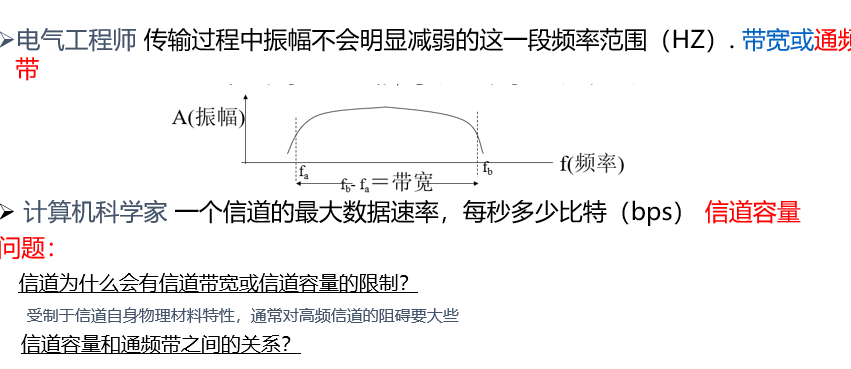
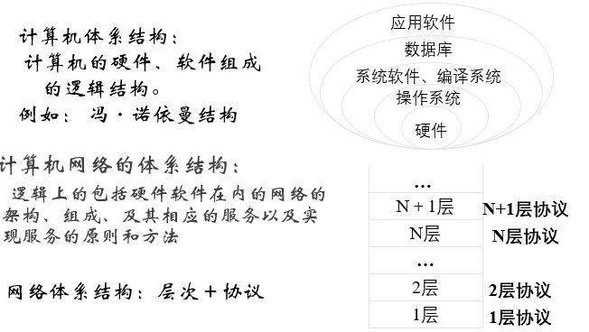
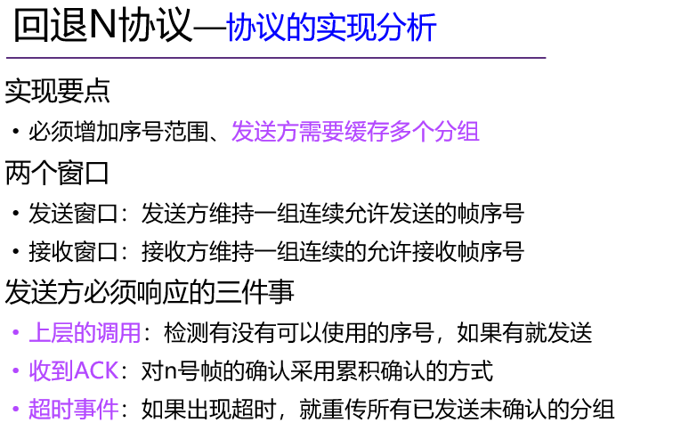
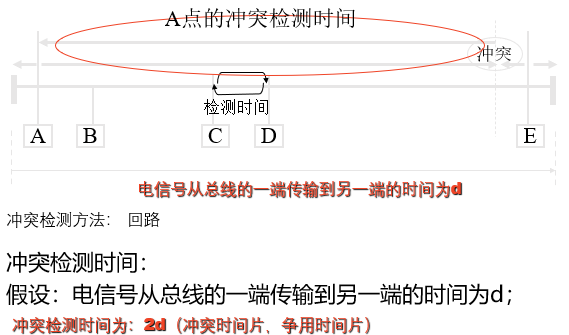
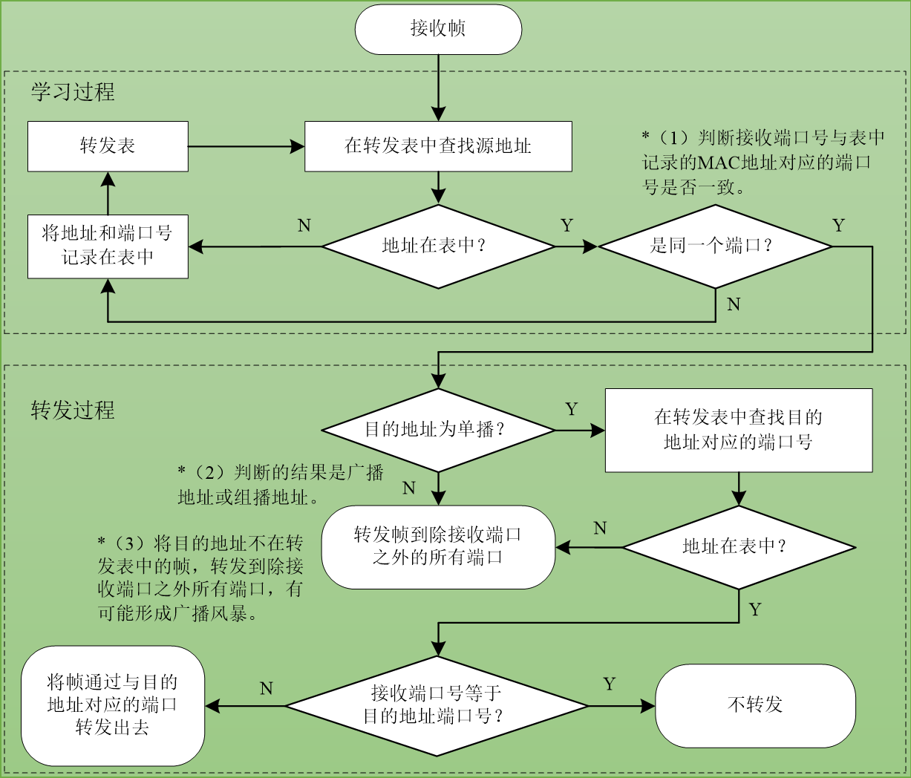
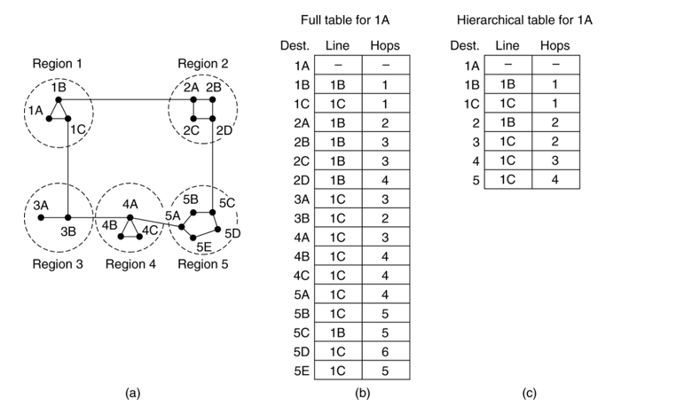
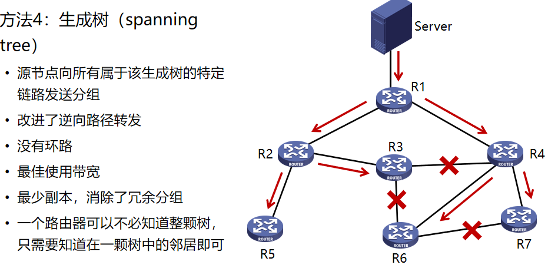
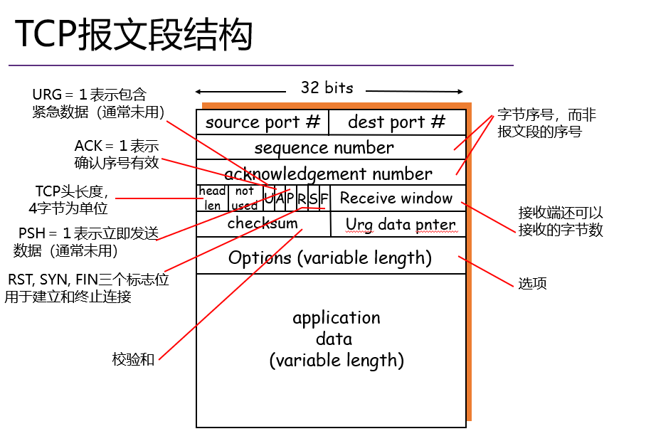
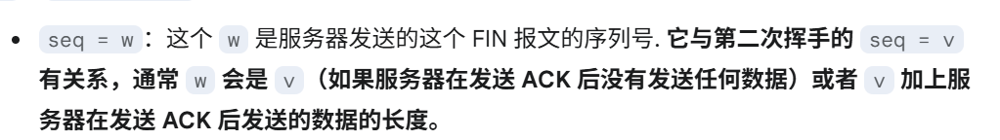
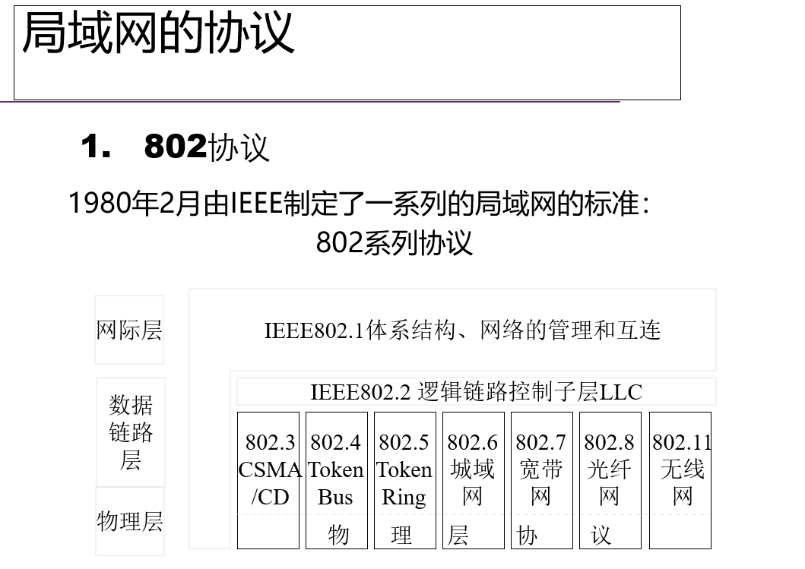

> > > # 计算机网络

# 网络概述

## 计算机网络定义

> 将**独立自主的**、**地理上分散的**计算机系统，通过通信设备和通信线路互连起来，并在**完善的网络软件控制下**实现**资源共享和信息传输**。  

- 网络提供的基本服务
  - 资源传递    (“数据通信”是最基础的功能)
  - 信息共享

## 协议

- 网络协议

> 将独立自主的、地理上分散的计算机系统，通过通信设备和通信线路互连起来，并在完善的网络软件控制下实现资源共享和信息传输。  
>
> 网络协议三要素，语义、语法和时序。
>
> - 三要素
>   - 语法：即**协议元素的格式**，包括数据及控制信息的格式、编码和信号电平等；（如何讲）
>   - 语义：指**交换的信息含义**，包括用于协调与差错处理的控制信息；即“讲什么”，
>   - 时序：**规定各种操作的顺序**（双方讲话的顺序）

- 协议分层结构

  - 层次栈

  - 对等实体

  - 接口

  - **网络体系结构**

    > **层和协议的集合为网络体系结构**，一个特定的系统所使用的一组协议，即每层的协议，称为协议栈

## 三种模型

- OSI

  > | 应用层  Application Layer        bit           |
  > | ---------------------------------------------- |
  > | 表示层  Presentation Layer         帧          |
  > | 会话层  Session Layer                  分组    |
  > | 传输层  Transport Layer               数据层   |
  > | 网络层  Network Layer                 数据层   |
  > | 数据链路层  Data Link Layer        数据层      |
  > | 物理层  Physical  Layer                 数据层 |

- IEEE 802 LAN

  >
  
- TCP/IP

  >| 应用层  application Layer          |
  >| ---------------------------------- |
  >| 传输层  transport Layer            |
  >| 互联网层  internet Layer           |
  >| 网络接口层  host-to-network  Layer |
  >

---

- - OSI 与 TCP/IP的差别

> - OSI模型的不足
>
>   - 从未真正被实现
>     - TCP/IP已成为事实标准，OSI缺少厂家支持
>
>   - 技术实现糟糕
>
>     - OSI分层欠缺技术考虑：会话层、表示层很少内容；数据链路层、网络层内容繁杂。模型和协议过于复杂
>
>     -  分层间功能重复：差错控制、流量控制等在不同层反复出现
>
>   - 非技术因素
>
>     - TCP/IP实现为UNIX一部分，免费
>
>     - OSI被认为是政府和机构的强加标准
>
> - TCP/IP模型的不足
>   - 核心概念未能体现
>     - 未明确区分服务、接口和协议等核心概念
>   - 不具备通用性
>     - 不适于描述TCP/IP之外的其它协议栈
>   - 混用接口与分层的设计
>     - 链路层和物理层一起被定义为网络接口层，而非真正意思上的分层
>   - 模型欠缺完整性
>     - 未包含物理层与数据链路层
>     - 物理层与数据链路层是至关重要的部分

## 网络接入的基本方式

- 光纤
- 数字用户线DSL
- 同轴电缆
- 无线接入

## 零散知识点

- 网络分类

  - 按分布范围分类
    - 个域网PAN
    - 局域网LAN
    - 城域网MAN
    - 广域网WAN

  - 按传输技术分类
    - 广播式网络
    - 点对点网络

  - 按拓扑结构分类
    - 总线型网络
    - 星型网络
    - 环型网络
    - 网状网络

  - 按使用者分离
    - 公用网
    - 专用网

  - 按传输介质分类
    - 有线、无线

- 网络核心的两大功能

  路由和转发

  

# 物理层(数据通信基础)

物理层是网络体系结构的最低层，**要尽可能地屏蔽掉不同传输媒体和通信手段的差异**

## 物理层的四个特性

- 机械特性

  比如规定什么接口，具体设备的尺寸等

- 电气特性

  比如数据交换信号，电压电平等

- 功能特性

  比如每一张线是干什么的

  **信号线可分为四类：数据线、控制线、同步线和地线。**

- 规程特性

  不同功能时间可能出现的次序

### 数据传输速率、信道容量

- 带宽、信道容量



- 奈奎斯特定理（无噪声）

  

- 香农信道容量公式（有噪声）


- 三个速率

  

  比特率即为数据传输速率

- 传输方式
  - 模拟通信和数字通信
  
  - 并行传输和串行传输
  
    | 特性       | 串行传输   | 并行传输           |
    | ---------- | ---------- | ------------------ |
    | 传输方式   | 一位接一位 | 多位同时           |
    | 数据线数量 | 少 (1条)   | 多条               |
    | 传输速率   | 低         | 高                 |
    | 成本       | 低         | 高                 |
    | 干扰       | 小         | 大 (串扰)          |
    | 适合距离   | 远         | 近                 |
    | 应用       | 远距离通信 | 计算机内部、短距离 |
  
  - 点到点传输/点到多点传输
  
  - 单工、半双工和全双工
  
  - 异步传输和同步传输
  
    异步传输：
  
    | 起始位  一般1位 | 字符 | 校验位 | 停止位 |
    | --------------- | ---- | ------ | ------ |
  
    起始位和停止位一定有，其他的注意看题目
  
  - 基带传输和频带传输
  
    | 特性       | 基带传输       | 频带传输                 |
    | ---------- | -------------- | ------------------------ |
    | 信号形式   | 数字信号       | 模拟信号 (调制后)        |
    | 是否调制   | 否             | 是                       |
    | 占用带宽   | 整个信道       | 部分信道                 |
    | 应用场景   | 局域网、短距离 | 广域网、长距离、多路复用 |
    | 设备       | 简单           | 复杂 (需要调制解调器)    |
    | 成本       | 低             | 高                       |
    | 传输距离   | 短             | 长                       |
    | 抗干扰能力 | 弱             | 强                       |
    | 信道利用率 | 高             | 相对较低                 |
  


## 数据传输中的四种转换

1.模拟 - 模拟

> 注意：这是最简单（容易实现）的转换

2.数字 - 模拟

3.模拟 - 数字

4.数字 - 数字

- 数字通信的优势


## 编码

- 不归零制码（NRZ）

  - 不归零电平编码（NRZ-L）
  - 不归零反相编码（NRZI）

  >用两种不同的电平分别表示二进制信息“0”和“1”，低电平表示“0”，高电平表示“1”
  >
  >但是难以分辨开始和结束，没有时钟
  >
  >反相是“0”不跳变，“1”跳变 ——注意：这里一般要标注：逢“1”变化的NRZ

- 曼彻斯特编码

  > •原理：每一位中间都有一个跳变，从低跳到高表示“0”，从高跳到低表示“1”
  >
  > •优点：克服了NRZ码的不足。每位中间的跳变即可作为数据，又可作为时钟，能够自同步

- - - 注意：这里波特率是数据传输速率的2倍

- 差分曼彻斯特编码

  > •原理：每一位中间都有一个跳变，每位开始时有跳变表示“0”，无跳变表示“1”。位中间跳变表示时钟，位前跳变表示数据
  >
  > •优点：时钟、数据分离，便于提取
  >
  > - - - 注意：这里跳变和不归零反相编码不要搞混

- 4B/5B编码

  > 不归零制编码的一种变种
  >
  > 数据流中每4个bit成一个组合，并对应为5个bit的编码
  >
  > 5B编码中至少有两个1，即保证在传输中信号码元至少发生两次跳变，这是在接收端提取时钟信号所必须的
  >
  > 

## 传输介质

- 传输介质分类

  - 引导型介质
  - 非引导型介质

- 引导型介质

  - 双绞线

    > 相同设备用交叉线接法，不同设备用直连线接法

  - 同轴电缆

    > 互联网初期用的比较多，现在主要是用有线电视网。
    >
    > 同轴电缆老化后电阻变大，会“提前视为终端电阻”，查错困难

  - 光纤

    > 多模光纤
    >
    > - 多模渐变：带宽窄，小容量短距离
    > - 多模突变：较宽，中
    >
    > 单模光纤：极宽，大容量距离远

  - 电力载波

- 非引导型介质

  - 散射传输（无线电波）
  - 地面微波
  - 光波传输
  - 卫星通信


## 多路复用技术

- 频分复用

  > 频分复用的所有用户在同样的时间占用不同的带宽资源（请注意，这里的“带宽”是**频率带宽**而不是数据的**发送速率**） 

- 时分复用

  > 
  >
  > - 不足：使用时分复用系统传送计算机数据时，由于计算机数据的突发性质，用户对分配到的子信道的利用率一般是不高的。

- 波分复用

  > 是利用多个激光器在单条光纤上同时发送多束不同波长激光的技术

- 码分复用(CDMA)

  > - 4是指利用码序列相关性实现的多址通信 , 基本思想是靠不同的地址码来区分的地址
  >
  > - 各用户使用经过特殊挑选的不同码型，因此彼此不会造成干扰
  >
  > - 这种系统发送的信号有很强的抗干扰能力，其频谱类似于白噪声，不易被敌人发现
  >
  > 
  >
  > 

- - - 计算式与各个栈的码片进行向量计算，结果为正，发送的是1；结果为负，发送的是-1；结果为0，为发送数据。

- 正交频分复用

  > •将信道分成若干正交子信道；
  >
  > •将高速数据信号转换成并行的低速子数据流，调制到在每个子信道上进行传输
  >
  > - 原理：
  >
  > - A=sin(t) B=sin(2t)
  >
  >   **sin(t)·sin(2t)在区间[0,2π]上的积分为0**

- 空分复用

  > 同一个频段在不同的空间内得到重复利用
  >
  > 在移动通信中，采用自适应阵列天线实现空间分割，在不同的用户方向上形成不同的波束

## 交换技术

- 电路交换

  > 
  >
  > 无法应对互联网中广泛存在的“突发”（Burst）流量

- - - 注意：电路交换虽然建立连接耗时，但是由于有连接，所以在数据传输期间时延最小

- 报文交换

  > 基于存储转发的机制
  >
  > 路由器需要接收到完整的整个数据报文后，才能开始下一跳发送。

- 分组交换

  > •将大报文拆分成多个小分组
  >
  > •通信双方以分组为单位、使用存储-转发机制，实现数据交互的通信方式
  >
  > •以分组作为数据传输单元
  >
  > •每个分组的首部都含有地址（目的地址和源地址）等控制信息
  >
  > •每个分组在互联网中独立地选择传输路径
  >
  > •支持灵活的统计多路复用

- 三种交换的比较
  - 电路交换需要建立连接并预留资源，难以实现灵活复用
  - 报文交换和分组交换叫灵活，抗毁性高，在传送突发数据时可提高网络利用率
  - 由于分组长度小于报文长度，分组交换比报文交换的时延小，也具有更好的灵活性
  - 

## 网络拓扑结构

- 总线型
- 星型
- 环型
- 树型

## 零散知识点

- 信噪比

  
  
- 计算机网络的体系结构

  > 

---


# 数据链路层

- 功能：成帧、差错控制、流量控制
- 提供的服务
  - 无确认，无连接服务
  - 有确认、无连接服务
  - 有确认、有连接服务


## 数据成帧的方法

- 字节计数法

  > 
  >
  > 仅适用于无差错传输的情形
  >
  > 如果有一个字节差错，就破坏了帧的边界，导致一连串帧的错误

- 带字节填充的定界符法

  > - 定界符（FLAG）：一个特殊的字节，比如 01111110，即 0x7E，用于区分前后两个不同的帧
  >
  > 
  >
  > - 发送方处理：发送方检查有效载荷，进行字节填充
  >
  >   
  >
  > - 接收方的处理
  >
  > >  逐个检查收到的每一个字节
  > >
  > > **收到ESC**：则**后一字节无条件成为有效载荷，不予检查**
  > >
  > > 收到FLAG：则为帧的边界
  >
  > ​                        
  >
  > - - 不足：依赖特定的字符集，增加数据的冗余性；增加处理开销，容易出错

- 带比特填充的定界符法

  > - 定界符：两个0比特之间，连续6个1比特，即01111110，0x7E
  >
  >   问题：如果有效载荷部分包含与“定界符”相同的位组合如何解决？
  >
  > - 发送方：检查有效载荷
  >
  >   > 若在有效载荷中出现连续5个1比特，则直接插入1个0比特
  >   >
  >   > 
  >
  > - 接收方
  >
  >   >- 若出现连续5个1比特
  >   >
  >   >  若下一比特为0，则为有效载荷，直接丢弃0比特
  >   >
  >   >  若下一比特为1，则连同后一比特的0，构成定界符，一帧结束
  >   >
  >   >

- 物理层编码违例

  

---


## 差错控制方法

- [ ] 存在的问题：信道的噪声导致数据传输问题

  •差错（ incorrect ）：数据发生错误

  •丢失（ lost ）：接收方未收到

  •乱序（out of order）：先发后到，后发先到

  •重复（repeatedly delivery）：一次发送，多次接收

- [ ] 解决方案：差错检测与纠正、确认重传

  •确认：接收方校验数据（差错校验），并给发送方应答，防止差错

  •定时器：发送方启动定时器，防止丢失

  •顺序号：接收方检查序号，防止乱序递交、重复递交

---

- 误码率

  

  

### 差错检测和纠错

- 检错码

  code word = 数据位 + 冗余位

- 差错控制方法

  - 自动请求重发（ARQ）方式

    > 发送端发送出可以发现错误的码字
    >
    > 接收端姨妈，若检测到错误，则主动向发送带能发出请求，要求重发以便纠错
    >
    > 要求有返回信道且发送端和接收端都有缓存器

  - 前向纠错（FEC）方式

    > 发送端发出的码字是具有一定纠错能力的码字。
    >
    > 接收端译码后不仅可以发现错码，而且能够判断错码所在的位置并自动纠正。
    >
    >  不需反馈信道，实时性好，传输效率较高，但纠错编码方法和设备较复杂。

  - 混合纠错（HEC）方式

    > 结合使用ARQ方式和FEC方式。
    >
    > 在传输错码较少且接收端能纠正时，自动纠正错误；
    >
    > 在错码较多、超出纠正能力但尚能检测时，采用自动请求重发方式，请求发送端重传，直到正确接收为止
    >
    > 该方式大大提高了通信的可靠性。

### 差错控制编码类型

#### 检错码

- 奇偶校验码

  - 垂直奇偶校验

  - 水平奇偶校验

    > 漏检率小于1/2

  - 水平垂直奇偶校验

    > 先垂直的校验写完，再写水平的

- - - 注意：

    - >  偶校验
      >
      >   使码字中“1”的个数保持偶数。
      >
      > - 偶数个1是0，奇数个1是1
      >
      > 奇校验
      >
      >   使码字中“1”的个数保持奇数。
      >
      > - 奇数个1是0，偶数个1是1

- 循环冗余校验码（CRC）

  > 
  >
  > T(x)/G(x) 整除——没错；不整除——出错。
  >
  > - - - 注意：仅仅知道G(x)是，CRC比G(x)少一位
  >     - 模2运算：加法不进位，减法不借位

- 校验和

  > 
  >
  > - - - 注意：计算结果取反才是校验和
  >     - 加法有进位的话，最高位补到末尾计算

#### 纠错码

> 4种不同的纠错编码：海明码、二进制卷积码、里德所罗门码、低密度奇偶效验码

- 海明码

  - 冗余位数的计算

    > m为数据；r位冗余位
    >
    > 

  - 冗余位的位置和数值

    > 位置：各冗余位处于第1、2、4、8位（2的n次方处），分别用r1，r2，r3，r4表示。
    >
    > 
    >
    > 判断：后面的位用2的n次方的加法分解是一点用到该位。（为了方便分解，用二进制表示更快一点）
    >
    > 数值：根据上述一定会出现的位置进行奇校验或者偶校验（看题目），还没有出的位置用0

  - 检错与纠错

    > 注意：这里开始就是第一位，没有第0位开始
    >
    > 接收端取出接收结果，并使用与发送端相同的方法计算出一组新的奇偶校验码。然后将这些奇偶校验码按r的顺序（r8,r4,r2,r1）组成一个二进制数。这就是准确的差错位置。如果算出来是0，那就是没错。


## 流量控制

- [ ] 链路层存在的另一个问题：接收方的处理速率

  •接收方的接收缓冲区溢出

- [ ] 解决方案

  - **基于反馈**的流量控制
    - 接收方反馈，发送方调整发送速率

  - **基于速率**的流量控制
    - 发送方根据内建机制，自行限速

---

### 停等协议

几个关键要素：

1. **数据帧（Data Frame）：** 这是要传输的实际数据单元，通常包含需要发送的信息以及一些控制信息（例如，序号）。
2. **确认帧（Acknowledgement Frame，ACK）：** 接收方在成功接收到数据帧后，会发送一个确认帧给发送方，告知发送方数据已正确接收。确认帧通常包含期望接收的下一个数据帧的序号。
3. **序号（Sequence Number）：** 为了解决数据包丢失、重复或乱序等问题，发送方会为每个发送的数据帧赋予一个序号。接收方可以使用序号来识别重复的数据包并按正确的顺序接收数据。在最简单的停等协议中，只需要 1 比特的序号（0 和 1）即可交替使用。
4. **超时重传（Timeout and Retransmission）：** 发送方在发送一个数据帧后，会启动一个定时器。如果在定时器超时之前没有收到接收方发来的确认帧，发送方会认为该数据帧丢失或确认帧丢失，并重新发送该数据帧。
5. **发送方状态（Sender State）：** 发送方需要维护当前的状态，例如：
   - 等待发送（idle）
   - 已发送未确认（waiting for ACK）
6. **接收方状态（Receiver State）：** 接收方也需要维护当前的状态，例如：
   - 等待接收数据帧 0
   - 等待接收数据帧 1
7. **缓冲区（Buffer）：**
   - **发送缓冲区：** 发送方需要一个缓冲区来存储已发送但尚未被确认的数据帧，以便在超时重传时能够重新发送。
   - **接收缓冲区：** 接收方可能需要一个缓冲区来临时存储接收到的数据帧，以便按正确的顺序向上层交付。在简单的停等协议中，由于要求按序接收，这个缓冲区可能相对简单。

---


### 滑窗协议

停止-等待机制降低了信道利用率

#### 协议基本思想

> 发送方和接收方都具有一定容量的缓冲区（即窗口），发送端在收到确认之前可以发送多个帧

#### 滑动窗口协议


滑动窗口协议处理帧出错或丢失的方式取决于具体的协议类型，主要有两种常见的滑动窗口协议：**Go-Back-N (GBN)** 和 **Selective Repeat (SR)**。

---

#### 回退N协议



#### 选择重发协议


---

#### 最大窗口数

对应n个bit

**Go-Back-N (GBN):**

- 最大发送窗口数 (WS): 2^n−1
- 接收窗口数 (WR): 1

**Selective Repeat (SR):**

- 最大发送窗口数 (WS): 通常为 2^n−1
- 最大接收窗口数 (WR): 通常为 2^n−1
- 需要满足 WS+WR≤2^n

---

- [x] PPT修正结果

​	

---


# 介质访问控制子层(MAC层)

- 数据链路层分为两个子层：

  - MAC子层：介质访问

  - LLC子层：承上启下（弱层）

---

- 信道分配
  - 静态分配
  - 动态分配
    - 随机访问
      - 如ALOHA协议、CSMA协议
    - 受控访问
      - 如令牌传递

## 介质访问控制方法

- 载波侦听多路路由访问协议CSMA

  > 载波侦听（Carrier Sense）：站点在发送帧之前，首先侦听信道有无载波，若有载波，说明已有用户在使用信道，则不发送帧以避免冲突。三种方式：
  >
  > ​    1、坚持型CSMA（1-persistent CSMA） 
  >
  > ​    2、非坚持型CSMA（nonpersistent CSMA） 
  >
  > ​    3、p-坚持型CSMA（p-persistent CSMA） 
  >
  > - 坚持型CSMA（或 1-坚持型CSMA）
  >
  >   1.先侦听
  >
  >   2.忙，坚持侦听
  >
  >   3.闲，发送data
  >
  >   4.冲突，等待一个随机时间，重新开始发送过程（回到（1））
  >
  >   > 优点：减少了信道空闲时间，
  >   >
  >   > 缺点：增加了发生冲突的概率。广播延迟越大，发生冲突的可能性越大，协议性能越差。
  >
  > - 非坚持型CSMA
  >
  >   1.先侦听
  >
  >   2.闲，发送data
  >
  >   3.忙，等待一个随机时间，然后重新开始发送过程（回到（1））
  >
  >   4.冲突，等待一个随机时间，然后重新开始发送过程（回到（1））
  >
  >   >优点：减少了冲突的概率，信道效率比1-坚持CSMA高
  >   >
  >   >缺点：增加了信道空闲时间，数据发送延迟增大。传输延迟比1-坚持CSMA大。 
  >
  > - p-坚持型CSMA
  >
  >   1.先侦听
  >
  >   2.闲，p发送data，q=1-p延迟发送
  >
  >   3.忙，等待
  >
  >   4.冲突，等待一随机时间，重新开始发送
  >
  >   > 折中方案，既能像非坚持型CSMA那样减少冲突，又能像1-坚持型CSMA那样减少媒体空闲时间的，适用于分槽信道.

---


- 带有冲突检测的CSMA（CSMA/CD）

  > - 基本思想
  >
  >   1.先侦听
  >
  >   2.忙，后退，等待一个随机事件再进行线路侦听
  >
  >   3.闲，data发送，发送过程继续侦听
  >
  >   - 无冲突，发送成功
  >   - 有冲突，后退，等待时间T，再进行发送
  >
  > - 冲突检测时间
  >
  >   
  >
  > - 退避时间
  >
  >   
  >
  >   - - - 注意：这里是最大退避时间，过程见笔记
  >
  > - 冲突的检测
  >
  > - CSMA/CD的**特点：**
  >
  >     ① 竞争机制，站点越多，负载越重，冲突的可能 性越大；反之负载越轻，冲突的可能性越小
  >
  >     ② 不宜设立优先级
  >
  >     ③ 不宜实时控制

---


- 令牌传递

  > 
  >
  > 
  >
  > - 无优先级
  >
  >   
  >
  > - 有优先级
  >
  >   
  >
  >   - - - 注意优先级，结合笔记

---


## 常用的局域网模型

- 传统以太网连接方法（四种）

  - 铜缆（粗缆、细缆）

  - 双绞线

  - 光缆

    

- - - 注意：以10 BASE 5 为例：
    - 10：10Mbps
    - BASE：基带传输
    - 5：粗缆

### 10M(普通以太网)

- - - 注意每种网的距离，网段等

- 10BASE5

  

  使用曼彻斯特编码，使用同轴电缆和中继器连接

- - - 重点：54321方法
    -  

- 10BASE2

  

- 10BASE-T

  

- MAC子层协议

  

  > - 数据字段
  >   - 46 ~ 1500字节
  >   - 最小帧长 = 46+18 = 64B
  >   - 最大帧长 = 1500+18 = 1518B （MTU：1500B）
  >
  > 数据字段不足46字节，需要填充整数字节（Padding）至46字节，以保证以太网MAC帧不小于64字节
  >
  > 
  >
  > - 争用期的长度
  >
  >   
  >
  > 
  >
  > 
  >
  > 

---

### 100M

- 快速以太网

  

- 千兆以太网

  

  - 问题的答案
  - 

- - - 注意：

    - •保留以太网帧格式 

      •保留以太网最小帧长和最大帧长

### 交换式以太网

- 使用集线器（HUB）组建以太网

- 交换式以太网的核心是交换机

- 集线器和交换式对比

  

- 交换式局域网技术

  > - 交换的基本功能：
  >
  >   > 建立和维护一个表示MAC地址与交换机端口号对应关系的映射表。
  >   >
  >   > 在发送主机与接收主机端口之间建立虚连接。
  >   >
  >   > 完成帧的过滤与转发。
  >   >
  >   > 执行生成树协议，防止出现环路
  >
  > - 全双工交换机
  >
  >   - 端口速率：10M/100M/1000M
  >   - 交叉矩阵：三种工作方式
  >   - 背板：确定数据帧如何从一个端口向另外的端口转发
  >     - 循环法
  >     - 优先端口服务：引入各端口争用地板总线
  >   - 三种工作方式
  >   - 

---


### 虚拟网

- VLAN的划分方法

  - 基于交换机端口的VLAN划分方法
  - 基于主机MAC地址和VLAN划分方法
  - 基于网络层地址或协议的VLAN划分方法

- 扩展后的以太网帧结构

  

---


- - - 注意：笔记中有冲突域的计算
    - 两两配对算，“一个个放大都算”
    - 网桥会隔开，只有每个部分自己的冲突域

- 数据链路层交换原理

  

  

---

## 虚拟网络的组网方法

- 以太网的基本组网方法
  - 中继器组网
  - 集线器组网
  - 交换机


- 源路由网桥

  - 源路由网桥由发送帧的源主机负责路由选择。
  - 每个主机在发送帧时，将详细的路由信息写在帧头部，网桥根据源主机确定的路由转发帧。
  - 为了发现合适的路由，源主机以广播方式向目的主机发送用于探测的发现帧。
  - 源主机得到这些路由信息后，从可能的路由中选择出一个最佳路由。
  - 常用的方法是：如果有超过一条的路径，源主机将选择经过的中间经过的网桥跳数最少的路径。

- 透明网桥

  - 用透明网桥互联局域网时，网桥的转发表开始是空的。网桥采取与交换机采取自学习方法，在转发帧的过程中，逐渐将建立和更新转发表。
  - 透明网桥通过自学习算法生成和维护网桥转发表，是一种**即插即用**的局域网互联设备。
  - 局域网的主机不负责帧传输路径的选择。互联的局域网主机不需要知道网桥的存在，也不需要了解网桥之间的连接关系，网桥对主机是透明的。

  > 


- 局域网互联和网桥

  > 局域网互联与网桥的基本概念
  >
  >   **—** 网桥是实现两个或两个以上相同类型的同构局域网的互联，也可以实现两个或两个以上不同类型的异构局域网的互联设备
  >
  > 网桥主要有两大主要的功能：
  >
  >   **—** 端口号与对应的MAC地址表的转发表生成与维护
  >
  >   **—** 帧接收、过滤与转发

---


- 几个概念

  - 端口优先级
    - 每个网桥需要有网桥地址，**选择端口号最小的MAC地址作为网桥地址**，如B1端口1的A201102A1001，则B1的网桥地址就是端口1 的地址；
    - 网管人员为每个网桥分配一个优先级，优先级+MAC地址就是网桥地址，如B1的优先级是0，则网桥B的表示为：0， A201102A1001
    - 选择根网桥的方法是**先比较网桥的优先级，如果优先级相同，就选择MAC地址小的网桥作为根网桥，最后才是端口**
  - 路径成本
    - 每个局域网需要按照带宽选择成本
    - 如10Mbps的路径成本一般选择100等
  - 附：
    - 如果两个端口与另一个网桥链接，则一个是正常链接（优先级高的），一个是备份    ——优先级数字越小越高
    - 如果两个端口优先级相同，选择端口小的作为链接

  

- - - 注意这里B是网桥，横线才是网

---


- 中继器、集线器、网桥与交换机比较

  > 

  

# 网络层

## 原理

- 网络层关键功能
  - 路由
    - 选择数据报从源端到目的端的路径
    - 核心：**路由算法与协议**
  - 转发
    - 将数据报从路由器的输入接口传送到正确的输出接口

### 网络层的服务

- 网络提供（给传输层）的服务

  - 虚电路（面向连接）

  - 数据报（无连接）

---

#### 数据报

- 数据报机制---每个分组需要携带完整的目的地址，每个分组独立寻找路径，分组到达的顺序与发送的顺序可能不同。发送分组的数量、分组的丢失或重发由高层负责

- 路由算法---管理这些路由表并做出路由选择的算法
- 数据报转发决策**基于分组的目的地址**

#### 虚电路

> - 概念
>
> 
>
> - 示例
>
>   
>
>   - 同一个节点的In 和 Out是分开的
>   - 不同节点相关的In和Out是一直的
>   - 数字从0开始
>   - 虚电路转发决策基于分组标签，即虚电路号
>
> - - - 注意，虚电路是面向连接的方法。但是，面向连接的方法也不一定能完全保证数据的可靠传输，链路中的任何一个组成环节仍有可能失效，而这种失效是严重的，可能导致所有数据丢失

- - - 注意：面向连接的方法一般的三个步骤：
    - 建立连接，data传输，拆除连接

---

- 虚电路和数数据报网络的比较

  | 对比内容           | 虚电路服务                         | 数据报服务                     |
  | ------------------ | ---------------------------------- | ------------------------------ |
  | 可靠传输的保证     | 可靠通信由网络保证                 | 可靠通信由主机保证             |
  | 连接的建立         | 必须要                             | 不需要                         |
  | 地址               | 每个分组含有一个短的虚电路号       | 每个分组需要有源地址和目的地址 |
  | 状态信息           | 建立好的虚电路要占用子网表空间     | 子网不存储状态信息             |
  | 路由选择           | 分组必须经过建立好的路由发送       | 每个分组独立选择路由           |
  | 分组顺序           | 总是按序到达                       | 可能乱序                       |
  | 路由器失效         | 所有经过失效路由器的虚电路都要终止 | 失效结点可能丢失分组           |
  | 差错处理和流量控制 | 网络或用户主机负责                 | 用户主机负责                   |
  | 拥塞控制           | 容易控制                           | 难控制                         |

---


### 路由算法

- 概述

  

#### 静态路由算法

- 最短路径选择

  > - 基本思想
  >
  >   构建子网的拓扑图，图中的每个结点代表一个路由器，每条弧代表一条通信线路。
  >
  >   目的是构建两个路由器间的路由，算法是在子网拓扑图中找出最短路径。
  >
  > - 得到最短路径，有不同的测量
  >
  >   Dijkstra算法是其中的一直计算最短路径的算法

- 洪泛算法

  > - 工作原理：将收到的每一个分组，从除了分组到来的线路外的所有输出线路上发出。
  > - 优点：鲁棒性好，总能找到最短的那条路径
  > - 缺点：产生大量的重复分组
  > - 抑制措施：  
  >   - 让每个分组头包含站点计数器；  
  >   - 记录下分组扩散的路径(记下来自于某源路由器的序列号，可用一计数器)；  
  >   - 选择性扩散 

---


#### 动态路由算法

##### 距离矢量路由算法

也称为分布式Bellman-Ford算法和Ford-Fulkerson算法

- 工作原理：工作原理 :每个路由器维护一张表，表中给出了到每个目的路由器的已知最短“距离”和相应输出线路,并通过与相邻路由器交换距离信息来更新表。

- “距离” ：到目的路由器的站点数、估计的时间延迟、路由排队的分组估计总数或类似的值。

  - Bellman-Ford 方程

  

- 基本思想

  

  - 示例

    

- 步骤：

  >1.路由器启动时初始化自己的路由表，初始路由表包含所有直接相连的网络路径，距离均为0（1？通过路由器是1，路由器和网络直接连接是0）
  >
  >2.路由器周期性地向其相邻路由器广播自己知道的路由信息
  >
  >3.相邻路由器可以根据收到的路由信息修改和刷新自己的路由表
  >
  >4.路由器经过若干次更新后，最终都会知道到达所有网络的最短距离
  >
  >5.所有的路由器都得到正确的路由选择信息时网络进入“收敛”（convergence）状态
  >
  >- - - 注意，这会有无穷计算问题——“好消息快，坏消息慢”
  >    - 
  >    - 


##### 链路状态路由算法

- 基本思想

  > 发现它的邻接节点，并得到其网络地址
  >
  > 测量它到各邻接节点的延迟或开销
  >
  > 组装一个分组以告知它刚知道的所有信息
  >
  > 将这个分组发给所有其他路由器
  >
  > 计算到每个其他路由器的最短路径

- 步骤

  - 当一个路由器启动后，向每个点到点线路发送HELLO分组，另一端的路由器发送回来一个应答来说明它是谁

  - 发送一个ECHO分组要求对方立即响应，通过测量一个来回时间再除以2，发送方就可以得到一个延迟估计值，想要更精确些，可以重复这一过程，取其平均值

  - 构造分组子网及其节点到其邻节点（路由器）的线路开销测量值（即延时，假设以ms计）

    

    - 如果分组序列号小于看到过的来自于该源路由器的最大序列号，则认为重复，丢弃。

  - 将LSP分组发送给其他的路由器

---

- 层次路由

  

- 广播路由

  

  

  

  

  

- 组播路由

  源主机给网络中的一部分目标用户发送数据包

  

#### 小结


### 拥塞控制


#### 开环控制

根据网络状态进行动态控制，包括两部分：反馈机制和控制机制。闭环控制方法分为两个子类：显式反馈与隐式反馈

开环控制属于预防性拥塞控制，它竭力使网络总是处于无拥塞状态运行。开环控制的方法包括决定什么时候接受新流量，什么时候丢弃数据包和丢弃哪些数据包。其缺点是没有考虑网络的当前状态


- 

- 检测拥塞

  


- 

- 

- 负载脱落

  

  牛奶——丢旧，葡萄酒——丢新

  视频：牛奶；文件：葡萄酒

#### 闭环控制

根据网络状态进行动态控制，包括两部分：反馈机制和控制机制。闭环控制方法分为两个子类：显式反馈与隐式反馈


### 服务质量


#### 流量整形

- - - 注意，这也是拥塞控制的内容

调节进入网络的数据流的平均速率和突发性所采用的技术：将用户发出的不平滑的数据包流转变成网络中平滑的数据包流

- 漏桶

  

- 令牌桶

  

#### 各种调控方式

- 包调度

  - - 在同一个流的数据包之间以及在竞争流之间分配路由器资源的算法。
    - 资源：带宽、缓冲区、CPU周期。

  - 先入先出 FIFO       

    采取尾丢弃（tail drop）   

    无法满足良好的服务质量

  - 公平排队

  - 加权公平队列

- 准入控制方法

- 综合服务

- 区分服务


## TCP/IP

### 四种地址

| 层 | 地址 |
| ---------- | ------------ |
| 应用层 | 域名地址 |
| 传输层     | 端口地址     |
| 网络层     | IP地址       |
| 网络接口层 | 物理地址     |

#### 物理地址（MAC地址）

- 物理地址（或MAC地址）的作用是用来找到所要通信的计算机。网卡从网上收到MAC首先检查其硬件地址，如果是发往本站的帧则收下，然后进行相应的处理，否则就将此帧丢弃，不再进行其他处理。802标准规定MAC地址字段可以采用6字节或2字节两种.

- IEEE是世界上**局域网全局地址的法定管理单位，它负责分配地址字段6字节的前3个字节，后3个字节由厂商自行分配。**

- 物理地址写法：00-00-00-0-02-03

  | 厂商     | CISCO  | 3Com   | HP     | Sun    | IBM    | Intel  |
  | -------- | ------ | ------ | ------ | ------ | ------ | ------ |
  | 厂商代号 | 00000C | 02608C | 080009 | 080020 | 08005A | 00AA00 |

#### IP地址

- IPv4地址

  > 基本的IP地址是分成8位一个单元(称为8位位组)的32位二进制数。IP地址中的每一个8位位组用0～255之间的一个十进制数表示。这些数之间用点(.)隔开，这就是所谓的点分十进制格式。
  >
  > 
  >
  > Internet上每台主机都有它自己的IP地址
  >
  > - IP地址有两部分组成：网络部分和主机部分，即
  >   $$
  >   IP = 网络地址 + 主机地址
  >   $$
  >
  >   - 网络部分用来描述主机驻留的网络
  >   - 主机部分用来识别特定的主机
  >
  > - IP地址的分类
  >
  >   > IP地址共分为A、B、C、D、E五类，A类、B类、C类为单播地址
  >   >
  >   > IP地址的书写采用点分十进制记法，其中每一段取值范围为0到255
  >   >
  >   > 
  >   >
  >   > A：0~127；B：128~191；C：192~223
  >   >
  >   > - - -
  >   >
  >   > 
  >
  > - IP特殊地址
  >
  >   | 地址            | 用途                                                         |
  >   | --------------- | ------------------------------------------------------------ |
  >   | 全0网络地址     | 只在系统启动时有效，用于启动时临时通信，又叫主机地址         |
  >   | 网络127.0.0.0   | 指本地节点(一般为127.0.0.1)，用于测试网卡及TCP/IP软件，这样浪费了1700万个地址 |
  >   | 全0主机地址     | 用于指定网络本身，称之为网络地址或者网络号                   |
  >   | 全1主机地址     | 用于广播，也称定向广播，需要指定目标网络                     |
  >   | 0.0.0.0         | 指任意地址                                                   |
  >   | 255.255.255.255 | 用于本地广播，也称有限/受限广播，无须知道本地网络地址        |
  >
  > - **私有地址**
  >
  >   - 私有地址不被正式的分配给任何人，而且决不应该被使用在自己网络的外部机构(即Internet网上)
  >   - A类网10.0.0.0到10.255.255.255；
  >   - B类网172.16.0.0到172.31.255.255；
  >   - C类网192.168.0.0到l92.168.255.255 

  ---

  

- IPv6地址

  > - IPv6用冒号十六进制表示法
  >
  > - 128位的地址按每16位划分为8个位段
  >
  > - 将每个位段转换成十六进制数，并用冒号隔开
  >
  > - 
  > - - -  注意：双冒号只能用一次

#### 端口地址


#### 域名地址


### 子网掩码、CIDR、路由地址

#### 子网掩码

- 子网划分

  > 子网划分：在网络内部将一个网络块进行划分以供多个内部网络使用，对外仍是一个网络
  >
  > 子网：一个网络进行子网划分后得到的一系列结果网络称为子网
  >
  > 子网掩码：与 IP 地址一一对应，是32 bit 的二进制数，置1表示网络位，置0表示主机位
  >
  > 子网划分减少了 IP 地址的浪费、网络的组织更加灵活、便于维护和管理
  >
  > 

- - - 根据子网掩码判断两个网络是本地网络还是远程网络

      > 1.源主机与目的主机的IP地址形式（二进制）
      >
      > 2.分别于子网掩码进行与运算
      >
      > 3.比较是否相同
      >
      > - 相同——本地，不需要路由器转发
      > - 不同——远程，需要路由器转发

- - - 注意：由于有全0和全1的存在，有子网掩码**计算可容纳多少主机时要减2**

#### CIDR（无类域间路由选择）

丢弃地址的分类思想

> 
>
> - - - 注意路由器的最长前缀匹配
>
> ---
>
> - CIDR的基本思想是取消IP 的分类思想，将多个C类地址聚合成更大的网络，亦包含更多的主机；
>
> - CIDR支持路由聚合，可以将路由器中多个条目合并成更少条目，减少路由器表的大小，限制路由表的增长
>
> - 利用CIDR实现地址汇总有两个基本条件：
>
>   - 待汇总地址的网络号拥有相同的高位。
>
>   - 待汇总的网络地址数目必须是2n，如2个、4个、8个、16个等等。否则，可能会导致路由黑洞（汇总后的网络可能包含实际中并不存在的子网）。
>     - 路由黑洞举例：
>     - 
>
> - CIDR路由转发过程
>
>   - 分组到来，与子网掩码与，找匹配项
>   - 如有多个匹配项，则找掩码长度最长的那个

#### 路由地址的汇聚

在上一点中已经涉及

---


### IP层协议

- - - 注意：IP协议提供的是无连接，不可靠的协议


#### ARP（地址解析协议）/RARP

> IP层协议只知道要发送的下一站的主机和路由器的IP地址。
>
> 在以太网等局域网上，使用ARP协议，来实现IP地址到MAC地址的动态转换。广播询问应答
>
> RARP协议则实现MAC地址到IP地址的逆向转换。
>
> 
>
> 

#### IPv4

一种无连接的协议，是互联网的核心，也是使用最广泛的网际协议版本，其后继版本为IPv6

- internet协议执行两个基本功能

  - 寻址
  - 分片

- 

  

- 数据报分片

  - MTU，最大传输单元
    - 链路MTU
    - 路径MTU
  - 分片策略
  - 重组策略

- IP分段

  

- - - 注意：OS是8B为一组
    - 这里的MF/DF是指“该部分”，不是指能不能“分裂”，MF/DF是真的独立的数据报而言的。表示的是该数据报的状态
    - **只有最终目的主机才会对段进行重组**

- 

- 


#### NAT（网络地址转换）

- 用于解决IPv4地址不足的问题，是一种将私有（保留）地址转化为公有IP地址的转换技术

- 私有IP地址：

  - A类地址：10.0.0.0--10.255.255.255
  - B类地址：172.16.0.0--172.31.255.555
  - C类地址：192.168.0.0--192.168.255.255

- NAT的三种用法

  - 一个公有地址对应一个私有地址

  - 几个私有地址对应几个公有地址

  - 一个公有地址对应一大群私有地址

- NAT类型:

  - 静态NAT

  - 动态NAT

  - 端口NAT

- 


#### DHCP（动态主机配置协议）

- 工作模式：客服/服务器模式（ C/S ）
  - 基于 UDP 工作，服务器运行在 67 号端口， 客户端运行在 68 号端口

| 阶段     | 源MAC                         | 目标MAC         | 源IP                           | 目标IP           | 传输形式 |
| -------- | ----------------------------- | --------------- | ------------------------------ | ---------------- | -------- |
| Discover | PC机的MAC                     | 全FF            | 0.0.0.0                        | 255.255.255.255  | 广播     |
| Offer    | DHCP服务器或者中继器路由的MAC | DHCP客户机的MAC | DHCP服务器或中继路由器的IP地址 | 准备分配的IP地址 | 单播     |
| Request  | PC机的MAC                     | 全FF            | 0.0.0.0                        | 255.255.255.255  | 广播     |
| Ack      | DHCP服务器或者中继器路由的MAC | DHCP客户机的MAC | DHCP服务器或中继路由器的IP地址 | 准备分配的IP地址 | 单播     |

#### ICMP（互联网控制报文协议）

- ICMP报文类型

  - ICMP 差错报告报文
    - 终点不可达：不可达主机、不可达网络，无效端口、协议

  - ICMP 询问报文
    - 回送请求/回答 (ping使用)

- 

- 

- Ping和ICMP

  - PING (Packet InterNet Groper) 

    - PING 用来测试两个主机之间的连通性

    - PING 使用了 ICMP 回送请求与回送回答报文

- Tracetoute和ICMP

  - 

- 差错报文

  - 

- 查询报文

  - 

#### OSPF（开放最短路径优先协议）

采用分布式的链路状态算法

- 基本思想
  - 向本自治系统中所有路由器洪泛信息
  - 发送的信息就是与本路由器相邻的所有路由器的链路状态
  - 只有当链路状态发生变化时路由器才用洪泛法发送此信息

- 报文格式
  - 

- - - 问题：
    - OSPF报文，在backbone区域（骨干区域）

- 特点
  - 支持无类域间路由（CIDR）
  - 无路由自环
  - 收敛速度快
  - 使用IP组播收发协议数据
  - 支持多条等值路由
  - 支持协议报文的认证

#### RIP（路径选择协议）

- 基本思想
  - 仅和相邻路由器交换信息
  - 路由器交换的内容是自己的路由表
  - 周期性更新：30s

- 

- 

- 

- **为什么 RIP 没有认证？**

  查看图片中间详细信息部分，"Routing Information Protocol" 中并没有明显的认证字段。

  **RIPv1 确实没有内置的认证机制。** 这意味着任何接收到 RIPv1 更新的路由器都会信任并处理其中的路由信息，这存在安全风险。

  **RIPv2 引入了简单的密码认证机制。** 然而，从图片中我们无法直接判断是否使用了认证。如果使用了认证，通常会在 RIPv2 报文的特定字段中包含认证信息。由于这里没有看到明显的认证字段，可能的情况是：

  - **没有配置认证：** 网络管理员可能没有为 RIPv2 配置认证。
  - **认证信息在报文的其他部分：** Wireshark 可能没有在展开的这部分详细显示认证信息（虽然不太可能）。

- - - v2支持CIDR

#### IGP（内部网关路由协议）

有 RIP 和、OSPF、ISIS 等多种具体的协议

#### BGP（边界网关协议）

EGP（外部网关路由协议）：目前使用的协议就是 BGP

- iBGP：从相邻的AS获得网络可达信息

- eBGP：将网络可达信息传播给AS内的路由器
- 


#### RPC（远程过程调用协议）

#### IPV6

- 分组结构

  

----


# 传输层

- 引入传输层的原因
  - 消除网络层的多样性和不确定性
  - 提供从源主机到目的端主机可靠的、价格合理的、与实际使用的网络无关的信息传输

- 基本功能

  传输层的主要功能是实现进程之间的端-端通信

- 提供的服务

  - 面向连接的传输服务

    “三个阶段”

    其中释放连接有两种方式：

    - 不对称方式：任何一方都可以关闭双向连接。
    - 对称方式：每个方向的连接单独关闭，双方都执行Disconnect才能关闭整条连接。

  - 无连接的传输服务

- 

- 

---

- 在TCP和UDP协议中引入了端口(Port)和套接字(Socket)的概念。

- 端口号:16位的标志符（0~65535），标识传输层协议和应用程序之间的数据接口，端口号是由不同的主机上的TCP和UDP协议独立分配的，所以不可能全局唯一。

- 套接字:**端口号+IP地址，唯一标识一端。在TCP协议中，一条连接两端的套接字就可以唯一标识该连接了**


---

- 端口号

  - 

  - UDP的熟知端口号

    | **端口号**  | **服务进程** | **说明**             |
    | ----------- | ------------ | -------------------- |
    | **53**      | **DNS**      | **域名服务**         |
    | **67/68**   | **DHCP**     | **动态主机配置协议** |
    | **69**      | **TFTP**     | **简单文件传送协议** |
    | **161/162** | **SNMP**     | **简单网络管理协议** |
    | **520**     | **RIP**      | **路由信息协议**     |

  - TCP的熟知端口号

    | **端口号** | **服务进程** | **说明**                     |
    | ---------- | ------------ | ---------------------------- |
    | **20**     | **FTP**      | **文件传输协议（数据连接）** |
    | **21**     | **FTP**      | **文件传输协议（控制连接）** |
    | **23**     | **TELNET**   | **网络虚拟终端协议**         |
    | **25**     | **SMTP**     | **简单邮件传输协议**         |
    | **80**     | **HTTP**     | **超文本传输协议**           |
    | **179**    | **BGP**      | **边界路由协议**             |


### 传输层协议要素

#### 寻址

#### 连接建立

- 面临的问题

  网络可能丢失、重复分组，特别是延迟重复分组

- 三次握手

#### 差错控制与流量控制

-  例

  > 

- 步骤

  > 1.A向B提出申请
  >
  > 2.B应该尽量满足A的申请
  >
  > 3.A数据发送，每发一个数据，信用量减1，信用量到0时停止发送
  >
  > 4.B收到数据，信用量减1
  >
  > 5.A等待B给出新的信用量
  >
  > 由于某些原因（例如确认丢失），发送方 A 的信用量一直为 0，而接收方 B 又没有发送新的信用量，可能会导致通信停滞（死锁）。解决这种问题的一种常见方法是使用超时重传机制，发送方在等待确认超时后重新发送数据或探测报文，以尝试恢复通信。

#### 多路复用和逆向多路复用


#### 崩溃恢复

- 


#### 

### TCP协议

TCP弥补了IP协议不可靠的特性，向应用层提供可靠的面向连接的服务，实现了通信进程的连接与释放、滑动窗口协议及拥塞控制等功能。

- TCP已经分配的一些端口

  | 端口 (Port) | 协议 (Protocol) | 用途 (Use)                                                   |
  | ----------- | --------------- | ------------------------------------------------------------ |
  | 20, 21      | FTP             | 文件传输 (File transfer)                                     |
  | 22          | SSH             | 远程登录，Telnet 的替代 (Remote login, replacement for Telnet) |
  | 25          | SMTP            | 电子邮件 (Email)                                             |
  | 80          | HTTP            | 万维网 (World Wide Web)                                      |
  | 110         | POP-3           | 远程电子邮件访问 (Remote email access)                       |
  | 143         | IMAP            | 远程电子邮件访问 (Remote email access)                       |
  | 443         | HTTPS           | 安全 Web (基于 SSL/TLS 的 HTTP) (Secure Web (HTTP over SSL/TLS)) |
  | 543         | RTSP            | 媒体播放器控制 (Media player control)                        |
  | 631         | IPP             | 打印机共享 (Printer sharing)                                 |

- - - 1024以下的端口被保留，只能用作由特权用户启动的标准服务-知名端口（well-known port）

- TCP报文段结构

  

  
  
  **TCP 首部字段（从上到下，从左到右）：**
  
  每一行通常是 32 位（4 字节）。
  
  - **源端口号 (Source Port #, 16 bits):** 标识发送方应用程序的端口号。
  
  - **目标端口号 (Destination Port #, 16 bits):** 标识接收方应用程序的端口号。
  
  - **序列号 (Sequence Number, 32 bits):**
  
    - 对于 SYN 报文，这是初始序列号 (ISN)。
    - 对于数据报文，这是本报文段中第一个字节的序列号。
    - **注释：** 字节序号，而非报文段的序号。
  
  - **确认号 (Acknowledgement Number, 32 bits):**
  
    - 只有当 ACK 标志位 (下面会解释) 为 1 时才有效。
    - 包含发送方期望接收的下一个字节的序列号。
    - **注释：** 接收端还可以接收的字节数。
  
  - **首部长度 (Header Length 或 Data Offset, 4 bits):** 指示 TCP 首部的长度，以 4 字节为单位。因此，TCP 首部的最小长度是 5 个 4 字节（20 字节）。
  
  - **保留 (Reserved, 3 bits):** 供将来使用，目前必须为 0。
  
  - **标志位 (Flags, 9 bits):** 控制 TCP 连接的各个方面。从左到右依次是：
  
    - **NS (Nonce Sum, 1 bit):** 用于显式拥塞通知 (ECN) 的保护。
  
    - **CWR (Congestion Window Reduced, 1 bit):** 用于显式拥塞通知 (ECN)。
  
    - **ECN-Echo (ECN-Echo, 1 bit):** 用于显式拥塞通知 (ECN)。
  
    - URG (Urgent, 1 bit):
  
       当 URG=1 时，紧急指针字段有效，指示报文中包含紧急数据（通常不用）。
  
      - **注释：** URG = 1 表示包含紧急数据（通常不用）。
  
    - ACK (Acknowledgement, 1 bit):
  
       当 ACK=1 时，确认号字段有效。在连接建立后的所有数据传输报文中，ACK 都必须为 1。
  
      - **注释：** ACK = 1 表示确认序号有效。
  
    - PSH (Push, 1 bit):
  
       当 PSH=1 时，请求接收方尽快将收到的数据递交给应用程序（通常不用）。
  
      - **注释：** PSH = 1 表示立即发送数据（通常不用）。
  
    - RST (Reset, 1 bit):
  
       当 RST=1 时，表示 TCP 连接中出现严重错误，需要释放连接。
  
      - **注释：** RST, SYN, FIN 三个标志位用于建立和终止连接。
  
    - **SYN (Synchronize, 1 bit):** 在连接建立时使用，SYN=1 表示连接请求报文。
  
    - **FIN (Finish, 1 bit):** 在连接终止时使用，FIN=1 表示发送方没有更多数据要发送，请求关闭连接。
  
  - **接收窗口 (Receive Window, 16 bits):** 指示发送方的接收窗口大小，单位是字节。它告诉对方自己当前能够接收多少数据。
  
  - **校验和 (Checksum, 16 bits):** 对 TCP 首部和数据部分进行校验，以检测传输过程中是否发生错误。 * **注释：** 校验和。
  
  - **紧急指针 (Urgent Pointer, 16 bits):** 只有当 URG=1 时才有效，指示紧急数据在报文段中的结束位置相对于序列号的偏移量。
  
  - **选项 (Options, variable length):** TCP 首部可以包含一些可选字段，例如 MSS（最大报文段长度）、窗口扩大因子、时间戳等。 * **注释：** 选项。
  
  - **填充 (Padding, variable length):** 用于填充选项字段，以确保 TCP 首部长度是 4 字节的整数倍。
  
  - **应用数据 (Application Data, variable length):** 实际传输的数据。

#### SOCKET的概念

上一大点中有

---

- - - 三次握手和四次挥手

      
      
      

#### 连接方式

TCP连接建立（SYN泛洪）

#### 流量控制（窗口）

TCP采用滑动窗口机制完成数据段的可靠传输。

- 窗口探测

  接收方：超时重发，发送方窗口探测

 （1）发送紧急数据

 （2）发送1字节段，强制接收端重新宣告下一个期望的字节和窗口大小

---


- TCP定时器管理

  - 重发定时器

    超时重发

    

    

  - 持续定时器

    用于防止出现以下死锁情况

  - 保活定时器

    当一个连接长时间闲置时，保活定时器会超时而使一方去检测另一方是否仍然存在。如果未得到响应，就终止该连接。

  - TCP连接的定时器

    用于每个TCP连接的定时器是用在断开连接操作中的TIME WAIT状态，设置为分组最长生命期的两倍，以确保当一个连接断开后，由它创建的分组完全消失。

#### 慢速启动（RTT的计算）

- TCP的拥塞控制策略

  > - 慢速启动
  >
  >   > 
  >   >
  >   > 第二个阈值是第一个发生拥塞的一半
  >   >
  >   > 
  >   >
  >   > - - - 注意：指数部分要”超过一半时按不足算“
  >
  > - 拥塞避免

#### 连接与释放


### UDP协议（用户数据报协议）

UDP（user data protocol）向应用程序提供了一种发送封装原始IP数据报的方法，并且在发送时无需建立连接


# 应用层

- 应用进程通信方式

  - C/S

    C/S方式可以是面向连接的，也可以是无连接的

    面向连接时，C/S通信关系一旦建立，通信就是双向的，双方地位平等，都可发送和接收数据

  - B/S

    

  - P2P

    从本质上看仍然是使用了C/S方式，但强调的是通信过程中的对等，这时每一个P2P进程既是客户同时也是服务器

---


### 域名解析方法

- 域名

  

  

- 域名解析方式

  - 递归解析（查询

    即递归地一个域名服务器请求下一个服务器，直到最后找到相匹配的地址

  - 迭代解析（查询）

    每次请求一个服务器，当本地域名服务器不能获得查询答案时，就返回下一个域名服务器的名字给客户端。

  - 区别

    二者的区别在于前者将复杂性和负担交给服务器软件，适用于域名请求不多的情况。后者将复杂性和负担交给解析器软件，适用于域名请求较多的环境。

  - 或这样

    

---


### 应用层的各种协议

#### 电子邮件

- STMP（简单邮件传输协议）

  - SMTP利用TCP可靠地从客户向服务器传递邮件，使用端口25
  - 直接投递: 发送端直接到接收端
  - SMTP的3个阶段：连接建立、邮件传送、连接关闭
  - 命令/响应（以HTTP为例）
    - 命令: ASCII字符串
    - 响应: 状态码+短语
  - SMTP是一个简单的ASCII协议，邮件必须为7位ASCII
  - 
  - 不足
    - 没有认证
    - 传输ASCII，不是二进制数据
    - 明文

- 

- POP3/IMAP

  | 特性           | POP3                           | IMAP                                   |
  | -------------- | ------------------------------ | -------------------------------------- |
  | **邮件存储**   | 主要在本地设备                 | 主要在邮件服务器                       |
  | **多设备访问** | 各设备独立下载，操作不同步     | 多设备同步查看和操作                   |
  | **离线访问**   | 已下载邮件可离线查看           | 可下载副本离线查看，服务器保留原始邮件 |
  | **服务器空间** | 通常占用较少                   | 通常占用较多                           |
  | **操作同步**   | 不同设备上的操作互不影响       | 所有设备上的操作实时同步               |
  | **适用场景**   | 主要在一个设备上查看邮件的用户 | 需要在多个设备上管理和查看邮件的用户   |

- - - 为什么不能使用SMTP获取邮件？
    - 接收方的用户代理不能使用 SMTP 从传输代理获取邮件，因为取邮件是一个拉操作，而 SMTP 是一个推协议，通过引入最终交付（邮件访问）协议来解决这个问题。

- Webmail

  基于Web的电子邮件

#### SNMP

一种广泛应用于 **IP 网络** 的 **应用层协议**，旨在 **管理和监控网络设备**。它提供了一种标准的框架和语言，使得网络管理员可以集中地 **监控网络设备的性能、配置、状态和故障**，并进行一定的 **远程配置和控制**

#### FTP（文件传输协议）

- FTP使用C/S方式实现
- FTP工作过程
  - 服务器主进程打开TCP21端口，等待客户进程发出的连接请求
  - 客户可以用分配的任意一个本地端口号与服务器进程的TCP21端口进行连接 
  - 客户请求到来时，服务器主进程启动从属进程来处理客户进程发来的请求
  - 服务器从属进程对客户进程的请求处理完毕后即终止，但从属进程在运行期间根据需要还可能创建其他一些子进程
  - 服务器主进程返回，继续等待接收其他客户进程发来的连接请求，服务器主进程与从属进程并行工作
- - TFTP（简单文件传输协议）
- - - 文件传输协议FTP(File Transfer Protocol)是Internet上使用最广泛的应用层协议之一

---


# 注意

- 802.3

  

  

  | 标准         | 年份 | 描述                                                         |
  | ------------ | ---- | ------------------------------------------------------------ |
  | Ethernet II  | 1982 | 采用粗同轴电缆(粗缆)为传输介质，数据传输速率为 10 Mb/s       |
  | IEEE 802.3   | 1983 | 10 Base-5 标准，采用粗同轴电缆(粗缆)作为传输介质，数据传输速率为 10 Mb/s |
  | IEEE 802.3a  | 1985 | 10 Base-2 标准，采用细同轴电缆(细缆)作为传输介质，数据传输速率为 10 Mb/s |
  | IEEE 802.3i  | 1990 | 10 Base-T 标准，采用双绞线作为传输介质，数据传输速率为 10 Mb/s |
  | IEEE 802.3j  | 1993 | 10 Base-F 标准，采用光纤作为传输介质，数据传输速率为 10 Mb/s |
  | IEEE 802.3u  | 1995 | 包括 100 Base-TX、100 Base-T4 与 100 Base-FX 三个快速以太网标准，分别采用双绞线与光纤作为传输介质，数据传输速率为 100 Mb/s |
  | IEEE 802.3y  | 1998 | 100 Base-T2 标准，以低质廉价的双绞线为传输介质，数据传输速率为 100 Mb/s |
  | IEEE 802.3z  | 1998 | 1000 Base-X 标准，采用光纤作为传输介质，数据传输速率为 1 Gb/s |
  | IEEE 802.3ab | 1999 | 1000 Base-T 标准，采用双绞线作为传输介质，数据传输速率为 1 Gb/s |
  | IEEE 802.3ae | 2003 | 采用光纤作为传输介质，数据传输速率为 10 Gb/s                 |
  | IEEE 802.3an | 2006 | 100G Base-T 标准，采用非屏蔽双绞线作为传输介质，数据传输速率为 10 Gb/s |

- FTP可能要在看一遍

  

- **IP层协议（尤其是ICMP）**
- 哪一层的协议是有哪一层的设备完成，如路由器才能执行RIP协议
- **常见端口及服务，如53，dns**
- TCP，UDP报文细节


# 作业零散知识点总结

- **并行传输**用于计算机内部通信

- 利用模拟通信信道传输数字信号的方法称为**频带传输**

- 流量控制实际上是对 **发送方的数据流量** 的控制。

- CSMA/CD最开始是同轴电缆

- 令牌环网是单方向，并不是隔站传输

- IEEE 802.4是令牌总线，不是宽带网

- 冲突窗口：D(距离)/V(速度)*2

- Ethernet重发机制没有说最大值，只是之后是以10来计数

- 源路由网桥的源节点才赋值路径选择，透明网桥是不断学习的

- 数据报不能按序到达

-  只和相邻的路由器交换的是距离矢量，链路状态是洪泛

- 路由器发数据报是根据IP地址

- 静态路由的修改不是自动发生的，需要人工干预，不是不能修改

- 网络层拥塞控制包括（开环）和（闭环）两大类，其中漏桶算法属于开环控制策略中的（流量均衡）

- 数据链路层协议为（PPP），物理层协议有（X.21），网络层协议为（IP）

- 虚拟局域网常用的组网方法包括（基于端口）、（ 基于MAC地址）、（基于协议 ）、（基于IP地址）

- 1、 如果一个网络采用24口的10M/s的半双工交换机，每个端口平均获得的带宽为（10M ）。

  2、 对于由交换机连接起来的10M/s的共享式以太网，若有10个用户，则每个用户能够占有的带宽是（10M）。

- TCP协议中，流量控制的串口限度是接收方给予的最大缓冲区

- 控制信息是带外传输的协议是FTP协议；

  FTP包含两个端，数据可控制分开的就是带外传输


# 问答题

### 1~5

- **协议的概念**

  > 协议是同等实体间通信制定的有关通信规则约定的集合
  >
  > 网络协议三要素，语义、语法和时序 。
  >
  > - 三要素
  >
  >   语法：即协议元素的格式，包括数据及控制信息的格式、编码和信号电平等；（如何讲）
  >
  >   语义：指交换的信息含义，包括用于协调与差错处理的控制信息；即“讲什么”，
  >
  >   时序：规定各种操作的顺序（双方讲话的顺序）
  >
  > 网络协议设计的目的
  >
  > - 可靠性、资源分配、拥塞问题、自适应性、安全问题

- **什么是网络体系结构？**

  > - 层和协议的集合为网络体系结构
  >
  >   一个特定的系统所使用的一组协议，即每层的协议，称为协议栈
  >
  > - 常用的体系结构包括OSI、TCP/IP

- **试比较三种交换方式**

  >  交换方式包括电路交换、报文交换、分组交换
  >
  > - 电路交换的主要特点
  >
  >   电路交换通常采用面向连接方式；先呼叫建立连接，实现端到端的资源预留；预留的资源包括：链路带宽资源、交换机的交换能力；**电路交换连接建立后，物理通路被通信双方独占，资源专用**，即使空闲也不与其他连接共享；由于建立连接并预留资源，因此传输性能好；但如果传输中发生设备故障，则传输被中断
  >
  > - 报文交换
  >
  >   报文交换基于存储转发机制
  >
  >   路由器**需要接收到完整的整个数据报文后，才能开始向下一跳发送**
  >
  > - 分组交换
  >
  >   将大报文拆分成多个小分组;通信双方以分组为单位、使用存储-转发机制，实现数据交互的通信方式；以分组作为数据传输单元，每个分组的首部都含有地址 （目的地址和源地址）等控制信息；每个分组在互联网中独立地选择传输路径；支持灵活的统计多路复用
  >
  > - 三种交换的比较
  >
  >   - 电路交换需要建立连接并预留资源，难以实现灵活复用
  >
  >   - 报文交换和分组交换较灵活，抗毁性高，在传送突发数据时可提高网络利用率
  >
  >   - 由于分组长度小于报文长度，分组交换比报文交换的时延小，也具有更好的灵活性

- **试分别说明虚电路和数据报的工作原理**

  > - 虚电路：面向连接的工作方式 ，数据传输过程中以虚电路号进行传输，按序到达，有两种工作方式：永久虚电路，交换虚电路
  >
  > - 数据报无连接工作方式，每个分组都要有目的地址与源地址，独立寻找路径，到达接受方重新排序
  >
  > - 两者比较
  >
  >   | 对比内容           | 虚电路服务                         | 数据报服务                     |
  >   | :----------------- | :--------------------------------- | ------------------------------ |
  >   | 可靠传输的保证     | 可靠通信由网络保证                 | 可靠通信由主机保证             |
  >   | 连接的建立         | 必须要                             | 不需要                         |
  >   | 地址               | 每个分组含有一个短的虚电路号       | 每个分组需要有源地址和目的地址 |
  >   | 状态信息           | 建立好的虚电路要占用子网表空间     | 子网不存储状态信息             |
  >   | 路由选择           | 分组必须经过建立好的路由发送       | 每个分组独立选择路由           |
  >   | 分组顺序           | 总是按序到达                       | 可能乱序                       |
  >   | 路由器失效         | 所有经过失效路由器的虚电路都要终止 | 失效结点可能丢失分组           |
  >   | 差错处理和流量控制 | 网络或用户主机负责                 | 用户主机负责                   |
  >   | 拥塞控制           | 容易控制                           | 难控制                         |

- **说明令牌桶的工作原理**

  > 桶子定期产生令牌，拿到令牌可以进行传输，如果令牌桶满，可以发送短时间的突发流量
  >
  > > 令牌桶(Token Bucket)是一种常用的网络流量控制算法，用于限制流量的平均速率和突发流量大小。
  > >
  > > ### 工作流程
  > >
  > > 1. 令牌生成：
  > >    - 系统以恒定速率r(tokens/second)向桶中添加令牌
  > >    - 如果桶已满，新令牌会被丢弃(桶溢出)
  > > 2. 请求处理：
  > >    - 当有请求(数据包)需要处理时，需要从桶中获取对应数量的令牌
  > >    - 如果桶中有足够的令牌，则请求被处理，对应数量的令牌被消耗
  > >    - 如果桶中令牌不足，根据配置可以选择:
  > >      - 等待直到积累足够的令牌
  > >      - 拒绝请求
  > >      - 以较低优先级处理请求

### 6~10

- **试说明CSMA/CD的工作过程以及退避算法。**

  > 侦听，闲进行数据发送，忙则后退；在发送过程中继续侦听，如果没有冲突，则发送成功，如果有冲突，则后退，等待一个随机的时间后重新进行侦听、发送等步骤
  >
  > - 二进制指数退避算法

- **电子邮件系统使用TCP传送邮件，为什么有时会遇到邮件发送失败的情况？为什么有时对方会收不到发送的邮件？**

  > ##### 为什么邮件发送失败？
  >
  > 1. **TCP连接建立失败**
  >     邮件发送基于SMTP协议，依赖TCP连接。如果目标服务器不可达或网络中断，TCP三次握手无法完成，导致发送失败。
  > 2. **网络拥塞或超时**
  >     网络拥塞可能导致数据包丢失或延迟，TCP重传次数超过阈值后，连接断开，邮件发送失败。
  > 3. **服务器拒绝连接**
  >     目标邮件服务器可能因为配置限制、黑名单或认证失败，拒绝建立连接或传输邮件。
  > 4. **本地客户端或服务器故障**
  >     客户端软件故障、配置错误或服务器故障，也会导致发送失败。
  >
  > ------
  >
  > ##### 为什么对方收不到邮件？
  >
  > 1. **邮件被对方服务器拒收**
  >     由于垃圾邮件过滤、防火墙规则或收件箱满等原因，邮件被服务器拒收。
  > 2. **邮件在传输途中丢失**
  >     网络不稳定导致数据包丢失，或者中间邮件服务器转发失败，邮件未能成功到达。
  > 3. **DNS解析错误**
  >     发送方无法正确解析收件方邮件服务器地址，导致邮件无法发送。
  > 4. **邮件被标记为垃圾邮件**
  >     邮件可能被收件方邮件系统归类到垃圾邮件箱，用户未注意查收。

- **试说明域名解析的过程**

  > - 域名解析的方式有两种。 
  >
  > - 一种是递归解析（recursive resolution），即递归地一个域名服务器请求下一个服务器，直到最后找到相匹配的地址 。 
  >
  > - 另一种是迭代解析（iterative resolution），每次请求一个服务器，当本地域名服务器不能获得查询答案时，就返回下一个域名服务器的名字给客户端。
  >
  > - 二者的区别在于前者将复杂性和负担交给服务器软件，适用于域名请求不多的情况。后者将复杂性和负担交给解析器软件，适用于域名请求较多的环境。

- **说明NAT的作用以及工作原理**

  > 内网地址-外网地址的映射，三种方式：一对一、多对多、一对多
  >
  > - NAT的功能通常集成到路由器,防火墙,或者单独的NAT设备中.
  > - NAT维护一个状态表,用来把内部地址映射到合法地址上去.
  >
  > NAT类型:
  >
  > - 静态NAT，动态NAT，端口NAT
  >
  > 静态地址转换将内部本地地址与内部合法地址进行一对一的转换，且需要指定和哪个合法地址进行转换。如果内部网络有E-mail服务器或FTP服务器等可以为外部用户提供的服务，这些服务器的IP地址必须采用静态地址转换，以便外部用户可以使用这些服务。
  >
  > 动态地址转换也是将本地地址与内部合法地址一对一的转换，但是动态地址转换是从内部合法地址池中动态地选择一个末使用的地址对内部本地地址进行转换。
  >
  > 端口转换:将内部TCP/IP映射到外部注册IP地址的多个端口上

- **说明IP电话为什么会时断时续？**

  无连接服务、网络抖动、网络拥塞

### 11~15

- **请说明子网掩码的功能**

  > 判断源地址与目的地址是不是在一个网段，判别方法：与
  >
  > **划分网络和主机**：通过子网掩码，可以明确IP地址中哪些位是用于标识网络，哪些位是用于标识主机，从而实现网络的分层管理。
  >
  > **确定子网范围**：子网掩码决定了一个子网中可用的IP地址数量。例如，子网掩码为255.255.255.0的子网可以容纳最多254个主机地址。
  >
  > **路由决策依据**：路由器使用子网掩码来判断目标IP地址是否在本地网络中，从而决定数据包的转发路径。

- **为什么在网上看电影的时候，经常会出现正在缓冲的字样？为什么在缓冲完看电影的过程中，经常会出现不连续的现象？**

  > **网络带宽限制**：视频流是连续的数据传输，若用户带宽低于视频码率，接收端的数据包到达速度跟不上播放速度，播放器必须暂停播放等待数据积累，产生缓冲。
  >
  > **网络延迟与丢包**：网络延迟和数据包丢失导致视频数据传输不稳定，播放器需要重传丢失的数据，增加等待时间。
  >
  > **流量控制与拥塞控制**：TCP协议的流量控制和拥塞控制机制限制了发送速度，遇到网络拥堵时，发送窗口缩小，导致视频传输变慢。
  >
  > ---
  >
  > **变长时延和抖动**：网络传输中，数据包延迟波动（抖动）导致视频帧无法按时连续到达，播放器播放时出现卡顿。
  >
  > **TCP重传延迟**：丢包后TCP重传会带来额外延迟，导致播放间断。
  >
  > **自适应比特率调节**：为适应网络状况，播放器动态调整视频码率，切换过程中可能出现短暂卡顿。
  >
  > **接收端缓冲区不足**：缓冲区设置不合理，缓冲区大小不足以应对网络波动，导致播放中断。

- **比如说我要知道一台机器是否联网了，可以用什么命令之类的题目**

  > ###### 判断一台机器是否联网，常用命令：
  >
  > 1. **ping 命令**
  >     向某个已知IP地址（如网关或公共DNS 8.8.8.8）发送ICMP回显请求，查看是否收到响应。
  >
  > ```
  > bash
  > 
  > 
  > 复制编辑
  > ping 8.8.8.8
  > ```
  >
  > 如果有响应，说明网络连通。
  >
  > 1. **ipconfig（Windows） / ifconfig 或 ip addr（Linux）**
  >     查看本机网络接口配置，判断是否获取到有效IP地址。
  >
  > ```
  > bash复制编辑ipconfig   # Windows
  > ifconfig   # Linux
  > ip addr    # Linux
  > ```
  >
  > 1. **tracert（Windows） / traceroute（Linux）**
  >     追踪到目标主机的路由路径，确认数据包能否通过网络传输。
  >
  > ```
  > bash复制编辑tracert www.baidu.com  # Windows
  > traceroute www.baidu.com  # Linux
  > ```

- **比如Ping命令的使用**

  > 用于测试主机与网络中另一台主机之间的连通性。
  >
  > 通过发送ICMP回显请求（Echo Request）并等待回显应答（Echo Reply）来判断目标是否可达。
  >
  > 还可以测量往返时间（RTT）和丢包率，反映网络质量。
  >
  > ###### 结果说明
  >
  > - **收到回复**：显示每个数据包的往返时间，说明网络连接正常。
  > - **请求超时（Request timed out）**：目标主机无响应，可能网络不可达或目标主机关闭ICMP响应。
  > - **丢包**：部分数据包未收到响应，可能存在网络质量问题。

- **比如说要访问BBS论坛，要经过多少个步骤之类的**

  > ### 访问BBS论坛的主要步骤
  >
  > 1. **域名解析（DNS查询）**
  >     用户输入BBS论坛网址，浏览器通过DNS协议查询对应的IP地址。
  > 2. **建立TCP连接**
  >     浏览器与BBS服务器通过三次握手建立TCP连接（通常是80端口HTTP或443端口HTTPS）。
  > 3. **发送HTTP请求**
  >     浏览器向服务器发送HTTP请求报文，请求论坛首页或指定页面。
  > 4. **服务器处理请求**
  >     服务器接收请求，处理业务逻辑，准备响应数据。
  > 5. **服务器响应**
  >     服务器返回HTTP响应报文，包括网页内容（HTML、CSS、JavaScript等）。
  > 6. **浏览器渲染页面**
  >     浏览器接收数据，解析并渲染页面，用户看到论坛界面。
  > 7. **维持连接/关闭连接**
  >     TCP连接保持或关闭，支持后续请求。
  >
  > 从输入网址到页面显示，至少经过DNS解析、TCP连接建立、HTTP请求响应和页面渲染四大步骤