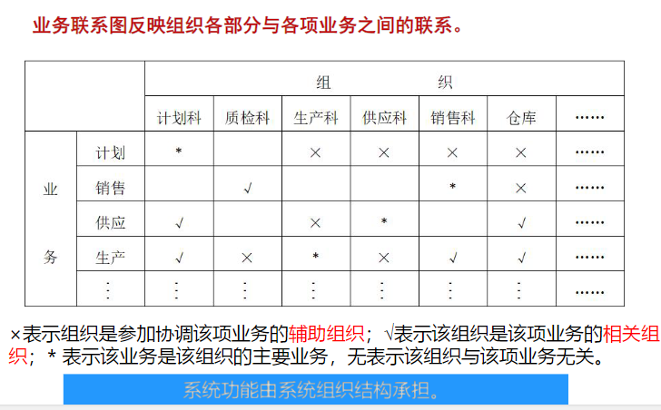
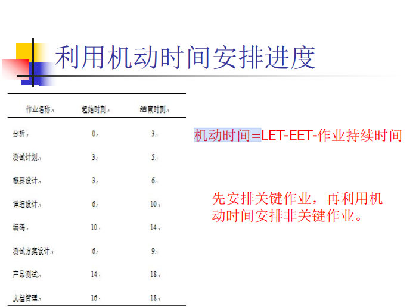
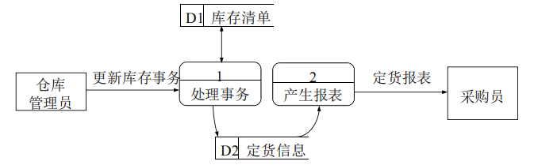
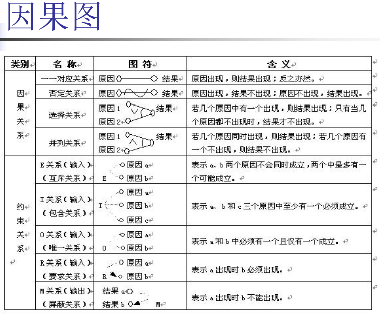

# 软件工程基础

# 绪论

## 系统与系统工程

- 系统

  > 系统就是由两个或以上有机联系、相互作用的要素所组成，**具有特定功能、结构和环境的整体**

- 系统工程

  >系统工程就是从整体出发，合理开发、管理、运行和改进一个大规模复杂系统所需的思想、理论、方法和技术的总称。

## 软件与软件工程

- 软件

  > 软件是计算机系统中看不见、摸不着的逻辑部分，以程序、数据和文档的形式出现。
  >
  > 即：软件 = 程序 + 数据 + 文档
  >
  > - 软件的特点
  >
  >   > 1. 软件不是传统意义上的“制造”产生的，而是“研发”出来的。 
  >   >
  >   >    ​	导致：软件项目管理和软件产品保护困难。 
  >   >
  >   > 2. 软件不会被“用坏”。
  >   >
  >   >    ​	导致：软件维护困难（软件维护不能通过重复制造解决）。 
  >   >
  >   > 3. 软件大多是“定制”的。 
  >   >
  >   >    ​	导致：软件开发的质量和效率受到影响。 
  >   >
  >   > 4. 软件成本难于估计。 
  >   >
  >   >    ​	导致：软件项目计划失效。

- 软件分类

  - 功能分类

    > 系统软件、支持软件、应用软件

  - 服务对象

    > 项目软件
    >
    > 产品软件

- 软件危机

  1. 软件质量差，可靠性难以保证
  2. 成本难以控制，很少有在预算内完成的
  3. 开发进度难以把握，周期拖得很长
  4. 可维护性较差，维护人员和费用不断增加。

- 软件工程

  - 概念：什么是软件工程？

    >性质（能力）：指导软件开发和维护的工程性学科；
    >
    >理论基础：计算机科学、管理科学和数学等 ；
    >
    >手段：采用工程化的概念、原理、技术和方法进行软件的开发和维护，把经过时间证明正确的管理措施和当前能够得到的最好的技术、方法相结合 ；
    >
    >目的：以期用较少的代价获取高质量的软件。
    >
    >

## 可信软件

>可信性（Dependability）反映了一个系统向其用户提供预期服务水平的能力。

- 软件失效

  | 故障类型       | 产生原因                     | 行为表现                                 | 可预测性             | 典型例子                         |
  | -------------- | ---------------------------- | ---------------------------------------- | -------------------- | -------------------------------- |
  | **退化故障**   | 物理部件**磨损、老化**       | 性能随时间**逐渐衰减**                   | 较高，可预测         | 电池老化、硬盘坏道               |
  | **设计故障**   | 逻辑、算法、规范**设计错误** | 在特定条件下触发，表现**固定**           | 低（何时触发难预测） | 程序Bug、千年虫问题              |
  | **拜占庭故障** | 节点恶意或**行为异常**       | **完全随机、不可预测**，可对外表现不一致 | 极低，几乎不可预测   | 分布式系统中的恶意节点、双花攻击 |

- 软件可信性属性

  1. 可靠性
  2. 可用性
  3. 防危性
  4. 完整性
  5. 安全性
  6. 可维护性

- 软件可信性工程

  > 故障的类型：退化故障，设计故障，拜占庭故障
  >
  > - 主要目标是正确处理软件系统中的故障： 
  >   1. 故障避免：在软件开发和维护过程中避免引入故障
  >   2. 故障移除：检测、识别和修复故障
  >   3. 容 错：出现故障时，系统仍能继续提供可接受服务的能力
  >   4. 故障预测：预测将来可能出现的故障种类、数量和故障对于系统的影响
  > - 软件可信性工程主要任务
  >   1. 针对系统的功能需求，**确定**系统可能遭受的**风险**。
  >   2. 针对每个风险，确定导致该风险的**故障**。
  >   3. 针对每个需要处理的故**障确定可信性需求**。
  >   4. 采用四种故障处理技术来**处理软件故障**。
  >   5. 对系统是否满足可信性需求进行**评估**。
  >   6. 重复上述任务，确保软件系统尽可能满足系统的可信性需求
  > - 故障处理技术
  >   1. 人工审核技术
  >   2. 软件测试技术
  >   3. 模型检测技术
  >   4. 系统仿真技术

## 软件工程的研究对象与基本原理

- 研究对象

  > 软件工程主要有四个方面的内容
  >
  > 1. 标准和规范——工程化
  > 2. 过程与模型——做什么（有序）
  > 3. 方法和技术——怎么做
  > 4. 工具和环境——质量和效率
  >
  > 软件工程管理则贯穿于这四个方面。

- 层次结构

  

- 基本原理

  

## 软件开发方法

- 开发方法

  - 三要素

    > 开发步骤，软件文档格式，方案评价

  - 核心输出

    > 程序 ： 程序 = 数据结构 + 算法
    >
    > 软件 ： 软件 = 程序 + 数据 + 文档

- 结构化方法

  > 从功能（算法）角度看程序 ====> 以功能为中心
  >
  > ---
  >
  > 结构化方法认为系统是由一些功能的相互联系、相互作用而形成
  >
  > ---
  >
  > - 指导思想
  >
  >   自顶向下、逐步求精、单入口和单出口，利用 抽象和功能分解来处理软件复杂性问题
  >
  > - 方法系列
  >
  >   结构化程序设计 => 结构化设计 => 结构化分析
  >
  > - 方法实现
  >
  >   面向数据流图的方法、IDEF0方法、Jackson方法、LCP方法
  >
  > - **特点**
  >
  >   - 方法简单实用、技术成熟、应用广泛。
  >   - 不适应规模大的项目及特别复杂的项目。
  >   - 难于解决软件重用（复用）问题。
  >   - 难于适应需求变化的问题。
  >   - 软件维护依然比较复杂

- 面向对象方法

  >从数据结构（数据）角度看程序 ==> 以数据为中心
  >
  >---
  >
  >面向对象方法认为系统是由一些对象的相互联系、相互作用而形成
  >
  >---
  >
  >- 指导思想
  >
  >  尽可能**模拟人类习惯的思维方式**，使开发软件的方法与过程尽可能**接近人类认识世界的方法与过程** ：对象+类+继承+消息通信
  >
  >- 方法系列
  >
  >  面向对象程序设计 => 面向对象设计 => 面向对象分析
  >
  >- 方法实现
  >
  >  Coad/Yourdon方法、Booch方法、OMT方法、OOSE方法、IDEF4方 法、CRC方法等
  >
  >- **特点**
  >
  >  - 对象与功能相比，对象更易理解；
  >  - 由对象建立的系统往往更稳定；
  >  - 面向对象方法易学习；
  >  - 面向对象方法易处理需求模糊或变化的情况；
  >  - 由对象建立的系统便于重用；
  >  - 类的封装，使系统易于修改维护。
  >
  >- **不足**
  >
  >  - 类作为复用单元，有时显得太小；
  >  - 继承会增加类间的耦合性；
  >  - 面向对象方法理论没有结构化方法成熟；
  >  - 面向对象方法比结构化方法复杂。

- 面向方面方法

  > 解决面向对象方法的横切关注点问题。
  >
  > ---
  >
  > 横切关注点：散布在功能模块或对象类中的横切行为
  >
  > 面向方面方法利用关注点分离来处理软件复杂性。关注点分离意味着 在软件中，每个成分（类、方法、过程等）做且只做一件事
  >
  > ---
  >
  > 面向方面方法认为，一个系统是由核心关注点构成的核心系统和若干横切关注 点构成的若干方面扩展所构成

- 形式化方法

  >用数学的方法分析并构建程序
  >
  >描述做什么，不描述如何做
  >
  >---
  >
  >- **特点**
  >  - 形式模型完整、一致和无二义性；
  >  - 支持形式推理，便于软件验证；
  >  - 便于软件自动生成；
  >  - 一般人不易接受，需要培训,增加成本；
  >  - 灵活性差；
  >  - 难以与工程化的软件开发过程平滑地结合；
  >  - 支持工具少。

- 方法结合

  利用各种方法的长处，从而实现优势互补

## 软件工程工具与环境

- 目的：提高软件开发的质量和效率

> 对一个待开发的系统，先考虑采用何种方法（看待系统的立场、观点等），然后 再考虑采用何种工具（提高开发质量和效率

- 工具

  - 存在的问题

    一般情况下一种软件工具只支持一种活动(软件开发和维护过程中进行的活动较多)

    工具界面不统一，工具内部无联系，工具切换由人工操作(对大型软件的开发和维护的支持能力受限)

  > 于是出现了工具集成化

- 集成环境

- Flask框架

  >
  >
  >
  >
  >

# 软件过程

## 软件生存期过程

- 软件过程的定义

  >软件产品生产由一组相互有机联系起来的活动来完成，这些 相互有机联系的活动便构成软件过程

- 过程模型

  > 软件生存期过程模型是软件生存期各项活动或任务或子过程 的有机结合，以满足特定项目需要。

- 过程国标

## 软件工程经典生存周期模型

- 生存周期模型定义

  >软件生存周期模型，亦称软件开发模型，描述了从软件项目需求定义开 始，到开发成功后投入使用，在使用中不断增补修订，直到停止使用， 这一期间各种活动如何执行的模型。

- 瀑布模型

  - 概念

    > 传统的生命周期模型

  - 特点

    > 1. 各阶段顺序相互依赖
    >
    > 2. 每阶段生成文档并进行评审
    >
    >     – 文档驱动（便于管理）
    >
    >     – 软件过程可视化（便于管理）
    >
    >     – 质量保障（便于管理）
    >
    > 3. 强调需求分析和设计
    >
    >     – 推迟物理实施（有助于提高质量）
    >
    > - - - 瀑布模型比较适合于功能和性能需求明确的软件项目的开发和维护，如编译器、操作系统等

  - 不足

    > - 开发前期用户需求模糊不全面 
    >
    > - 在开发过程中，用户看不见系统 
    >
    >   – 得不到用户的反馈
    >
    >   – 容易导致开发出的系统并不是用户真正需要的系统 
    >
    > - 需求不确定或快速变化 
    >
    >   – 返工代价大，难以适用非线性顺序的开发活动

- 快速原型模型

  - 概念

    > 

  - 特点

    >- 通过向用户提供原型获取用户的反馈 
    >
    >  – 用户使用原型能够真正反映用户的需求（百闻不如一见）
    >
    >- 采用逐步求精方法完善原型 
    >
    >  – 避免冗长的开发过程
    >
    >- 快速开发原型
    >
    >  – 便于快速响应用户意见
    >
    >- 不断迭代改进，更符合人们开发软件的习惯
    >
    >- - - 原型模型比较适合于需求模糊或不确定的软件 项目的开发和维护。

  - 不足

    > - 不宜利用原型系统作为最终产品（原型成本问题）
    >
    >   – 原型可能对软件系统异常等问题虑较少，
    >
    >   – 原型主要用于获取需求
    >
    >   – 有些原型也可以融入最终系统
    >
    > - 原型模型的“快速”特点对最终系统不适用 
    >
    >   – 原型开发往往尽量使用能缩短开发周期的语言和工具
    >
    >   – 最终系统修改可能不像原型修改一样快 
    >
    > - - - 采用原型模型开发系统，用户和开发者必须达成一致：原型被建造仅仅是用来 定义需求，之后便部分或全部抛弃，最终的软件要在充分考虑了性能和可维护 性等质量方面之后才被开发。

- RAD模型(快速应用开发模型)

  - 概念

    > 

  - 特点

    > - 顺序开发（如同瀑布模型）
    >
    >   – 业务建模：弄清业务活动中的信息流；
    >
    >   – 数据建模：精化业务建模结果；
    >
    >   – 处理建模：依据数据建模结果，创建处理描述；
    >
    >   – 应用生成：组件复用与开发；
    >
    >   – 测 试：新的组件及所有接口。
    >
    > - 强调极短的开发周期（2-3月）
    >
    >   – 避免冗长的开发过程
    >
    > - - - RAD模型主要用于信息系统应用软件的开发

  - 不足

    > - 需要足够的人力以创建足够的RAD小组 
    >
    >   – RAD需要若干RAD小组。
    >
    > - 技术风险很高的情况不适合采用 
    >
    >   – 新软件要求与已存在的程序有高可互操性时 
    >
    >   – 系统难以被适当地划分为若干独立组件
    >
    > - 开发者和用户需要做到在很短的时间内完成系统开发

- 渐增模型

  - 概念

    > 

  - 特点

    > - 渐增模型结合了瀑布模型的直线式特点和快速原型化模型的迭代思想
    > - 渐增模型的每一轮都是产品
    > - 可以根据需要补充人员

  - 不足

    > - 对设计水平要求较高
    > - 由于采用增量开发，古难以进行彻底的测试

- 螺旋模型

  - 概念

    >

  - 特点

    > - 螺旋模型是风险驱动的
    > - 结合了诸多模型的特点
    > - 螺旋模型适合于大型软件的开发 – 尤其是内部创新性项目

  - 不足

    > - 要求软件开发人员善长风险分析
    > - 风险分析会导致项目终止而终止合同，出现违约诉讼
    > - 风险分析会增加项目成本

- 统一过程模型

  - 特点

    > - 用例驱动
    > - 以体系结构为中心
    > - 迭代增量式地进行软件开发

  - 不足

    > - 太复杂
    > - 太重

  

## 敏捷软件开发过程

- 敏捷价值观

  > 拥抱变化
  >
  > - 价值观       人，可工作软件？，客户，变化
  >
  > - 敏捷——快速，增量式交付软件

- 敏捷原则（12条）

  - 团队
    1. 一起工作
    2. 个体积极
    3. 面对面交流
    4. 可持续
    5. 关注好的设计，增强敏捷能力
    6. 自组织
    7. 反省
  - 制品
    1. 尽早、持续地交付
    2. 欢迎需求改变
    3. 短的交付间隔
    4. 度量标准
    5. 简单

  

- 极限编程

  > 尽力而为
  >
  > ---
  >
  > 极限编程专注于编程技术、清晰沟通和团队协作，只需做能够 为客户创造价值的事情，是一组确保项目开发成功的规则，适 用于任何规模的团队，适合模糊或快速变化的需求。
  >
  > ---
  >
  > 
  >
  > - 价值观
  >
  >   > 
  >
  > - 原则
  >
  >   > 
  >
  > - 实践——最佳时间（重构，结对编程），持续集成
  >
  > - 过程(阶段)——规划，迭代，测试，发布（一次发布）

- Scrum过程

  - 三种角色

    > - 产品负责人（Product Owner）
    >
    >   定义和维护“产品待 办事项表（Product Backlog）”，负责最大化产品以 及Scrum团队的工作价值，代表利益相关者的利益。
    >
    > - Scrum主管（Scrum Master）
    >
    >   确保Scrum团队遵循 Scrum理论、实践和规则，通过指导和引导，使 Scrum团队更加高效地创建高质量的产品。
    >
    > - 开发团队（Development Team）
    >
    >   负责在每个冲刺 （Sprint）结束，交付潜在可发布的“已完成”产品 增量。**只有开发团队的成员才能交付产品增量**

  - 团队特点
    - 7+-2
    - 自组织
    - 跨功能
    - 不认可头衔
    - 各自有特长和专注
    - 不包含子团队
  - 四个阶段？
    1. 计划
    2. 开发
    3. 评审
    4. 反思（一次冲刺）
  - Scrum制品
    - 产品待办事项表
    - 冲刺待办是想表
    - 冲刺燃尽图
    - 发布燃尽图
  - Scrum会议
    - 冲刺计划会
    - 每日站立会
    - 冲刺评审会议
    - 冲刺反思会

| 特性           | **极限编程 (XP)**                                            | **Scrum**                                                    |
| -------------- | ------------------------------------------------------------ | ------------------------------------------------------------ |
| **关注点**     | 更侧重于**高质量的软件工程实践**和技术卓越性。               | 更侧重于**项目管理和组织流程**，定义了角色、事件和工件。     |
| **规定性**     | **规定性强**。明确要求结对编程、TDD、持续集成等具体技术实践。 | **规定性弱**。它提供了一个管理框架，但对如何进行技术开发不做具体规定。 |
| **迭代灵活性** | 在迭代中，如果某个任务还没开始，可以用等工作量的其他任务替换。 | 一旦冲刺（Sprint）开始，需求就被锁定，不允许变更，以保护团队不受干扰。 |
| **角色**       | 角色相对模糊，强调“现场客户”和“开发者”。                     | 明确定义了三个角色：产品负责人 (PO)、Scrum Master (SM)、开发团队。 |

- 其他敏捷过程
- 敏捷过程管理工具

# 软件项目可行性研究

## 软件项目可行性研究内容与步骤

- 内容

  >- 技术可行性 （待开发系统技术分析、资源有效性分 析、风险分析、系统故障分析）；
  >- 经济可行性 （成本估计、效益分析 ）；
  >- 社会可行性 （就政治意识形态、法律法规、社会道 德、民族意识以及系统运行的组织机构或人员 等， 分析系统能否运行及运行好坏程度）

- 步骤
  1. 系统目标和范围的定义
  2. 对现行系统进行分析研究
  3. 到处新系统的逻辑模型
  4. 设计新系统的物理方案
  5. 推荐可行的方案
  6. 编写可行性研究报告

## 软件系统功能分析

- 系统组织结构的定义

  > - 内容：组织结构图 业务联系图 业务功能树
  > - 组织结构图
  >
  > 
  >
  > - 业务联系图
  >
  > 
  >
  > - 业务功能树
  >
  > 

- 系统处理流程分析

  > 采用系统流程图来描述 
  >
  > - 系统流程图
  >
  >   **系统流程图表达的是信息在系统中各部件之间流动的情况，而不是对信息进行加工处理的控制过程。**
  >
  > - 跨职能流程图（泳道图）
  >
  >   
  >
  >   
  >
  > - 系统流程图建模基本步骤
  >
  >   1. 首先，建立系统组织结构，并描述组织结构完成哪 些业务功能，采用业务联系图或业务功能树描述。
  >   2. 其次，对某个业务处理，考察组织结构的不同业务功能之间的信息流动，并采用系统流程图描述。
  >   3. 最后，对建立的系统流程图进行完善。
  >
  > - 系统流程图作用
  >
  >   1.  有利于全面了解系统整体业务处理的大概过程。
  >   2. 有利于系统分析员、管理员和业务用户相互交流。
  >   3. 可用来分析系统业务流程的合理性。
  >   4. 是用来构建系统逻辑处理模型的基础

- 系统数据流分析

  > 数据流图
  >
  > > 将业务功能进一步精化为业务处理，显示每个处理的输入和输 出数据对象，指明处理如何变换信息来完成业务功能
  >
  > 
  >
  > - - - 在可行性研究阶段，采用数据流图来描述数据在系统中的流动和处理 情况时，不必详细描述，只须概括地描述高层的数据处理和流动

## 软件系统故障分析

- 故障树基本过程

  1. 确定定事件

     >
     >
     >

  2. 建立故障树（根据事件、关系）

     >
     >
     >
     >
     >

  3. 进行故障分析（定性分析，定量分析）

- 故障树规范化和简化

  > 故障树的规范化和简化有利于故障分析
  >
  > 
  >
  > 

- 故障树定性分析

  > 定性分析的关键是求故障树的最小割集
  >
  > 可靠性关键系统不允许有单点故障
  >
  > - 求最小割集的方法：上行法，下行法，布尔代数简化法
  > - 
  > - 
  > - 

- 故障树定量分析

  > 故障树的定性分析是定量分析的基础
  >
  > **在通过故障树定性分析计算得到全部最小割集后，如果能够确定故障树中各个基本事件发生的概率，则可以对故障树进行定量分析。**
  >
  > - 故障树定量分析主要内容：
  >
  >   > 确定基本事件发生的概率。
  >   >
  >   > 利用基本事件的发生概率计算每个最小割集的发生概率。
  >   >
  >   > 利用最小割集发生的概率计算出顶事件的发生概率。
  >   >
  >   > 分析基本事件的结构重要度、概率重要度、相对概率重要度（或称为关键重要度）
  >
  > ---
  >
  > - 结构函数
  >
  > 
  >
  > 
  >
  > 

- 基本事件重要度分析

  - 结构重要度

    

    

  - 概率重要度

    

    

  - 关键重要度

    

## 软件项目成本估计

> 软件成本难以估算

> 成本一般有四部分组成：
>
> - 购置并安装软件/硬件等有关设施的费用
> - 系统开发费用
> - 系统安装、运行和维护费用
> - 人员培训费用等。

成本分为人力成本和非人力成本

- 自顶向下

  > 根据相似的项目
  >
  > 仅有少数上传技术与管理人员参与
  >
  > 工作量小，速度快
  >
  > 有些可能难以评估，有些可能不准确

- 由底向上

  > 分析综合
  >
  > 交给任务开发人员去估计

- 经验模型

  > 主要经验模型：静态单变量模型，动态多变量模型，COCOMO模型
  >
  > 
  >
  > 
  >
  > 
  >
  > 

- 软件成本度量标准

  > 
  >
  > 
  >
  > 

## 软件项目效益分析

>**软件项目效益有两部分：经济效益和社会效益**
>
>
>
>
>
>

# 软件项目计划

## 目的

>为软件工程过程提供管理依据

## 内容

> - 风险管理——风险分析
> - 任务管理——进度计划
> - 组织管理——项目组织
>
> 

## 风险分析

- 风险标识

  > - 类型：宏观：项目风险、技术风险和商业风险
  > - 方法：
  >   1. 风险项目检查表
  >   2. 头脑风暴法

- 风险估计

  >估计风险发生的可能性。风险可能性尺度可以用布尔值、定量或定性的方式表示。 （概率）
  >
  >估计与风险相关的问题出现后将会带来的损失：灾难的、严重的、轻微的和可忽略的。（影响值）。
  >
  >- 定义项目的风险参考水准（成本，进度，性能等）
  >- 找出项目风险估计值与参考水准之间的关系
  >- 确定缝隙参考水准曲线——项目是否终止

- 风险评价

  > 
  >
  > - 建立风险表
  >
  >   

- 风险管理与监控

  > - 80-20规则——监控/管理 20%
  >
  > - 制定风险管理策略
  >
  > - 跟踪并收集风险信息
  >
  >   
  >
  >      
  >
  > - 风险监控
  >
  >   > **事件和主要风险因素的跟踪**，判断一个预测的风险事实上是否发生了
  >   >
  >   > **风险控制**，确保针对某个风险制定的风险管理措施正在实施
  >   >
  >   > **收集可用于将来风险分析的信息**

## 进度安排

> 进度安排的两种方式
>
> 

- 基本原则（七大原则）

  - **任务分解**：将软件工程项目的任务分解成易管理的子任务,即作业;
  - **作业依存**：确保作业间的依存关系——顺序和并发；
  - **时间分配**：为每个作业指定开始和终止时间；
  - **资源约束**：在进行时间分配时应考虑资源约束，如人员数量、工具；
  - **定义责任**：应指定某特定小组或个人负责某个作业；
  - **定义结果**：对每个作业定义相应的结果——产品或产品的一部分；
  - **定义里程碑**：每个作业或作业系列应与项目的里程碑相联系。

- 工作量分配

  > 40-20-40规则：在整个软件开发过程中，编码的工作量约占20%，编码前的工作量占40%，编码后的工作量也占40%

- 进度安排方法

  > - PERT技术
  >
  >   
  >
  >   
  >
  >   
  >
  > - Gantt图方法
  > - 

## 项目组织

- 人员组织规律

  > - R/N曲线——不能平均使用人力
  >
  >   中间多，两头少
  >
  > - 参与程度曲线——最大限度发挥
  >
  >   
  >
  > - 人员权衡——适当延长开发时间(软件开发工作量与软件开发时间的4次方成反比)
  >
  > - Brooks定律——开发人员少而精
  >
  >   > 1. 向一个已经延期的软件项目追加开发人员，可能会使它完成得更晚。
  >   > 2. 当开发人员以算术级数增长时，人员之间的通信将以几何级数增长。
  >   >
  >   > - - - 由这两条定律，可以得出：对于软件项目，开发时间宁可长一些，开发人员可少而精一些

- 人员组织形式

  > 注意：责任到人，合理分工，责权均衡
  >
  > - 层次模式
  >
  >   
  >
  > - 矩阵模式
  >
  >   
  >
  > - 主程序员小组
  >
  >   
  >
  > - 民主小组
  >
  >   
  >
  > - 层次小组
  >
  >   
  >
  >   
  >
  >   

## 软件项目开发计划文档

>- 目的：用文件的形式，把对于在开发过程中各项目工作的负责人员、开发进度、所需经费预算、所需软/硬件条件等问题作出的安排记载下来，以便根据本计划开展和检查项目的开发工作。
>- 只有在需求分析之后才能正式定稿。
>- 可能要随项目的进展而不断改变

- - - 

# 需求分析

> 需求分析是指开发人员通过细致的调查分析，详细、准确和完整地理解用户需要什么样的软件，将用户非形式的需求陈述转化为完整的需求定义，再将需求定义转换到相应的需求规格说明的过程。 
>
> 通常，把一整套的需求分析方法、 技术和工具等的集合称为建模方法。

## 需求分析的特点

> - 问题的复杂性——抽象（主要）
> - 交流障碍——认知不同（多次交流）
> - 不重要行和不完整行——综合分析（统一）
> - 需求的易变型——区分变化和不变

## 需求收集

- 内容：信息需求（数据需求），功能需求，性能需求，运行需求，未来需求
- 方式：访谈（程式化/非程式化），问卷调查，场景使用，用户资料收集

## 数据流建模(DFD)

> 数据流建模方法是一种结构化分析方法；
>
> 自顶向下、逐层分解地定义系统需求；
>
> 特点是利用数据流图来对用户需求进行分析；

- 数据流图

  > - 数据流图
  >
  >   > **数据源点或终点**：这个组件表示数据源头或归宿的外部实体 (一般用正方形或立方体来表示 )
  >   >
  >   > **加工（处理）**：它表示对数据进行的变换 (加工一般用一个圆圈或圆角方框来表示 )
  >   >
  >   > **数据存储**：该组件表示处于静止状态的数据 (一般用开口的矩形框或双划线来表示)
  >   >
  >   > **数据流**：它表示处于处理状态的数据流(箭头表示)
  >   >
  >   > 扩展符号主要有：* 、+和⊕
  >   >
  >   > 
  >
  > - 分层数据流图
  >
  >   - 顶层数据流图
  >
  >     
  >
  >   - 底层数据流图
  >
  >     
  >
  >   - 中间层数据流图
  >
  >     

- 数据词典

  > 是关于数据信息的集合，是对数据流图中的每个数据，包括数据流和数据存储，进行严格定义的场所，以保持数据在系统中的一致性。
  >
  > - 组成描述符
  >
  >   > 组成描述符及其含义如下：
  >   >
  >   > - =：表示“组成”，即定义为 
  >   > - +：表示“顺序组成” 
  >   > - () ：表示“可选组成”，指的是设计时可有可无的成份 
  >   > - [] ：表示“选择”，即从方括号内的选项中选择其中一个 
  >   > - {} ：表示“重复组成” 
  >   > - ***...\*** ：符号内的内容为注释 。
  >
  >   

- 加工说明

  - IPO(Input/Process/Output)图

    > 

  - 结构化语言

    > 结构化语言，PDL(Program Design Language)或伪代码(Pseudo Code)，是一种介于自然语言和形式语言之间的一种半形式语言

  - 判定树/判定表

- 数据流建模步骤

  > 原则上是由外向里、自顶向下去模拟问题的处理过程
  >
  > 1. 画顶层数据流图
  > 2. 画分层数据流图
  > 3. 用数据词典定义数据流图中的所有数据
  > 4. 用加工说明描述数据流图中的基本加工

## IDEF0功能建模

- IDEF0图

  > 主要元素是简单和盒子和箭头
  >
  > 盒子代表系统的功能（活动）。
  >
  > 箭头表示系统处理的数据约束，可以是具体的事物，也可以是抽象的信息。
  >
  > - 盒子
  >
  >   
  >
  >   左输入，右输出；上控制，下机制
  >
  > - 箭头
  >
  >   1. 分支箭头
  >
  >      
  >
  >   2. 汇合箭头
  >
  >   3. 通道箭头
  >
  >      
  >
  >   4. 双向箭头
  >
  >      
  >
  >   5. 虚线箭头
  >
  >      表示活动触发的先后顺序
  >
  >   6. 选择箭头
  >
  > - 分层IDEF0图
  >
  >   > 1. 为了明确分解过程中数据和图形间的关系，采用ICOM码和结点号来进行标识。
  >   >
  >   > 2. 对于来自父盒子的数据约束，分别用I、C、O、M表明来自父盒子的输入、控制、输出及机制边线，并在字母之后跟上数据约束在父盒子中的数字顺序号（编号顺序为：从上至下，从左至右）以表明数据约束在父盒子中的位置，统称为ICOM码。
  >   > 3. 结点号用来表明图形或盒子在分层IDEF0图中的位置
  >
  > - 结点树
  >
  >   > 顶层图——A0
  >   >
  >   > 上下关系图——A-0
  >   >
  >   > 文字加其他图形

- IDEF0建模步骤

  > 1. IDEF0方法在详细的功能需求调研基础上，用严格的自顶向下、逐层分解的方式来进行
  > 2. 确定建模的范围、观点及目的
  > 3. 建立系统的内外关系图，即A-0图
  > 4. 建立A0图的一系列子图
  > 5. 书写文字说明。

## IDEF1X数据建模

- IDEF1X图

  > - 实体
  >
  >   - 独立实体
  >   - 从属实体
  >
  > - 联系
  >
  >   - 确定联系：一对一（多）
  >
  >     - 连接联系
  >
  >       - 可标定联系
  >       - 非标定联系
  >
  >       
  >
  >       可标定是实线，非标定是虚线
  >
  >     - 分类联系
  >
  >       - 完全分类联系
  >       - 不完全分类联系
  >
  >       
  >
  >       完全分类是两条，不完全是一条
  >
  >   - 非确定联系：多对多

- IDEF1X建模步骤

  > 1. 确定建模目标和计划
  > 2. 定义实体
  > 3. 定义联系
  > 4. 定义键
  > 5. 定义属性

## UML建模语言

UML 是一种可应用于任何面向对象软件开发方法的标记法和语义语言 。它通过统一业界主流的面向对象方法，提供了强大的建模能力，并且独立于特定的开发语言和过程 。

- **UML 结构** UML 的核心由构造块、公共机制和构架三部分组成 。

  - 构造块 (Building Blocks):

    - 物件 (Things)：是模型中的基本元素 

      - 结构物件：如类、接口、组件、节点等 
      - 行为物件：如交互、状态机等 
      - 分组物件：如包（Package） 
      - 注释物件：用于解释模型的附注 

    - 关系 (Relationships)：描述物件之间的联系

      - | 关系类型                  | 图形标记 (文字描述)  | 语义说明                                                   |
        | ------------------------- | -------------------- | ---------------------------------------------------------- |
        | **关联 (Association)**    | 一条实线             | 描述对象之间的一组链接。                                   |
        | **依赖 (Dependency)**     | 带箭头的虚线         | 一个物件的改变会引起依赖物件的改变。                       |
        | **泛化 (Generalization)** | 带空心三角箭头的实线 | 一个元素是另一个元素的特化，且可取代更一般的元素。         |
        | **实现 (Implementation)** | 带空心三角箭头的虚线 | 一个类元说明一份契约（如接口），另一个类元保证实现该契约。 |

    - 图 (Diagrams)：是模型的图形化表示 

  - 公共机制 (Common Mechanisms):

    - 规格说明：对图中元素的语义进行文字描述 
    - 修饰：增强图的可读性 
    - 公共划分：如类元与实例的划分，接口与实现的划分 
    - 扩展机制：允许用户自定义UML以适应特定问题域 
      - 约束：用花括号 `{}`  表示必须为真的条件或规则 
      - 构造型：用书名号  `<< >>`  表示对现有模型元素的变体，以引入新元素 
      - 标记值：用花括号  `{}`   括起的 `tag=value` 对，用以增加元素的详细信息 

  - **“4+1” 视图构架**:UML 通过五个不同的视图来完整描述一个系统 

    - 用例视图：核心视图，描述系统行为和用户交互，面向最终用户、分析员和测试人员 
    - 逻辑视图：描述系统的静态结构（如类和对象），面向分析和设计人员 
    - 进程视图：描述系统的并发和同步机制（如进程和线程），面向集成人员 
    - 实现视图：描述代码组件和文件，关注配置管理，面向编程人员 
    - 部署视图：描述硬件拓扑结构和软件在硬件上的分布，面向系统工程师 

- **UML 图的分类** UML 图分为静态模型图和动态模型图两大类 。

| 分类           | 图名称     | 描述                                                         |
| -------------- | ---------- | ------------------------------------------------------------ |
| **静态模型图** | **类图**   | 描述系统的静态结构，包括类、属性、操作及它们之间的关联、泛化等关系 。 |
|                | 包图       | 由包或类组成，用于描述系统的分层结构 。                      |
|                | 组件图     | 描述软件的各个组件（如代码文件、可执行文件）之间的依赖关系 。 |
|                | 部署图     | 显示运行时处理节点以及其中组件的配置，反映硬件的物理拓扑结构 。 |
|                | 对象图     | 描述一组对象以及它们之间的关系，是类图在某一时刻的具体实例 。 |
| **动态模型图** | **用例图** | 从外部执行者角度描述系统需提供的功能，指明功能的参与者 。    |
|                | 顺序图     | 强调时间顺序，建模对象间的交互过程 。                        |
|                | 协作图     | 强调对象间的组织和链接，建模对象间的通信 。                  |
|                | 状态图     | 描述一个类对象所经历的各种状态以及事件发生时状态的转移条件 。 |
|                | 活动图     | 描述需要执行的活动以及这些活动的执行顺序，可包含用于划分职责的“泳道” 。 |

## 用例建模

用例建模是一种从用户使用系统的角度来建立系统功能需求模型的方法 。它不从数据模型或数据流着手，而是从系统的实际操作入手 。

- **用例图的基本成份** 
  - 参与者 ：与系统交互的人或外部系统 
  
  - 用例 ：系统为参与者提供的、能产生有价值结果的一项完整功能 
  
  - 系统 ：用方框表示系统的边界 
  
  - 关系 :
  
    - 通信关系：连接参与者和用例 
  
    - 包含关系 (`<<include>>`)：表示一个用例的行为包含了另一个用例的功能，被包含的用例是必须执行的公共部分 
  
    - 扩展关系 (`<<extend>>`)：表示在满足特定条件时，一个用例的行为可以插入到另一个用例（扩展点）中，是可选的附加功能 
  
    - 泛化关系：表示参与者之间或用例之间的一般化与特殊化关系（类似继承） 
  
- **用例的描述** 为了完整地表达需求，每个用例都需要有详细的描述 。
  - 描述方法：
  
    - 简单文字：用自然语言直接描述用例的功能 
  
    - 模板：使用标准化的模板，包含用例名、参与者、事件流（正常流程）和可选路径（异常或分支流程）等字段 
  
    - 表格：用分栏的表格清晰地展示不同参与者（或系统）之间的交互步骤 
  
    - 图形：使用UML动态图（如顺序图）来可视化用例的实现细节 
  
    - 形式化语言：如Z语言，提供数学上精确、无歧义的描述 
  
- **用例建模步骤** 
  1. 找出系统的参与者和用例：关键准则是为参与者找到真实用户，以及为用例找到有价值的结果 
  
  2. 区分用例的优先次序 
  
  3. 详细描述每个用例 
  
  4. 构造用户界面原型（可选） 
  
  5. 构造用例图：注意应避免从功能上分解用例 
  

------

## 对象建模

对象建模的主要任务是了解特定应用问题域内所涉及的对象，以及它们的结构和通信关系 。这里以Coad/Yourdon面向对象分析方法为例，该方法将建模过程分为五个层次（或活动）

- **1. 确定对象与类（对象层）**

  - 对象是现实事物的抽象，类是具有相同属性和操作的一组对象的集合 

  - 识别方法包括：分析语言信息（如名词短语分析）、三视图模型法(实体—关系模型、数据流模型、状态—迁移模型)，以及类-职责-协作（CRC）卡片法 

- **2. 标识结构（结构层）**

  - 此步骤用于处理对象建模的复杂性，主要识别两种现实世界中的主要关系 

    - 继承关系（一般/特殊结构）：描述“is-a”关系 

    - 整体/部分关系：描述“has-a”关系，在UML中对应聚合（部分可独立）和组合（部分与整体生命周期绑定） 
    
    - | 特性         | 聚合关系 (Aggregation) | 组合关系 (Composition) |
      | ------------ | ---------------------- | ---------------------- |
      | **关系强度** | 弱                     | 强                     |
      | **生命周期** | 部分可以独立于整体存在 | 部分与整体共存亡       |
      | **比喻**     | 班级与学生             | 公司与部门             |
      | **图形**     | 空心菱形               | 实心菱形               |

- **3. 标识主题（主题层）**

  - 当模型规模较大时，使用主题来组织模型，以控制复杂性并帮助理解总体概貌 

  - 主题是将语义上紧密相关的类组合成的单元，在UML中可用“包”来表示 

- **4. 定义属性及实例关联（属性层）**

  - 定义属性：属性是对象的数据单元，此步骤使对问题域的理解更具体 。属性应在原子概念的层次上进行定义 

  - 定义实例关联：描述对象实例之间的依赖关系，可看作是事务规则或应用约束 。在UML中，实例关联包括关联名称、角色名称、多重性和导航性等元素 

- **5. 定义服务及消息连接（服务层）**

  - 定义服务：即标识对象和类的操作（或方法），反映了对象的动态行为 

  - 定义消息连接：消息是对象间在行为上的唯一联系方式 

    。此步骤通过检查实例间的协作需求，确定对象之间如何通过传递消息来完成任务 

    。在UML类图中，消息连接可通过实例关联的导航性来表示，也可通过协作图或顺序图来详细描述 

------

## 需求规格说明与验证

- **需求规格说明**
  - SRS是需求分析阶段的主要成果，是用户与开发人员之间理解和交流的媒介
  
  - 它是后续系统设计、测试和验收的根本依据，同时也起着控制系统演化过程的作用
  
  - 编写方法:
  
    - 非形式化方法：采用自然语言，并辅以图表，易于理解 
  
    - 形式化方法：采用具有精确语法和语义的语言（如Z语言、Petri网），描述完全精确、无歧义 
  
- **需求验证**

  - 重要性：统计表明，软件系统中约15%的错误起源于需求错误 

  - 有效SRS的特征：一个高质量的SRS应具备正确性、无歧义性、完整性、一致性、可验证性、可理解性、可修改性和可追踪性等特征

  - 合同作用：一旦需求验证完成，SRS就成为软件开发的合同。尽管事后可以修改，但任何修改都可能增加成本或延长项目周期

## 小结

# 概要设计

## 什么是软件设计

> 软件设计的主要目的就是为了得到便于实现的高质量软件

> 软件设计步骤
>
> 1. 概要设计
> 2. 详细设计

## 软件设计与质量

- 软件设计可以提高软件质量
- 软件设计可以提高软件开发效率

## 软件设计的基本原理

- 抽象与求精

  - 抽象：抽取事物的本质的共同特性尔暂时避开不必要的低层细节
  - 求精：将摸个宏观功能不断分解，逐步确定过程细节，直至程序设计语言描述的算法实现为止

- 模块化与信息隐藏

  > 信息隐藏：解耦合

- 模块的独立性

  > 模块独立性是模块化、抽象和信息隐藏的直接产物，其基本含义是每一个模块只完成功能需求中的一个特定的子功能，而且从程序结构的其它部分来看这一模块只具有一个简单的接口

  **两个度量标准：内聚度和耦合度**

  - 内聚度：功能内聚、信息内聚、通信内聚、过程内聚、时间内聚、逻辑内聚和偶然内聚

    - 偶然内聚：模块内部个乘法在干上不相关或关系松散

    - 逻辑内聚：模块完成多个逻辑上相近或相关的功能，并且每一次调用只选择该模块中的一个功能执行。（多个逻辑功能交织）

    - 时间内聚：模块完成多个具有时间相关性的功能

    - 过程内聚：模块完成多个需要按一定的不足异常完成的功能（过程相关——控制耦合）

    - 通信内聚：模块完成多个需要按一定步骤异常完成的功能，并且这些功能的晚餐都依赖于相同的公用数据（数据相关——数据或标记耦合）

    - 信息内聚：模块完成多个功能，而每一个功能都有各种的入口点和独立的代码，但功能都依赖于同样的数据结构（数据相关）

    - 功能内聚：模块值完成一个单元的功能或者只实现一个单元的目标，则成为功能内聚

  - 耦合度：非直接耦合、数据耦合、标记耦合、控制耦合、外部耦合、公共耦合、内容耦合

    - 内容耦合：两个模块中一个模块直接引用另一个模块的内容
    - 公共耦合：两个模块都那个存钱同一公共数据环境
    - 外部耦合：一组模块访问同一单元类型全局变量或全局数组
    - 控制耦合：一个模块传递控制信息给另一个模块，显式的控制另外一个模块的逻辑
    - 标记耦合：在函数或过程调用时传递的参数是结构变量（如记录名、数组名、文件名等），但是被调用模块只操纵参数中的一部分数据
    - 数据耦合：所有的参数都是简单变量，或者虽然有结构变量，但是，被调用模块需要该结构中的所有数据
    - 非直接耦合：两个模糊都不需要另一模块的存在而能独立工作

  | 内聚度 (从高到低) | 耦合度 (从低到高) |
  | ----------------- | ----------------- |
  | 功能内聚          | 非直接耦合        |
  | 信息内聚          | 数据耦合          |
  | 通信内聚          | 标记耦合          |
  | 过程内聚          | 控制耦合          |
  | 时间内聚          | 外部耦合          |
  | 逻辑内聚          | 公共耦合          |
  | 偶然内聚          | 内容耦合          |

  - - - 注意，这里只是排序，不是一一对应

## 面向数据流图的软件结构设计

- 该方法将需求分析阶段的数据流图（DFD）映射为软件结构图 

- 软件结构图：用方框表示模块，箭头表示调用关系，带数据/控制标记的短箭头表示信息传递

  > 主要内容有：模块、模块间的调用关系和模块之间传递的信息

  

  

- 变换分析法：用于将线性的“变换型”数据流图映射为软件结构。首先识别出**传入路径、变换中心和传出路径** ，然后通过两级分解，将DFD中的加工映射为结构图中的模块

- 

- 事务分析法：用于将辐射状的“事务型”数据流图映射为软件结构。首先识别出接收路径、事务中心和动作路径

  ，然后进行分解，将接收路径和各动作路径分别映射为相应的模块结构

- 结构图改进：初始结构图需要根据一些启发式规则进行改进，如确保模块大小适中、扇入扇出合理，以及保证模块的作用域在其控制域之内

## 面向IDEF0图的软件结构设计

- 该方法以IDEF0功能模型为基础设计软件结构

- HIPO图：是此方法的主要工具，由两部分构成：

  - H图 (层次图)：用矩形框和连线描述模块的层次结构和调用关系

    

  - IPO图：详细描述H图中每个模块的输入（Input）、处理（Process）和输出（Output）

    

- 设计步骤通常是逐层将IDEF0图转换为H图，并确定模块接口，最终形成完整的层次图

------

## 类设计原则

> - 当需求变化时，类的职责就会因此而变化，也即类的职责是引起类变化的原因。 
> - 所谓单一职责原则，要求的是一个类应该仅有一个引起它变化的原因。如果一个类承担的职责过多，会导致设计脆弱，也即当设计因一个职责的变化而发生改变时会遭到意想不到的破坏，影响这个类完成其它职责的能力。
> - 分离职责可能会导致不必要的设计复杂性,设计人员应在设计过程中权衡利弊，审慎地使用单一职责原则。

- 单一职责原则：一个类应该仅有一个引起它变化的原因

- 开闭原则：软件实体应对于扩展是开放的，但对于修改是封闭的

- 里氏替换原则：子类型必须能够替换掉它们的基类型，而不影响程序功能

- 依赖倒置原则：高层模块不应依赖于低层模块，抽象不应依赖于细节

- 接口隔离原则：使用多个专门的接口比使用单一的总接口要好

- 组装/复用原则：也称组合优于继承，在新的对象里应尽量使用已有的对象来实现功能复用

## 面向对象设计

> **(基于Coad/Yourdon)**

- 面向对象设计（OOD）是在面向对象分析（OOA）的基础上，考虑软件实现环境，确定“如何做”的过程

- 设计过程主要围绕四个部分展开：

  1. 问题域部分设计：重用和调整OOA模型，以提高性能、重用已有类并适应实现环境

  2. 人机交互部分设计：设计用户与系统的交互方式，包括用户分类、命令层设计、详细交互设计以及相关类的设计 

  3. 任务管理部分设计：处理并发、中断、调度等问题，通常通过识别事件驱动型任务和时钟驱动型任务来完成 

  4. 数据管理部分设计：负责对系统生成的永久数据进行访问和管理，将特定的数据管理技术从问题域中分离出来 

## 可复用对象设计模式

- 设计模式是针对常见设计问题提出的、可复用的、以交互类形式出现的解决方案 61

- Gamma分类：将设计模式分为三类：

  - 创建型模式：处理对象的创建。如工厂方法、抽象工厂。

  - 结构型模式：处理类和对象的组合。如适配器、组合

  - 行为型模式：处理类和对象间的交互和职责分配。如迭代器、观察者

- 应用框架：是一组协同工作的类，为相关应用提供可复用的基础设施

  。**MVC（模型-视图-控制器）**是一个经典的GUI框架，它将数据层与表示层分离

## 软件体系结构设计

- 体系结构设计是定义系统组成成分及其关系，为系统建立一个整体框架的过程

- 体系结构视图：为了应对复杂性，可从不同视角对系统进行抽象。常见的视图模型有4+1视图和 C4模型（上下文图、容器图、组件图、代码图）

- 体系结构模式/风格：是针对特定设计情况的、抽象且可重用的设计方案。常见的模式包括：

  - MVC模式：分离数据、表现和用户交互

  - 层次模式：将系统组织成多个功能层，每层为上层提供服务。

  - 中心存储模式：所有组件通过一个中央数据仓库进行交互

  - C/S模式：将功能组织成服务，由客户端访问服务器来使用。

  - 管道过滤器模式：数据像在管道中流动一样，依次经过多个处理组件（过滤器）

  - 微内核模式 ：也称插件模式，由一个最小功能集的内核系统和多个可插拔的功能插件组成

  - 微服务模式 ：将系统分解为多个可独立部署的自治服务单元 

# 详细设计

# 软件测试

## **软件测试基础与概述**

#### **核心概念**

- 软件验证：通过检查和提供客观证据，表明软件满足规定需求，是贯穿整个软件生存周期的重要活动。验证方式主要有两种：测试和证明
- 软件测试定义：为了发现软件需求分析、设计和编码中的错误，而对软件进行复审、检查和运行的过程。其根本目的是以最少的代价发现错误，从而提高软件质量并降低成本
- 测试的重要性：软件开发中，测试通常占据30%至40%的项目精力，对于航空飞行控制等关键软件，成本更高 

#### **软件错误的来源与测试的复杂性**

- 错误来源：主要包括信息交流不畅、开发人员经验不足、软件需求不确定以及软件系统自身的复杂性
- 测试的复杂性：穷举测试（即测试所有可能的情况）是不现实的，因此必须在“经济性”原则指导下选择高效的测试用例

#### **测试的基本原则与对象**

- 测试原则：
  1. 测试应“尽早地和不断地进行” 
  2. 较早确定测试计划，严格执行测试计划
  3. 注意错误的群集现象和应用Pareto原则
  4. 测试规模应从小到大
  5. 测试应一般由独立的第三方进行
  6. 应保证测试用例的完整性和有效性
  7. 应保存所有测试用例和出错统计等，直至软件不用为止
- 测试对象：不仅仅是程序代码，而是包括软件生命周期中所有的文档和代码。统计显示，64%的错误源于分析和设计阶段
- 测试与调试：测试的目的是发现错误（症状），而调试是定位并修正错误（原因）的过程

#### **代码复审**

- 定义：在动态测试之前，通过人工方式对源代码进行分析和检查，是一种非常有效的静态测试方法，能发现30%到70%的逻辑和编码错误 
- 主要方法：包括代码会审、走查和办公桌检查
- 复审内容：重点检查代码的完备性、正确性、一致性、健壮性以及是否遵循编码标准等方面

------

## **软件测试主要技术**

#### **白盒测试**

白盒测试，又称结构测试，依据程序的内部逻辑来设计测试用例。目标是尽可能充分地覆盖源代码

- 逻辑覆盖法：通过覆盖不同程度的逻辑结构来检验程序。覆盖强度从弱到强依次为：

  - 语句覆盖：每条可执行语句至少执行一次

  - 判定覆盖（分支覆盖）：每个判定的“真”和“假”分支至少经历一次

  - 条件覆盖：每个判定中的每个条件的“真”和“假”结果至少出现一次

  - 判定/条件覆盖：同时满足判定覆盖和条件覆盖

  - 条件组合覆盖：每个判定中所有可能的条件取值组合至少执行一次

    

- 基本路径覆盖法：由T. McCabe提出，通过分析程序图的“环形复杂度”，找出所有线性独立的路径（基本路径集），并设计用例覆盖所有基本路径

  

  

  

  

  > 每一次在前一次的基础上修改即可

- 循环覆盖法：专门针对循环结构的测试，确保循环能被正确地跳过（0次）、执行1次、2次、m次（小于最大次数n）、n-1次、n次以及n+1次（如果可能）。对于嵌套和串接循环也有相应策略

  > 循环主要有三种：简单循环、嵌套循环和串接循环

  

  > 0，1,2，m，n-1，n，n+1

  

  

#### **黑盒测试**

黑盒测试，又称功能测试，不关心程序内部结构，只根据需求规格说明书来检查软件功能是否正常

- 主要发现的错误类型：**功能错误、接口错误、数据错误、性能错误以及初始化或终止错误**

- 等价分类法：将所有可能的输入数据划分为若干个“等价类”，从每个类中选取一个代表性数据作为测试用例

  步骤：

  1. 划分等价类，形成等价类表
  2. 为每个等价类规定一个唯一的编号
  3. 设计一个新的测试用例，使其尽量多地覆盖尚未被覆盖的有效等价类，重复这一步，直到所有的有效等价类都被覆盖为止
  4. 设计一个新的测试用例。使其覆盖一个而且只覆盖一个无效等价类，重复这一步，直到所有无效等价类均被覆盖为止。

- 边界值分析法：作为等价分类法的补充，重点**测试等价类边界上、略高于边界和略低于边界的值**，因为程序在边界处最容易出错

  

- 猜错法：依靠测试人员的经验和直觉，推测程序可能存在的错误，从而设计测试用例

  

- 因果图法：适用于输入条件组合复杂的情况，通过分析原因（输入）和结果（输出）之间的逻辑关系，绘制因果图并转换为判定表，最后为判定表的每一列设计测试用例

  
  
  步骤：
  
  1. 分析程序规格说明中哪些是原因，哪些是结果。原因常常是输入条件或输入条件的等价类，结果则是输出条件。 
  2. 分析程序规格说明中描述内容的语义和限制，找出两类关系，画出因果图。 
  3. 把因果图转换成判定表。
  4. 对判定表的每一列写成一个测试用例。
  
  

------

## **测试阶段与调试**

#### **测试的层次**

动态测试通常分为四个主要步骤，对应软件开发的逆过程：

- **单元测试**：针对软件最小单元（模块）的测试，通常结合白盒和黑盒方法，以白盒为主。测试时需要编写

  驱动模块（调用被测模块）和桩模块（模拟被测模块调用的下级模块）来创建测试环境

- **集成测试**：在单元测试后，将模块按设计要求组装起来进行的测试，主要目标是发现接口相关的问题 

  - 策略：分为非渐增式（一次性组装）和渐增式（逐步组装）。渐增式又分为自顶向下和自底向上两种集成方式

  - 回归测试：在修改软件后，重新执行部分或全部已做过的测试，以确认修改没有引入新的错误

- **确认测试**：验证软件的功能、性能等是否符合需求规格说明书的要求，主要采用黑盒测试方法

  - α (Alpha) 测试：由用户在开发环境下进行，开发者在场指导并记录问题

  - β (Beta) 测试：由最终用户在实际使用环境下进行，开发者不在场

- **系统测试**：将已确认的软件与硬件、外设、其他软件等系统元素结合，在真实运行环境下进行测试。包括恢复测试、安全性测试、可用性测试等。

#### **调试**

- 定义：在测试发现错误之后，定位错误的具体位置和原因，并加以改正的过程。它包含定位和修改两个活动

- 调试策略：

  - 猜测法：根据错误症状和经验猜测原因

  - 跟踪法：从出错点开始，沿程序控制流向回追踪代码

  - 演绎法：列出所有可能的原因作为假设，然后通过测试逐个排除。

  - 归纳法：从相关数据（线索）出发，分析它们之间的关系来找出错误

- 调试原则：调试时要冷静多思；修改要彻底，纠正错误本身而非症状；并通过回归测试防止引入新错误

#### **最终结论**

