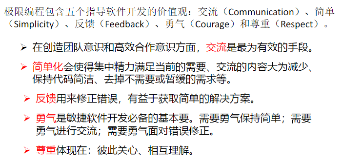

# 软件工程基础

# 绪论

## 系统与系统工程

- 系统

  > 系统就是由两个或以上有机联系、相互作用的要素所组成，**具有特定功能、结构和环境的整体**

- 系统工程

  >系统工程就是从整体出发，合理开发、管理、运行和改进一个大规模复杂系统所需的思想、理论、方法和技术的总称。

## 软件与软件工程

- 软件

  > 软件是计算机系统中看不见、摸不着的逻辑部分，以程序、数据和文档的形式出现。
  >
  > 即：软件 = 程序 + 数据 + 文档
  >
  > - 软件的特点
  >
  >   > 1. 软件不是传统意义上的“制造”产生的，而是“研发”出来的。 
  >   >
  >   >    ​	导致：软件项目管理和软件产品保护困难。 
  >   >
  >   > 2. 软件不会被“用坏”。
  >   >
  >   >    ​	导致：软件维护困难（软件维护不能通过重复制造解决）。 
  >   >
  >   > 3. 软件大多是“定制”的。 
  >   >
  >   >    ​	导致：软件开发的质量和效率受到影响。 
  >   >
  >   > 4. 软件成本难于估计。 
  >   >
  >   >    ​	导致：软件项目计划失效。

- 软件分类

  - 功能分类

    > 系统软件、支持软件、应用软件

  - 服务对象

    > 项目软件
    >
    > 产品软件

- 软件危机

  1. 软件质量差，可靠性难以保证
  2. 成本难以控制，很少有在预算内完成的
  3. 开发进度难以把握，周期拖得很长
  4. 可维护性较差，维护人员和费用不断增加。

- 软件工程

  - 概念：什么是软件工程？

    >性质（能力）：指导软件开发和维护的工程性学科；
    >
    >理论基础：计算机科学、管理科学和数学等 ；
    >
    >手段：采用工程化的概念、原理、技术和方法进行软件的开发和维护，把经过时间证明正确的管理措施和当前能够得到的最好的技术、方法相结合 ；
    >
    >目的：以期用较少的代价获取高质量的软件。
    >
    >

## 可信软件

>可信性（Dependability）反映了一个系统向其用户提供预期服务水平的能力。

- 软件失效

  | 故障类型       | 产生原因                     | 行为表现                                 | 可预测性             | 典型例子                         |
  | -------------- | ---------------------------- | ---------------------------------------- | -------------------- | -------------------------------- |
  | **退化故障**   | 物理部件**磨损、老化**       | 性能随时间**逐渐衰减**                   | 较高，可预测         | 电池老化、硬盘坏道               |
  | **设计故障**   | 逻辑、算法、规范**设计错误** | 在特定条件下触发，表现**固定**           | 低（何时触发难预测） | 程序Bug、千年虫问题              |
  | **拜占庭故障** | 节点恶意或**行为异常**       | **完全随机、不可预测**，可对外表现不一致 | 极低，几乎不可预测   | 分布式系统中的恶意节点、双花攻击 |

- 软件可信性属性

  1. 可靠性
  2. 可用性
  3. 防危性
  4. 完整性
  5. 安全性
  6. 可维护性

- 软件可信性工程

  > 故障的类型：退化故障，设计故障，拜占庭故障
  >
  > - 主要目标是正确处理软件系统中的故障： 
  >   1. 故障避免：在软件开发和维护过程中避免引入故障
  >   2. 故障移除：检测、识别和修复故障
  >   3. 容 错：出现故障时，系统仍能继续提供可接受服务的能力
  >   4. 故障预测：预测将来可能出现的故障种类、数量和故障对于系统的影响
  > - 软件可信性工程主要任务
  >   1. 针对系统的功能需求，**确定**系统可能遭受的**风险**。
  >   2. 针对每个风险，确定导致该风险的**故障**。
  >   3. 针对每个需要处理的故**障确定可信性需求**。
  >   4. 采用四种故障处理技术来**处理软件故障**。
  >   5. 对系统是否满足可信性需求进行**评估**。
  >   6. 重复上述任务，确保软件系统尽可能满足系统的可信性需求
  > - 故障处理技术
  >   1. 人工审核技术
  >   2. 软件测试技术
  >   3. 模型检测技术
  >   4. 系统仿真技术

## 软件工程的研究对象与基本原理

- 研究对象

  > 软件工程主要有四个方面的内容
  >
  > 1. 标准和规范——工程化
  > 2. 过程与模型——做什么（有序）
  > 3. 方法和技术——怎么做
  > 4. 工具和环境——质量和效率
  >
  > 软件工程管理则贯穿于这四个方面。

- 层次结构

  

- 基本原理

  

## 软件开发方法

- 开发方法

  - 三要素

    > 开发步骤，软件文档格式，方案评价

  - 核心输出

    > 程序 ： 程序 = 数据结构 + 算法
    >
    > 软件 ： 软件 = 程序 + 数据 + 文档

- 结构化方法

  > 从功能（算法）角度看程序 ====> 以功能为中心
  >
  > ---
  >
  > 结构化方法认为系统是由一些功能的相互联系、相互作用而形成
  >
  > ---
  >
  > - 指导思想
  >
  >   自顶向下、逐步求精、单入口和单出口，利用 抽象和功能分解来处理软件复杂性问题
  >
  > - 方法系列
  >
  >   结构化程序设计 => 结构化设计 => 结构化分析
  >
  > - 方法实现
  >
  >   面向数据流图的方法、IDEF0方法、Jackson方法、LCP方法
  >
  > - **特点**
  >
  >   - 方法简单实用、技术成熟、应用广泛。
  >   - 不适应规模大的项目及特别复杂的项目。
  >   - 难于解决软件重用（复用）问题。
  >   - 难于适应需求变化的问题。
  >   - 软件维护依然比较复杂

- 面向对象方法

  >从数据结构（数据）角度看程序 ==> 以数据为中心
  >
  >---
  >
  >面向对象方法认为系统是由一些对象的相互联系、相互作用而形成
  >
  >---
  >
  >- 指导思想
  >
  >  尽可能**模拟人类习惯的思维方式**，使开发软件的方法与过程尽可能**接近人类认识世界的方法与过程** 	：对象+类+继承+消息通信
  >
  >- 方法系列
  >
  >  面向对象程序设计 => 面向对象设计 => 面向对象分析
  >
  >- 方法实现
  >
  >  Coad/Yourdon方法、Booch方法、OMT方法、OOSE方法、IDEF4方 法、CRC方法等
  >
  >- **特点**
  >
  >  - 对象与功能相比，对象更易理解；
  >  - 由对象建立的系统往往更稳定；
  >  - 面向对象方法易学习；
  >  - 面向对象方法易处理需求模糊或变化的情况；
  >  - 由对象建立的系统便于重用；
  >  - 类的封装，使系统易于修改维护。
  >
  >- **不足**
  >
  >  - 类作为复用单元，有时显得太小；
  >  - 继承会增加类间的耦合性；
  >  - 面向对象方法理论没有结构化方法成熟；
  >  - 面向对象方法比结构化方法复杂。

- 面向方面方法

  > 解决面向对象方法的横切关注点问题。
  >
  > ---
  >
  > 横切关注点：散布在功能模块或对象类中的横切行为
  >
  > 面向方面方法利用关注点分离来处理软件复杂性。关注点分离意味着 在软件中，每个成分（类、方法、过程等）做且只做一件事
  >
  > ---
  >
  > 面向方面方法认为，一个系统是由核心关注点构成的核心系统和若干横切关注 点构成的若干方面扩展所构成

- 形式化方法

  >用数学的方法分析并构建程序
  >
  >描述做什么，不描述如何做
  >
  >---
  >
  >- **特点**
  >  - 形式模型完整、一致和无二义性；
  >  - 支持形式推理，便于软件验证；
  >  - 便于软件自动生成；
  >  - 一般人不易接受，需要培训,增加成本；
  >  - 灵活性差；
  >  - 难以与工程化的软件开发过程平滑地结合；
  >  - 支持工具少。

- 方法结合

  利用各种方法的长处，从而实现优势互补

## 软件工程工具与环境

- 目的：提高软件开发的质量和效率

> 对一个待开发的系统，先考虑采用何种方法（看待系统的立场、观点等），然后 再考虑采用何种工具（提高开发质量和效率

- 工具

  - 存在的问题

    一般情况下一种软件工具只支持一种活动(软件开发和维护过程中进行的活动较多)

    工具界面不统一，工具内部无联系，工具切换由人工操作(对大型软件的开发和维护的支持能力受限)

  > 于是出现了工具集成化

- 集成环境

- Flask框架

  >
  >
  >
  >
  >

# 软件过程

## 软件生存期过程

- 软件过程的定义

  >软件产品生产由一组相互有机联系起来的活动来完成，这些 相互有机联系的活动便构成软件过程

- 过程模型

  > 软件生存期过程模型是软件生存期各项活动或任务或子过程 的有机结合，以满足特定项目需要。

- 过程国标

## 软件工程经典生存周期模型

- 生存周期模型定义

  >软件生存周期模型，亦称软件开发模型，描述了从软件项目需求定义开 始，到开发成功后投入使用，在使用中不断增补修订，直到停止使用， 这一期间各种活动如何执行的模型。

- 瀑布模型

  - 概念

    > 传统的生命周期模型

  - 特点

    > 1. 各阶段顺序相互依赖
    >
    > 2. 每阶段生成文档并进行评审
    >
    >     – 文档驱动（便于管理）
    >
    >     – 软件过程可视化（便于管理）
    >
    >     – 质量保障（便于管理）
    >
    > 3. 强调需求分析和设计
    >
    >     – 推迟物理实施（有助于提高质量）
    >
    > - - - 瀑布模型比较适合于功能和性能需求明确的软件项目的开发和维护，如编译器、操作系统等

  - 不足

    > - 开发前期用户需求模糊不全面 
    >
    > - 在开发过程中，用户看不见系统 
    >
    >   – 得不到用户的反馈
    >
    >   – 容易导致开发出的系统并不是用户真正需要的系统 
    >
    > - 需求不确定或快速变化 
    >
    >   – 返工代价大，难以适用非线性顺序的开发活动

- 快速原型模型

  - 概念

    > 

  - 特点

    >- 通过向用户提供原型获取用户的反馈 
    >
    >  – 用户使用原型能够真正反映用户的需求（百闻不如一见）
    >
    >- 采用逐步求精方法完善原型 
    >
    >  – 避免冗长的开发过程
    >
    >- 快速开发原型
    >
    >  – 便于快速响应用户意见
    >
    >- 不断迭代改进，更符合人们开发软件的习惯
    >
    >- - - 原型模型比较适合于需求模糊或不确定的软件 项目的开发和维护。

  - 不足

    > - 不宜利用原型系统作为最终产品（原型成本问题）
    >
    >   – 原型可能对软件系统异常等问题虑较少，
    >
    >   – 原型主要用于获取需求
    >
    >   – 有些原型也可以融入最终系统
    >
    > - 原型模型的“快速”特点对最终系统不适用 
    >
    >   – 原型开发往往尽量使用能缩短开发周期的语言和工具
    >
    >   – 最终系统修改可能不像原型修改一样快 
    >
    > - - - 采用原型模型开发系统，用户和开发者必须达成一致：原型被建造仅仅是用来 定义需求，之后便部分或全部抛弃，最终的软件要在充分考虑了性能和可维护 性等质量方面之后才被开发。

- RAD模型(快速应用开发模型)

  - 概念

    > 

  - 特点

    > - 顺序开发（如同瀑布模型）
    >
    >   – 业务建模：弄清业务活动中的信息流；
    >
    >   – 数据建模：精化业务建模结果；
    >
    >   – 处理建模：依据数据建模结果，创建处理描述；
    >
    >   – 应用生成：组件复用与开发；
    >
    >   – 测 试：新的组件及所有接口。
    >
    > - 强调极短的开发周期（2-3月）
    >
    >   – 避免冗长的开发过程
    >
    > - - - RAD模型主要用于信息系统应用软件的开发

  - 不足

    > - 需要足够的人力以创建足够的RAD小组 
    >
    >   – RAD需要若干RAD小组。
    >
    > - 技术风险很高的情况不适合采用 
    >
    >   – 新软件要求与已存在的程序有高可互操性时 
    >
    >   – 系统难以被适当地划分为若干独立组件
    >
    > - 开发者和用户需要做到在很短的时间内完成系统开发

- 渐增模型

  - 概念

    > 

  - 特点

    > - 渐增模型结合了瀑布模型的直线式特点和快速原型化模型的迭代思想
    > - 渐增模型的每一轮都是产品
    > - 可以根据需要补充人员

  - 不足

    > - 对设计水平要求较高
    > - 由于采用增量开发，古难以进行彻底的测试

- 螺旋模型

  - 概念

    >

  - 特点

    > - 螺旋模型是风险驱动的
    > - 结合了诸多模型的特点
    > - 螺旋模型适合于大型软件的开发 – 尤其是内部创新性项目

  - 不足

    > - 要求软件开发人员善长风险分析
    > - 风险分析会导致项目终止而终止合同，出现违约诉讼
    > - 风险分析会增加项目成本

- 统一过程模型

  - 特点

    > - 用例驱动
    > - 以体系结构为中心
    > - 迭代增量式地进行软件开发

  - 不足

    > - 太复杂
    > - 太重

  

## 敏捷软件开发过程

- 敏捷价值观

  > 拥抱变化
  >
  > - 价值观       人，可工作软件？，客户，变化
  >
  > - 敏捷——快速，增量式交付软件

- 敏捷原则（12条）

  - 团队
    1. 一起工作
    2. 个体积极
    3. 面对面交流
    4. 可持续
    5. 关注好的设计，增强敏捷能力
    6. 自组织
    7. 反省
  - 制品
    1. 尽早、持续地交付
    2. 欢迎需求改变
    3. 短的交付间隔
    4. 度量标准
    5. 简单

  

- 极限编程

  > 尽力而为
  >
  > ---
  >
  > 极限编程专注于编程技术、清晰沟通和团队协作，只需做能够 为客户创造价值的事情，是一组确保项目开发成功的规则，适 用于任何规模的团队，适合模糊或快速变化的需求。
  >
  > ---
  >
  > 
  >
  > - 价值观
  >
  >   > 
  >
  > - 原则
  >
  >   > 
  >
  > - 实践——最佳时间（重构，结对编程），持续集成
  >
  > - 过程(阶段)——规划，迭代，测试，发布（一次发布）

- Scrum过程

  - 三种角色

    > - 产品负责人（Product Owner）
    >
    >   定义和维护“产品待 办事项表（Product Backlog）”，负责最大化产品以 及Scrum团队的工作价值，代表利益相关者的利益。
    >
    > - Scrum主管（Scrum Master）
    >
    >   确保Scrum团队遵循 Scrum理论、实践和规则，通过指导和引导，使 Scrum团队更加高效地创建高质量的产品。
    >
    > - 开发团队（Development Team）
    >
    >   负责在每个冲刺 （Sprint）结束，交付潜在可发布的“已完成”产品 增量。**只有开发团队的成员才能交付产品增量**

  - 团队特点
    - 7+-2
    - 自组织
    - 跨功能
    - 不认可头衔
    - 各自有特长和专注
    - 不包含子团队
  - 四个阶段？
    1. 计划
    2. 开发
    3. 评审
    4. 反思（一次冲刺）
  - Scrum制品
    - 产品待办事项表
    - 冲刺待办是想表
    - 冲刺燃尽图
    - 发布燃尽图
  - Scrum会议
    - 冲刺计划会
    - 每日站立会
    - 冲刺评审会议
    - 冲刺反思会

| 特性           | **极限编程 (XP)**                                            | **Scrum**                                                    |
| -------------- | ------------------------------------------------------------ | ------------------------------------------------------------ |
| **关注点**     | 更侧重于**高质量的软件工程实践**和技术卓越性。               | 更侧重于**项目管理和组织流程**，定义了角色、事件和工件。     |
| **规定性**     | **规定性强**。明确要求结对编程、TDD、持续集成等具体技术实践。 | **规定性弱**。它提供了一个管理框架，但对如何进行技术开发不做具体规定。 |
| **迭代灵活性** | 在迭代中，如果某个任务还没开始，可以用等工作量的其他任务替换。 | 一旦冲刺（Sprint）开始，需求就被锁定，不允许变更，以保护团队不受干扰。 |
| **角色**       | 角色相对模糊，强调“现场客户”和“开发者”。                     | 明确定义了三个角色：产品负责人 (PO)、Scrum Master (SM)、开发团队。 |

- 其他敏捷过程
- 敏捷过程管理工具

# 软件项目可行性研究

## 软件项目可行性研究内容与步骤

- 内容

  >- 技术可行性 （待开发系统技术分析、资源有效性分 析、风险分析、系统故障分析）；
  >- 经济可行性 （成本估计、效益分析 ）；
  >- 社会可行性 （就政治意识形态、法律法规、社会道 德、民族意识以及系统运行的组织机构或人员 等， 分析系统能否运行及运行好坏程度）

- 步骤
  1. 系统目标和范围的定义
  2. 对现行系统进行分析研究
  3. 到处新系统的逻辑模型
  4. 设计新系统的物理方案
  5. 推荐可行的方案
  6. 编写可行性研究报告

## 软件系统功能分析

- 系统组织结构的定义

  > - 内容：组织结构图 业务联系图 业务功能树
  > - 组织结构图
  >
  > 
  >
  > - 业务联系图
  >
  > 
  >
  > - 业务功能树
  >
  > 

- 系统处理流程分析

  > 采用系统流程图来描述 
  >
  > - 系统流程图
  >
  >   **系统流程图表达的是信息在系统中各部件之间流动的情况，而不是对信息进行加工处理的控制过程。**
  >
  > - 跨职能流程图（泳道图）
  >
  >   
  >
  >   
  >
  > - 系统流程图建模基本步骤
  >
  >   1. 首先，建立系统组织结构，并描述组织结构完成哪 些业务功能，采用业务联系图或业务功能树描述。
  >   2. 其次，对某个业务处理，考察组织结构的不同业务功能之间的信息流动，并采用系统流程图描述。
  >   3. 最后，对建立的系统流程图进行完善。
  >
  > - 系统流程图作用
  >
  >   1.  有利于全面了解系统整体业务处理的大概过程。
  >   2. 有利于系统分析员、管理员和业务用户相互交流。
  >   3. 可用来分析系统业务流程的合理性。
  >   4. 是用来构建系统逻辑处理模型的基础

- 系统数据流分析

  > 数据流图
  >
  > > 将业务功能进一步精化为业务处理，显示每个处理的输入和输 出数据对象，指明处理如何变换信息来完成业务功能
  >
  > 
  >
  > - - - 在可行性研究阶段，采用数据流图来描述数据在系统中的流动和处理 情况时，不必详细描述，只须概括地描述高层的数据处理和流动

## 软件系统故障分析

- 故障树基本过程

  1. 确定定事件

     >
     >
     >

  2. 建立故障树（根据事件、关系）

     >
     >
     >
     >
     >

  3. 进行故障分析（定性分析，定量分析）

- 故障树规范化和简化

  > 故障树的规范化和简化有利于故障分析
  >
  > 
  >
  > 

- 故障树定性分析

  > 定性分析的关键是求故障树的最小割集
  >
  > 可靠性关键系统不允许有单点故障
  >
  > - 求最小割集的方法：上行法，下行法，布尔代数简化法
  > - 
  > - 
  > - 

- 故障树定量分析

  > 故障树的定性分析是定量分析的基础
  >
  > **在通过故障树定性分析计算得到全部最小割集后，如果能够确定故障树中各个基本事件发生的概率，则可以对故障树进行定量分析。**
  >
  > - 故障树定量分析主要内容：
  >
  >   > 确定基本事件发生的概率。
  >   >
  >   > 利用基本事件的发生概率计算每个最小割集的发生概率。
  >   >
  >   > 利用最小割集发生的概率计算出顶事件的发生概率。
  >   >
  >   > 分析基本事件的结构重要度、概率重要度、相对概率重要度（或称为关键重要度）
  >
  > ---
  >
  > - 结构函数
  >
  > 
  >
  > 
  >
  > 

- 基本事件重要度分析

  - 结构重要度

    

    

  - 概率重要度

    

    

  - 关键重要度

    

## 软件项目成本估计

> 软件成本难以估算

> 成本一般有四部分组成：
>
> - 购置并安装软件/硬件等有关设施的费用
> - 系统开发费用
> - 系统安装、运行和维护费用
> - 人员培训费用等。

成本分为人力成本和非人类成本

- 自顶向下

  > 根据相似的项目
  >
  > 仅有少数上传技术与管理人员参与
  >
  > 工作量小，速度快
  >
  > 有些可能难以评估，有些可能不准确

- 由底向上

  > 分析综合
  >
  > 交给任务开发人员去估计

- 经验模型

  > 主要经验模型：静态单变量模型，动态多变量模型，COCOMO模型
  >
  > 
  >
  > 
  >
  > 
  >
  > 

- 软件成本度量标准

  > 
  >
  > 
  >
  > 

## 软件项目效益分析

>**软件项目效益有两部分：经济效益和社会效益**
>
>
>
>
>
>

# 软件项目计划

## 目的

>为软件工程过程提供管理依据

## 内容

> - 风险管理——风险分析
> - 任务管理——进度计划
> - 组织管理——项目组织
>
> 

## 风险分析

- 风险标识

  > - 类型：宏观：项目风险、技术风险和商业风险
  > - 方法：
  >   1. 风险项目检查表
  >   2. 头脑风暴法

- 风险估计

  >估计风险发生的可能性。风险可能性尺度可以用布尔值、定量或定性的方式表示。 （概率）
  >
  >估计与风险相关的问题出现后将会带来的损失：灾难的、严重的、轻微的和可忽略的。（影响值）。
  >
  >- 定义项目的风险参考水准（成本，进度，性能等）
  >- 找出项目风险估计值与参考水准之间的关系
  >- 确定缝隙参考水准曲线——项目是否终止

- 风险评价

  > 
  >
  > - 建立风险表
  >
  >   

- 风险管理与监控

  > - 80-20规则——监控/管理 20%
  >
  > - 制定风险管理策略
  >
  > - 跟踪并收集风险信息
  >
  >   
  >
  >      
  >
  > - 风险监控
  >
  >   > **事件和主要风险因素的跟踪**，判断一个预测的风险事实上是否发生了
  >   >
  >   > **风险控制**，确保针对某个风险制定的风险管理措施正在实施
  >   >
  >   > **收集可用于将来风险分析的信息**

## 进度安排

> 进度安排的两种方式
>
> 

- 基本原则（七大原则）

  - **任务分解**：将软件工程项目的任务分解成易管理的子任务,即作业;
  - **作业依存**：确保作业间的依存关系——顺序和并发；
  - **时间分配**：为每个作业指定开始和终止时间；
  - **资源约束**：在进行时间分配时应考虑资源约束，如人员数量、工具；
  - **定义责任**：应指定某特定小组或个人负责某个作业；
  - **定义结果**：对每个作业定义相应的结果——产品或产品的一部分；
  - **定义里程碑**：每个作业或作业系列应与项目的里程碑相联系。

- 工作量分配

  > 40-20-40规则：在整个软件开发过程中，编码的工作量约占20%，编码前的工作量占40%，编码后的工作量也占40%

- 进度安排方法

  > - PERT技术
  >
  > - Gantt图方法

## 项目组织

## 软件项目开发计划文档

# 需求分析

# 概要设计

# 详细设计

# 软件测试

