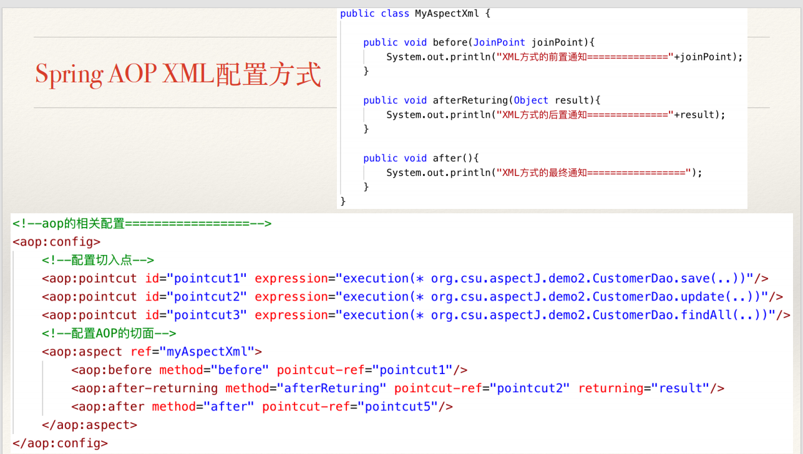
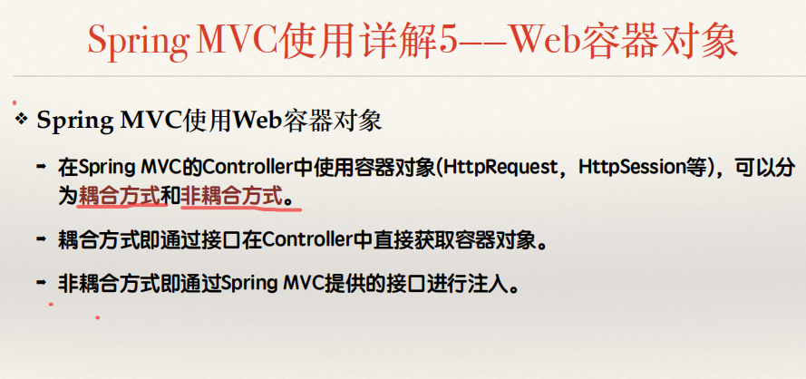
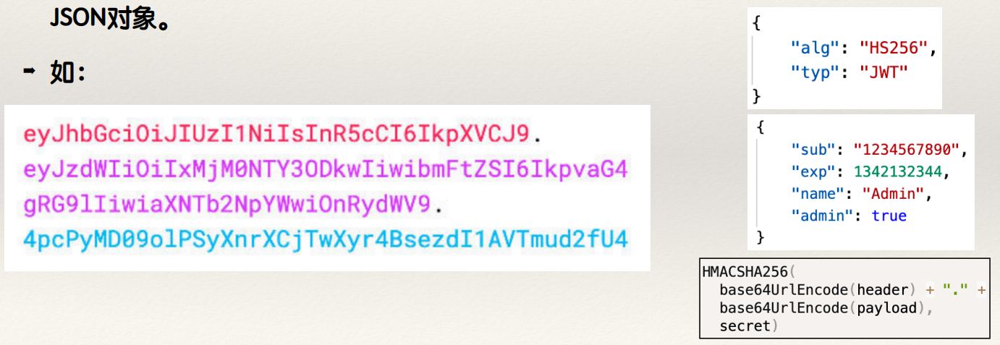
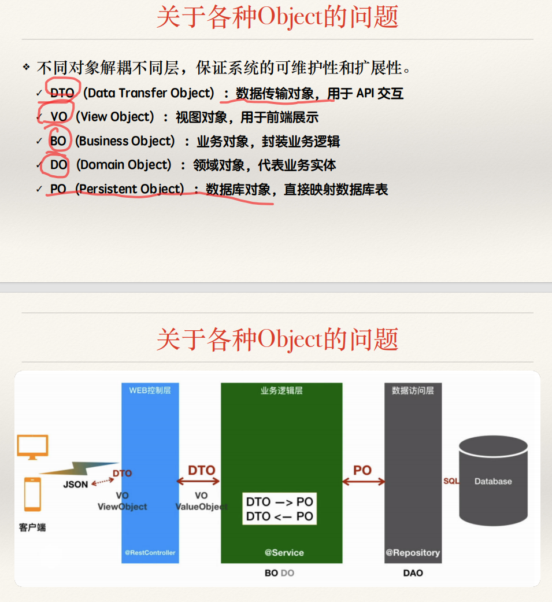

# 软件开发架构平台


# Spring MVC 体现了 Spring什么思想

IoC AOP 依赖注入等等


# CH01  开发架构和框架技术概述


## 开发架构与框架技术的发展

### 	框架技术由来

​		**MVC**已成为事实标准

​		在**Java Web**应⽤的开发中，⼀般将**Model**还进⼀步细分为：完成业务逻辑的业务**Bean**、实现数据持久化操作的**DAO**和仅⽤于表达数据的值对象**POJO**

​		基于上述分析，**表⽰层框架使⽤配置⽂件设定可变部分，将不可变部分⽤框架**的⽅式确定下来。约束了程序员遵循MVC架构规范，提⾼了开发效率；有较好的可维护性和可扩展性。


## 框架技术概览

### 		Struts 1 的基本原理

#### 				配置web.xml接管请求

#### 				创建ActionForm对象

#### 				创建Action对象

#### 				完成配置struts-config.xml

​			


​			


### 		框架技术的侵⼊性

####  				基本概念

​					由于**使用第三方框架技术而导致项目自身代码的改变**，被称为框架/架构的侵入性

##### 						 高侵入性

##### 						低侵入性	

##### 						高内聚，低耦合

### 	Struts 2的基本原理

​		约定优于配置

​		Action对象不用(Servlet)Action，业务领域对象(entity)不用继承ActionForm

### 	Spring MVC框架基本原理 

​			

​			① 请求首先到达前端控制器，委托给具体的控制器处理请求； 

​			② 前端控制器通过查询处理器映射，找到URL对应的控制器； 

​			③ 控制器处理请求，包括处理数据，调用业务逻辑等； 

​			④ 控制器将模型数据(打包)和(逻辑)视图名返回给前端控制器； 

​			⑤ 视图解析器将逻辑视图名匹配成具体的视图实现； 

​			⑥ 视图进⾏模型数据和视图实现的渲染； 

​			⑦ 交付模型数据，给出Web响应。


## Maven

​	一种基于项目对象模型(POM，Project Object Model)的项目管理机制

​	通过简单的描述信息(配置文件**pom.xml**)来管理项目的构建和模块间的依赖

​	

​	下载依赖的搜索顺序是**本地仓库->私服->中央仓库->远程仓库**

### 	约定

### 


# CH02  Spring IoC原理和实现


## 控制反转IoC和依赖注入DI的基本原理

### 	IoC 的基本概念

​		**IoC**:是面向对象编程中的一种设计原则，可以用来降低计算机代码之间的耦合度

​		IoC的实现方式是依赖注入（有系统外部的实体传递（注入进来），而不是系统内部创建）

### 	面向接口编程的思想

​			优点：业务逻辑(HelloWorld类)和数据访问(HelloStr接口)完全解耦(通过构造注入) 

​			缺点：界面逻辑**(**HelloWorldClient类**)**和另外两层均有依赖

#### 		解决方案

​			**到系统外部来解决这种依赖关系——工厂模式**

​				**使用高效、通用的外部工厂（框架、容器）统一管理对象；**

​				**通过配置文件替代硬编码、通过反射等技术自动创建对象**

### 	IoC原理总结

​			**IoC核心思想：**解耦合，将组件的构建和组件的使用分开，实现每个组件时只考虑组件内部的事情，要点是明确和定义组件间的接口——高内聚、低耦合。 

​			**IoC实现基础：**面向接口编程+工厂模式+依赖注入。


## Spring IoC 的实现

​		最核⼼的组件： ⼯⼚类(**IoC容器**)

​			

​	

### 	使用Spring IoC容器

​			导入Spring IoC相关的依赖包  org.springframework

​			创建applicationContext.xml

​			添加Bean配置

​					

​			初始化容器，并使用容器装配对象

​						


## Spring Bean 的配置详解

​	注意，修改了xml静态文件或修改了注解后是无法热部署的，必须重启

### 	XML配置文件方式

​		id：实例名				properties：属性

​		class：类名				autowiring mode：自动织入方式

​		name：对象名			lazy-initialization mode：延迟加载方式（lazy-init 懒加载）

​		scope：作用域			initialization method：实例化方式

​		constructor argument：构造函数

​		destruction method：析构方法

​		作用域：

​				

#### 		依赖注⼊的两种⽅式

​			**构造注⼊和setter注⼊**

构造器注入
当你的类具有必要的依赖关系时，可以考虑使用构造器注入。这种方式可以**确保依赖关系在对象创建时就被注入**，并且**能保证依赖关系不会被修改**。

Setter注入
当你的类有可选的依赖关系或者依赖关系**可能发生变化时，可以考虑使用setter注入**。这种方式允许对象在运行时更改依赖关系，提供了一定的**灵活性**。

字段注入
字段注入提供了**简洁的注入方式**，不需要创建额外的构造器或setter方法。但是，这种方式**可能会导致测试困难**，因为字段通常是私有的。虽然可以使用反射来修改私有字段，但这会导致测试代码的可读性降低。此外，字段注入在某些情况下**可能导致循环依赖**。

#### 		**Bean**的三种实例化⽅式

​			使用类构造器实例化（默认无参构造方法） 

​			使用静态工厂实例化（简单工厂模式） 

​			使用实例工厂实例化（工厂方法模式）


通过构造器实例化

- **适用场景** ：是最常见和基础的实例化方式，适用于大多数需要创建 Bean 的场景，尤其是当 Bean 的创建不需要依赖复杂的逻辑和外部因素，只需通过调用其构造器即可完成初始化时。
- **原因** ：这种方式简单直接，符合 Java 对象的常规创建方式，只要定义好了 Bean 的构造器，并在 Spring 配置中指定对应的类和构造器参数（如果有参数的话），就可以轻松地创建出 Bean 实例。

通过静态工厂方法实例化

- **适用场景** ：当需要对 Bean 的创建过程进行更精细的控制，例如需要根据不同的条件或参数来决定返回哪个具体的 Bean 实例时，或者当 Bean 的创建需要借助一些特殊的工具类或工厂类中的静态方法来完成时。
- **原因** ：静态工厂方法可以在不创建类实例的情况下，通过类名直接调用，它可以根据传入的参数等信息灵活地创建不同配置或类型的 Bean 对象，而且可以很好地隐藏对象创建的复杂细节，实现更灵活的对象创建机制。

通过实例工厂方法实例化

- **适用场景** ：与静态工厂方法类似，也是用于需要更灵活地控制 Bean 创建过程的情况，但与静态工厂方法不同的是，实例工厂方法需要先创建一个工厂类的实例，然后再通过该实例来调用工厂方法创建 Bean。适用于当工厂本身也需要进行一些初始化操作或需要维护一些状态信息时，或者当需要根据不同的实例上下文来创建不同的 Bean 实例时。
- **原因** ：实例工厂方法可以使得工厂对象在创建 Bean 时能够利用自身的状态和行为，根据不同的实例上下文和业务逻辑来决定如何创建和配置 Bean，从而实现更复杂、更动态的对象创建过程。


### 	注解方式

​			通过**@Configuration**和**@Bean**注解替代**XML**配置⽂件

​			添加**@ComponentScan**注解，通知Spring IoC容器去扫描哪些包路径下的类

​			在类的定义上添加**@Component**注解，告知Spring IoC容器该类需要被容器管理

​			使用**@Autowired**注解实现自动装配

​			除了@Component注解外，还有**@Controller**、**@Service**、**@Repository**等子注解


## JUnit 测试框架


​						

 			**(ps: Spring Boot中仅用@SpringBootTest即可替换开头的注解)**

​		@Test


​				


# CH03  Spring AOP原理和实现


## ⾯向切⾯编程思想概述

### 		AOP 的基本概念

​			面向切面编程。一种程序设计思想，是对面向对象编程OOP的一种完善和补充

​			AOP采取横向抽取机制，取代了传统的纵向继承体系解决重复性代码的问题

### 		关注点（三棱镜法则）

#### 				核心关注点

#### 				横切关注点

### 			切面

​					**切面**是对一个横切关注点的模块化，将那些散落在各处的、实现横切关注点的代码归整在一起，类似于OOP中的类的概念，但切面代表的				更多是对象间横向的关系。

### 			连接点、建议、引介、织入等

​				


## ⾯向切⾯编程的实现⽅式

### 	AOP 的实现技术（Java，原理）

​			编译期(语言扩展)、类加载器、运行时(动态代理)

#### 		动态代理实现 AOP

​						

​						

​						

#### 		AspectJ 实现 AOP

​				.aj  注意：Spring Boot中不需要，只是一个Java类

​						

​						

##### 			动态横切

##### 			静态横切


## **Spring AOP**的使⽤

​					

​					

​					

​			以上方式使用切面的作用范围不够精确，一般是将切面当成注解，精确控制切入的位置


### 			IoC 和 AOP 原理总结

​						```````

​	

## **Java**平台⽇志系统

### 		日志处理简介

​		**日志处理： **在程序运行过程中，为监测某些功能或验证某些指是否正确，需要输出相关的信息，这就是最简单的

### 		Java日志系统简介

​		**日志门面：**只提供日志相关的接⼝定义，即相应的 API，⽽不提供具体的接⼝实现。日志门面在使用时，可以动态或者静态地指					定具体的日志框架实现，解除了接⼝和实现的耦合，使用户可以灵活地选择日志的具体实现框架

​		**日志系统：**与日志门面对应，提供了具体的日志接⼝实现，应用程序通过它执⾏日志打印的功能

### 		Log4j,JUL,JCL,SLF4J

### 		Logback 和 Log4j2

​	


# CH04  Spring MVC


## Spring框架概述

​								


## Spring MVC入门

### 	Spring MVC简介

​							

​		

### 	Spring MVC的体系架构

​							

​						

## Spring MVC使用详解

### 	URL映射

​			**基于方法**

#### 			常用注解

​					**@RequestMapping**：通用映射，**不区分请求⽅法，常用于Controller类，进⾏全局设置**。 

​					**@GetMapping**：Get请求映射，作用于具体⽅法。 

​					**@PostMapping**：Post请求映射，作用于具体⽅法。 

​					用于其他请求⽅式的**@PutMapping**，**@DeleteMapping**等。

​					

### 	获取请求参数

#### 		获取参数原理

​							

#### 		获取参数方式

##### 				@RequsetParam

​			使用属性在方法参数直接接收参数

##### 				@RequestBody

​			使用JavaBean接收封装后的大量数据，更为常用（常常传递的是JSON数据）

##### 				@PathVariable，@RequestHeader

​			获取请求URI中的值   ，   获取请求头中的值(e.g. @RequestHeader("Authorization") String token)

##### 				附：@ModelAttribute

​			获取使用（Thymealeaf）模板引擎封装后的对象 （，前提：获取对象的页面提前加入了模板）

### 	响应处理

### 					

​							

​							

​		Model是直接跳转到页面，而ModelAndView需要自己设置跳转，但是可以直接返回一个对象

​							

​				

### 	参数校验	

​							

​							注意，这里ppt有误，不是Vaildation而是Vaildated

​							

### 	Web容器对象

​							

​							

### 	拦截器

​	**Spring MVC拦截器(Interceptor)**类似于Servlet技术中的过滤器，用于对请求进行前置和后置的过滤，实现系统的plug-in功能，达到按业务功能部分和非业务功能部分解耦的目的。

​	Spring MVC的拦截器实现机制是基于Spring AOP实现的，和Servlet中的过滤器及其他Web表现层框架的过滤/拦截器实现机制不同。

​						

​		注意，这里pre的拦截是boolean型的，用返回值判断，而过滤器要filterChain.doFilter()才能往下走

#### 			拦截器和过滤器的差别

​						

#### 		实现原理

​		`过滤器` 是基于函数回调的，`拦截器` 则是基于Java的反射机制（动态代理）实现的

#### 		使用范围

​		Filter` 的使用要依赖于`Tomcat`等容器，导致它只能在`web`程序中使用。

#### 		触发时机

​			

#### 		拦截的请求范围

#### 		注入Bean情况、控制执行顺序


# CH05  Spring Boot和ORM简介

## Spring Boot简介

​							

​							


## Spring Boot的基本原理


## Spring Boot的使用

​							

​	**SpringBoot**应⽤的⼊口类：

​		入口类一般以**Application**命名； 

​		入口类必须有@SpringBootApplication注解； 

​		Spring Boot应用通过SpringApplication.run()方法启动运行

​							


## ORM简介

​		**ORM(Object-Relation Mapping)**对象关系映射

​		持久化：把**瞬态数据（如内存中的对象）**保存到**可永久保存的存储设备中（如磁盘中的文件、数据库等）**；

​		完成**瞬态的对象数据到持久的关系型数据映射的机制**称为对象关系映射，简称ORM。


# CH06  ORM的实现方式和MyBatis


## ORM的实现方式

### 	JDBC

### 	JDBC Template

​			提供统⼀的模版⽅法，在保留代码灵活性的基础上，尽量减少持久化代码

​						

​			需要写一个Java类，将类中的变量名和数据库表的属性名一一对应，如UserRowMapper

#### 			**JDBC Template**的主要**API**

​					**execute**方法：可以执行任何SQL语句，一般用于DDL语句；

​					**update**与**batchUpdate**方法：执行增删改操作； 

​					**query**与**queryXXX**方法：执行查询操作； 

​					复杂查询：通过RowMapper接口将查询结果封装为实体对象； 

​					call方法

### 	MyBatis

#### 			特点

​					支持普通**SQL**查询，存储过程和高级映射的优秀持久层框架； 

​					消除了几乎所有的**JDBC**代码和参数的手工设置以及结果集的检索； 

​					使用简单的**XML**或注解用于配置和原始映射，将**Java POJOs**映射成数据库中的记录

#### 			基本原理

​								

​					在**XML**文件中定义**SQL**语句，**预留参数占位符**； 

​					在**运行时**，占位符**被指定的参数值取代**，参数可能来自参数映射表、**JavaBean**属性、或者简单的参数对象； 

​					在执行**SQL**查询时，**结果字段被映射到对象**，映射的方式与参数映射一样。


##### 					应⽤程序的组成

​							**Configuration.xml**文件 

​							**SqlSessionFactory/SqlMapper**对象；

​							**Mapper.xml**文件

​							**MyBatis Java API**

​							

​							

#### 				动态SQL

​						MyBatis框架中有if、choose(when, otherwise)、trim(where, set)、foreach四个用于动态SQL的标签元素

##### 						if

​							条件判断

##### 						choose(when, otherwise)

​							复杂条件判断

##### 						trim(where, set)

​							防止特殊情况SQL错误

##### 						foreach

​							复杂查询

### 	Hibernate

​			**Hibernate**实现了较为完整的**ORM(JPA**规范**)**

​				Hibernate是对JDBC的进一步封装； 

​				将通过SQL语句进行**持久化**改为**直接操作对象（持久化对象）**； 

​				根据**持久化对象的状态生成SQL语句**； 

​				 *****  利用**会话Session维持持久化对象**； 

​				技术上大量的**使用反射、事务、缓存**

#### 		瞬时/临时状态、持久化状态、托管/游离状态

​							


### 	Spring Data JPA

​							

​					


### 	MyBatis Plus

​					

​			MyBatis-Plus在实现原理上大部分基于AOP，无侵入、损耗小，直接面向对象操作，简单易用。

​			功能〸分强大，基本上囊括了“三剑客”的功能，同时还提供很多其他功能，包括Lambda表达式、ActiveRecord模式等比较新的特性。

#### 			MyBatis-Plus框架结构

​						


# CH07  前后端分离和RESTful API简介

## **Web**开发模式演变

### 		**Web**开发模式演变

#### 		早期时代**(Model I)**

​				简单明快、⼩规模项⽬、前后端不分⼯

​				不适合复杂业务逻辑、可维护性差、协作性差

#### 		MVC**时代**(Model II)

​				开始有前后端分⼯、有⼀定的协作性、可维护性明显好转

​				分⼯不明确、前端重度依赖后端、⽤户体验不好

#### 		从**AJAX**到前后端分离

​				前后端分⼯清晰明确、始强调⽤户体验、前端不再强依赖后端

​				前端⼯作量变⼤、由分离带来⼀系列的技术问题

#### 		前后端分离

​				后端只提供数据(Model)，通过API接口提供数据，前端独立实现

​					

​						

​				**•Single Page Application**  **•**前端开始采⽤**MVC   •**可维护性进⼀步提⾼

​				**•**前后端接⼜约定很重要        **•**前端复杂度控制

#### 		**Web**服务器和应⽤服务器

​					

#### 		CDN

​			Content Delivery Network：内容分发网络

​			CDN的关键技术主要有**内容存储**和**分发技术**

​			前后端分离的架构中，一般会将**前端静态页面**采用**CDN**进行**部署**

### 	前后端分离与SPA/MPA的关系

#### 		前后端不分离+MPA(**传统**Web**开发模式**)

​						

#### 		前后端分离+SPA(**单页应⽤**)

​						

#### 		前后端分离+MPA(多页应⽤)

​						

​			

​					


## **Web Service**和**REST**简介使⽤

### 	Web Service简介

​		**Web Service**（**Web** 服务）是⼀种基于 **Web** 的远程调⽤技术，主要⽤于不同系统之间的互操作

### 	SOAP

​		传统 WebService 主要使用 SOAP 协议，并依赖 XML 进行数据传输

​		使用 WSDL（Web Service Description Language）：提供服务描述，定义可用的方法和数据格式，通常用于生成客户端代码 

​		UDDI：Universal Description, Discovery, and Integration，统一描述、发现和集成协议 

​		协议支持：支持多种传输协议，如 HTTP、HTTPS、SMTP、JMS

​					

### 	REST

​		**RepresentationalStateTransfer**：表述性(表现层)状态转移，一个符合REST设计原则的架构就可以称为RESTful架构。

#### 		**REST**的六⼤约束

##### 			客户端-服务器

​	关注点分离、提高服务端的简单性和客户端的可移植性。 

##### 			无状态协议

​	会话信息保存在客户端、请求必须包含所有信息而不依赖于上下文、提升了服务端的简单性、可靠性和可见性。 

##### 			缓存

​	响应内容应该显式或隐式的被标为可以被缓存或不可被缓存、减少客户端和服务端的交互次数。 

##### 			分层系统

​	客户端不知道是和代理还是和真实服务器通信、尽可能将服务器端的安全、负载均衡、错误处理等实现细节隐藏。 

##### 			统一接口

​	API 设计应使用 统一的 URL 结构、HTTP 方法（GET、POST、PUT、DELETE）、一致的 JSON 响应格式。 

###### 				资源标识

​					服务器的任何资源都应该通过URI进行唯一的标识。 

###### 				通过表示操作资源

​					当客户端持有一个资源的表述时，就应该有足够的信息对资源进行操作(CRUD等)。 

###### 				响应消息的自描述性

​					每条响应消息都应该包含足够的信息来描述如何处理本条响应消息。 

###### 				超媒体作为应用程序状态的引擎：

​					点击链接跳转到另一个资源、另一个REST API等(没有必要对REST服务的动态处理过程进行硬编码)

##### 			按需代码

​				客户端可以按需直接从服务端下载部分代码、简化客户端。

### 	SOAP与REST

​							

#### 		RESTful API最佳实践

​						

​						

​						

## **Spring Boot**实现**RESTful API**

### 	Controller的请求和URL重构

#### 		请求数据的获取

​				使用@RequestParam注解获取URL中的查询参数值

​				使用@RequestBody注解获取POST或PUT中的对象值

​				使用@PathVariable注解获取URL中的参数值

### 	文档描述

### 	RESTful API的响应设计

### 	RESTful API测试⼯具

​		Postman


# CH08  RESTful API进阶


## ⽤户认证和**API**安全问题

### 	使用JWT实现用户认证 

​			**JWT**的原理

​				JWT的token字符串由三部分组成：Header、Payload和Signature，每部分均为一个JSON对象

​							

​				**Header部分**用于表示描述JWT自身的元数据，如alg属性表示签名的算法，typ表示token的类型

​				**Payload部分**用于存放实际需要传递的数据，包括标准字段和自定义字段，官方字段包括iss签发人、exp过期时间、sub主题、aud使用者、nbf生效时间、iat签发时间、jti唯一编号等

​				**Signature部分**是对上述两部分的签名，防止数据篡改，默认使用HMAC SHA256进行签名。

​					

### 	基于OAuth 2的用户鉴权 


## 其他相关主题

### 	跨域问题

### 	Java对象的JSON序列化

### 	关于各种Object的问题

​					

### 	统⼀全局异常处理

​				


# CH09  前端独立开发和ES6异步请求

## 前端独立开发简介

​				开发工具：Visual Studio Code ， WebStorm

​				项目目录结构：

​					选择多页应用MPA或单页应用SPA

​					重构页面


## Promise对象与异步请求

### 		Promise对象详解

#### 	Promise对象

​		Promise对象是异步编程的一种解决方案，比传统的解决方案（事件处理+回调函数）更合理和强大。

​		Promise对象是一个用于存取数据的容器，在异步处理中用于封装传统的基于XMLHttpRequest对象进行异步请求后的各种状态和值。

​							

##### 			Promise基本用法

​				Promise的构造⽅法必须有⼀个函数作为参数 

​				该函数的两个参数也为函数，分别在成功和失败时调用进⾏存值 

​				通过Promise实例对象的then⽅法中的两个回调函数分别在成功时取值，或在失败时处理 

​				Promise对象维护两个属性：PromiseResult保存值，PromiseState用于保存状态(三种)。 

​				then⽅法会监听PromiseState的状态，并选择⼀个回调函数运⾏。

##### 			主要特点

###### 					三种状态

​					pending（进行中）、fulfilled（已成功）和rejected（已失败）

###### 					两种状态转变

​					从pending变为fulfilled，以及从pending变为rejected

​					Promise对象的状态不受外界影响

​					一旦状态改变，任何时候都可以得到这个结果

​					如果状态已定型，再对Promise对象添加回调函数，也会立即得到这个结果

##### 			链式调⽤替代回调函数嵌套


##### 			**Promise**对象的其他**API**

​					Promise.prototype.catch() 

​					Promise.prototype.finally() 

​					Promise.all()

#### 	async和await关键字

##### 		async

​		快速创建异步函数，其目的是简化异步函数中Promise对象的写法(语法糖)

​		**async**用于**和await关键字组合**实现**异步向同步的转换**

##### 		await

​		将执行流阻塞，等待异步函数执行结束；同时自动从返回的Promise对象中取值，并返回

​					

​					

### 		fetch()函数和axios对象

#### 	Fetch API

​		**fetch()**是 XMLHttpRequest 的升级版，用于在 JavaScript 脚本里面发出异步请求

```javascript
                        fetch(url)
                            .then(/*.............*/)
                            .catch(/*.............*/)
```

##### 			使⽤**fetch()**发送请求

```javascript
async function login_fetch(username,password){
    const response = await fetch('http://127.0.0.1:8091/tokens',{
        method          : 'POST',
        mode            : 'cors',        // !跨域
        credentials     : 'include', //携带cookie
        headers : {
            'Content-Type' : 'application/x-www-form-urlencoded'
        },
        body    : `username=${username}&password=${password}` 
    });
    if(!response.ok){
        throw new Error(`请求异常: ${response.status}`);
    }
    return response.json();
}
```

##### 			使用fetch()的响应


​					

#### 	Axios

​		第三方库

```javascript
                        axios.get(url,{  // 以get请求为例
                            xxx:xxxx
                            })
                            .then(function(response){
                                // xxxxxx
                            })
                            .catch(function(error){
                                // xxxxxxxxx
                            });
```

##### 		使用范例

```javascript
async function login_axios(username,password){
    const response = await axios({
        url             : 'http://127.0.0.1:8091/tokens',
        method          : 'post',
        withCredentials : true,
        params            : {
            username : username,
            password : password
        }
    });
    return response;
}
```

#### 	

#### 	fetch()和axios对⽐

​						


# CH10  前端工程化与模块化

## 前端工程化和模块化的基本概念

### 	前端工程化

#### 		工程化

​		前端工程化广义上属于软件工程的一种，一般包括前端项目的模块化、组件化、规范化和自动化四个方面，解决的问题仍然是软件工程中面临的可维护性、可复用性、可扩展性等。

#### 		模块化

​		前端模块化简单来说就是将一个大工程(大文件)拆分成相互依赖的小工程(小文件)，编译或运行时再统一拼装和加载。狭义的前端工程化有时特指模块化。 

### 	前端模块化

#### 		分类

​		外部模块化，内部模块化

#### 		主要内容

​		外部模块的管理(Node.js和NPM)

​		内部模块的组织(CommonJS和ES6) 

​		模块源码到目标代码的编译和转换(Babel&Webpack)


## Node.js和NPM

### 	Node.js简介

### 	NPM

​	Node.js包管理工具，内置于Node.js环境中

​	使用NPM进行包管理，首先需要将本项目初始化(npm init)成NPM项目，初始化完成后会在项目中生成package.json文件。

#### 		常用操作和命令

​					

### 	其他包管理工具

#### 		Yarn

#### 		pnPm


## Common JS和ES的模块化支撑

### 	内部模块的组织

#### 	                原始阶段

​	将不同的JS文件在HTML中——**引入**，每个文件代表一个模块。

​	将每个模块包裹在一个函数作用域里面执行，最大程度地避免污染全局执行环境。 

​	通过执行匿名函数得到模块输出，达到暴露给其他模块使用的目的

##### 		                问题

​					

#### 	在线处理阶段

​	提供API和某种语法声明模块和模块间的依赖关系，在浏览器下载一个JS文件后，根据声明分析依赖，逐步加载(在线编译)

##### 		问题

​	在线组织模块的⽅式会延长前端页面的加载时间，影响用户体验 

​	加载过程中发出了⼤量的http请求，降低了页面性能

#### 预处理阶段

##### 	主要思想

​	提供⼀种特殊的语法，把组织模块的⼯作提前做好，开发⼀个⼯具(如Webpack)，使用⼯具进⾏代码合并，输出合并后的完整代码； 

​	这样在代码部署上线前就完成模块化代码的处理，从⽽节约页面加载时间； 

​	把多个script的代码合并到少数⼏个script里，减少http请求的数量

#### **CommonJS**规范的模块化⽅式

​	每个文件就是一个模块，有自己的作用域。在一个文件里面定义的变量、函数、类，都是私有的，对其他文件不可见。

​	每个模块内部，module代表当前模块。module是一个对象，exports属性（即module.exports）是对外的接口。加载某个模块，其实是加载该模块的module.exports属性

#### **ES6**的模块化⽅式

​			

#### **CommonJS**和**ES6**模块化的区别

​	CommonJS导出的是变量的一份拷贝，ES6 Module导出的是变量的绑定； 

​	CommonJS是单个值导出，ES6 Module可以导出多个； 

​	CommonJS是动态语法，可以写在判断里，ES6 Module是静态语法只能写在顶层； 

​	CommonJS的this是当前模块，ES6 Module的this是undefined


### 	前端模块化的实现

​	前端模块化的目标指的是开发模块化，而不是运行模块化


## Webpack和Vite等模块化工具

### Webpack

​	Webpack 是一个前端资源加载和打包工具。根据模块的依赖关系进行静态分析，然后将这些模块按照指定的规则生成对应的静态资源 

​	Webpack 可以将多种静态资源 包括js、css、html等转换成一个静态文件，减少了页面的请求

#### Webpack的基本概念

##### 入口

​			

##### 输出

​			

##### 加载器

​			

##### 插件

​			

##### 模式

​			

### Vite


# CH11  前端技术简介

## 前端框架概述

### 前端开发的问题

#### 代码层面

​	缺少规范、代码组织混乱、结构不清晰、难以维护

​	缺少限制和约束，变量及作用域容易冲突，代码量增加后很难协作

​	缺少支撑，对程序员能力要求高

#### 效率层面

​	项目没有结构化，程序员需要关注代码的所有模块和流程

​	团队协作效率低

​	测试效率低

#### 其他

​	前后端分离后，服务器返回的不再是渲染好的网页，而是数据

​	**将数据渲染到网页上、获取用户请求数据**——**操作DOM**（繁琐、低效）


### 前端框架的前身

#### 模版渲染——Hogan.js


## Angular

### 	Angular JS

​		**AngularJS**的主要贡献是：在前端⾸次提出了**MVC(MVVM)**的概念，并实现了**View**和**Model**的双向绑定

​		**AngularJS**基于**MVVM/MVC**，主要概念包括视图**View**、模型**Model**、模板**Template**、视图模型**ViewModel(**作⽤域**Scope**和数据绑定**)**等。

​				

### 	Angular

​				


## React

​	React专注于视图层，不是完整的MVC框架，因此通常需要配合其它库实现路由、状态管理等功能

### 主要特点

#### 虚拟DOM

​	React 使用虚拟DOM来优化界面更新

​	虚拟DOM是存储在内存中的对真实DOM的轻量级JS表示，当组件状态变化时，React**先计算虚拟DOM的变化**，然后以**最小代价同步到真实DOM**，从⽽提⾼渲染效率

​	这个Diff算法可以显著减少直接操作DOM的次数，提升性能

#### 声明式编程

​	声明式编程和**JSX**（**JavaScript XML**）语法

​	React引⼊了⼀种类似XML的JS扩展语法 JSX，直接在JavaScript代码中编写HTML结构。使用JSX可以直观地定义组件的UI结构

​	浏览器⽆法直接识别JSX，因此在构建时需要经过编译转换为普通的React.createElement调用

#### 基于组件

​	React 使用组件来构建界面，每个组件封装了自身的状态和渲染逻辑。React鼓励**组件的⾼度模块化**，每个组件**只关注自身应呈现的⼀部分UI**

​	组件可以是**函数组件或类组件**。现代React主要使用函数组件**配合Hooks来管理状态和⽣命周期**

​	组件通过属性**props接收⽗组件传⼊的数据**，通过状态state管理内部可变的数据。组件的输出是描述UI结构的JSX元素树

#### 单向数据流		


## Vue

#### 				


## 三大框架对比

​					


# CH12  前端技术进阶


# 名词解释

## CH01

### 框架技术

### 侵入性

### Maven

基于POM（项目对象模型）

合理的解决项目内部模块间和外部插件的依赖关系。

实现项目的自动化构建和部署运行

## CH02

### IoC

面向接口编程+工厂模式+依赖注入

## CH03

### AOP

### 关注点

### 切面

### 连接点

### AspectJ

#### 动态横切

#### 静态横切

### 日志系统

### 日志门面

## CH04

### 模型驱动

## CH05

### Spring Boot

#### 主要特点

#### 主要功能

### ORM

### JPA规范

### MyBatis框架特点

### Mybatis框架基本原理

## CH06

### 结果映射

### Hibernate

#### 瞬时/临时状态

#### 持久化状态

#### 托管/游离状态

## CH07

### Web服务器

### 应用服务器

### Web Service

是⼀种基于 **Web** 的远程调⽤技术，主要⽤于不同系统之间的互操作

### RESTful API请求设计规范

## CH08

### JWT的特点

### CORS

## CH09

### Promise对象

#### 简介

#### 特点

## CH10

### 工程化

### 模块化

### NPM

### Webpack

## CH11

### MVVM


